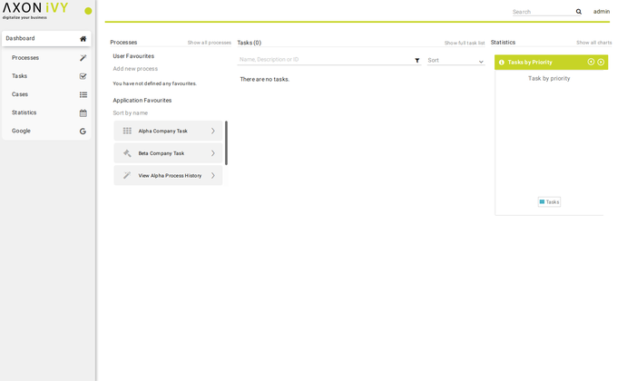

# Portal
The portal is a complete workflow user interface that fully exploits all the
features of the Axon Ivy Platform with a web-based, modern interface the Portal
provides you with key functionalities on all your devices:

* Access your company’s applications and start new cases
* Manage and fulfil tasks assigned to you or your roles
* Understand what’s going on by using on-the-spot statistics and historic data on all your cases and tasks
* Improve your Axon Ivy Portal experience and efficiency through the built-in customization options

