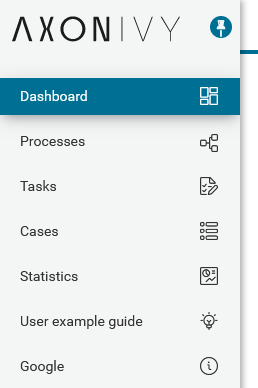
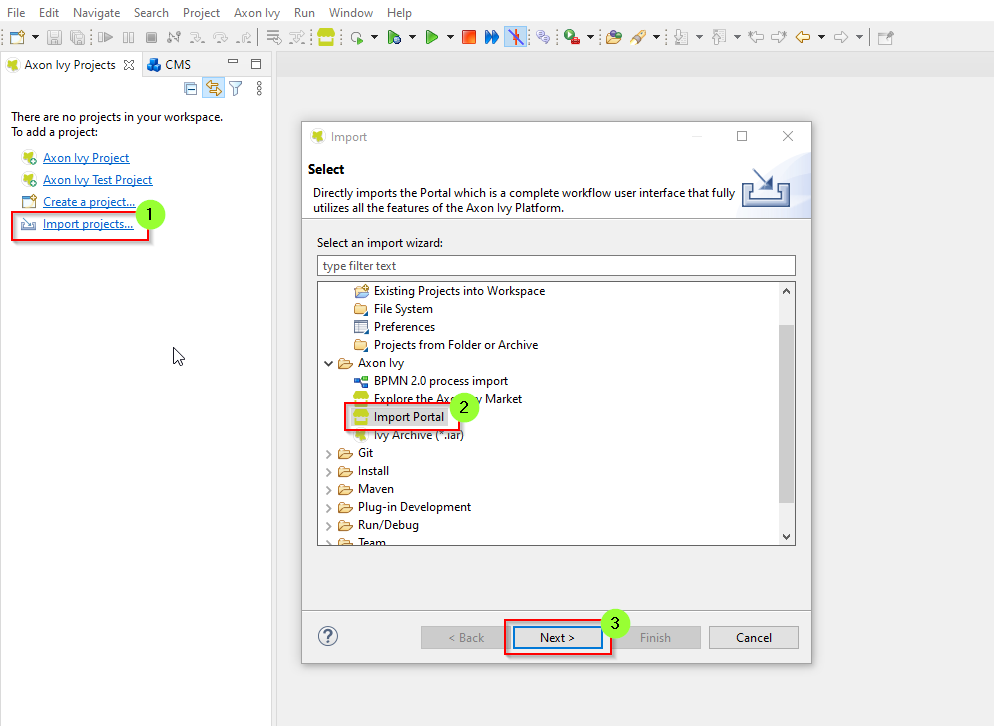
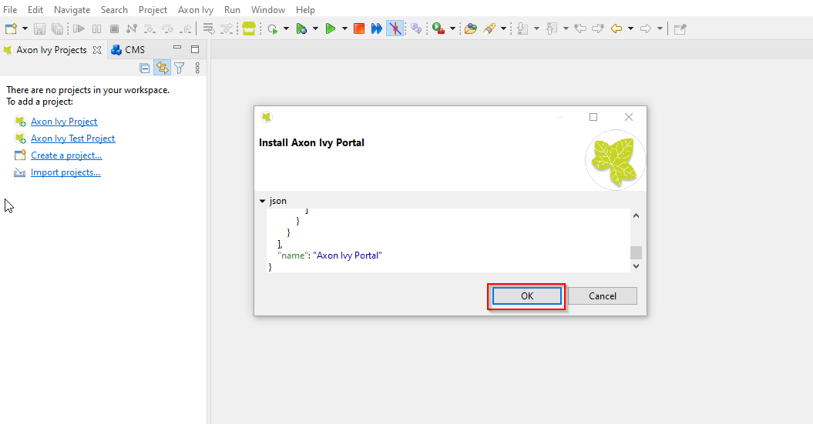
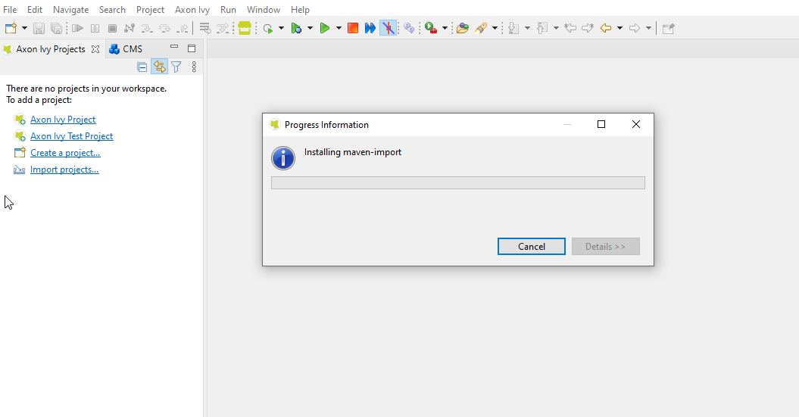
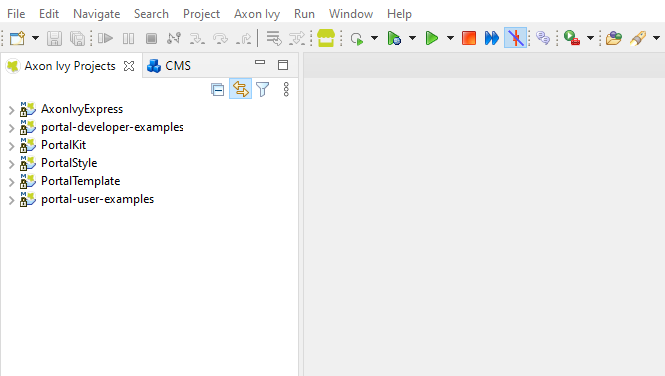
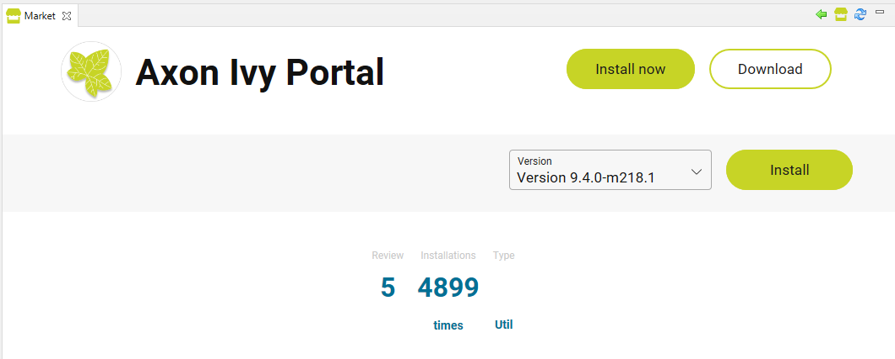

# Axon Ivy Portal
**Axon Ivy Portal** is the centerpiece for your daily work with the applications you / your company implemented using the **Axon Ivy Platform**. 
With a web-based, modern interface the Portal provides you with key functionalities on all your devices:

* Access your / your company’s applications and start new cases
* Manage and fulfil tasks assigned to you or your roles
* Understand what’s going on by using on-the-spot statistics and historic data on all your cases and tasks
* Improve your Axon Ivy Portal experience and efficiency through the built-in customization options

## Demo

To start your **Axon Ivy Portal** experience, use the link provided to you by your administrator.
Following the link, the **Axon Ivy Portal** will ask for your login credentials.

After successful login, you’ll see the **Axon Ivy Portal Homepage** and your personal dashboard.
All your activities can be managed from this central entry point.
In detail these are:

* The **Axon Ivy Portal header** on the top is always visible and provides you with a global search, key information about the Portal and options to configure your personal user account.
See **Portal Header** for details.

* The menu on the left side is always available and gives you access to all **processes**, **cases**, **tasks** and other features of the **Axon Ivy Portal**.
If the menu is minimised, you could hover to the menu to enlarge it.
You may enlarge permanently the menu by clicking on pin-icon icon in the top left corner.

* In the center you see **your personal dashboard** providing you instant access to **your processes**, **cases**, **tasks** and performance indicators.

## Setup

This section describes for first installation. We recommend reading the document detail in the **Portal guideline** in the section **Developer Guide » Installation**

### Project modules

The application consists of 4 process modules. For detailed information of each module, refer to **Portal Guide**.

* PortalStyle
* PortalKit
* PortalTemplate
* AxonIvyExpress

### Installation

Import Portal modules to Designer.
1. Open the **Designer**
2. On the Axon Ivy Project view
   - Click on the **Import projects...** link
   - On **Import** dialog, scroll down and select "Axon Ivy > Import Portal"
   - Click on the **Next** button
   
   

   - Wait a bit and a popup *Install Axon Ivy Portal* will show on, click on "OK" button
   
   
   
   - Wait for **Install progress** popup is closed
   
   
   
   - Finally, the result will look like here
   
   
   
Another way, you can open the **Axon Ivy Market** view and search the **Portal** then select download it to your workspaces.

### The default users for demonstration of Portal.

| Username | Description                                                               |
| -------- | ------------------------------------------------------------------------- |
| admin    | This user has all Portal permissions, can access to Portal Admin Settings |
| demo     | This user has permission to manage user absences                          |
| guest    | Default normal user of portal                                             |

### Hints

We recommend reading the document detail in the **Portal guideline** in the section **Developer Guide** to get more information about installation **Portal** to your workspaces.
