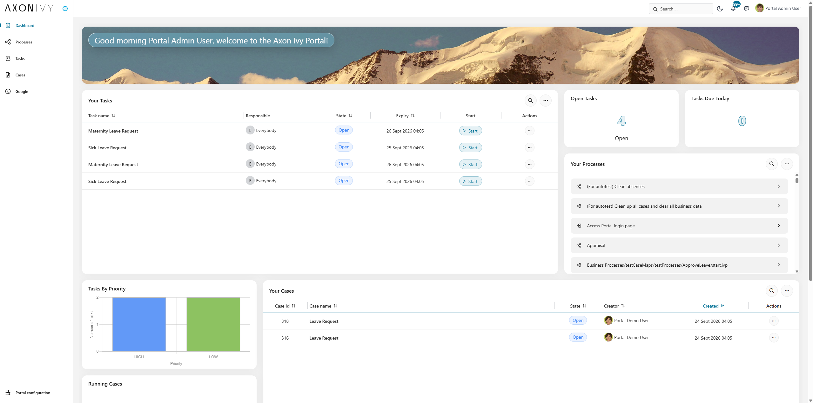
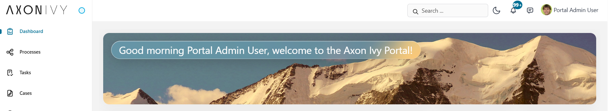

# Axon Ivy Portal
**Axon Ivy Portal** is your centralized entry point for working with business applications built on the **Axon Ivy Platform**.

Designed for both end users and business teams, the Portal streamlines your daily operations through an intuitive, web-based interface that runs seamlessly across desktop and mobile devices.

With the Portal, you can:

* **Start new business processes** quickly through the **Process List Widget** — launch workflows with just a few clicks.
* **Manage cases** through the **Case List Widget** — view, track, and follow up on all process instances you are involved in.
* **Work on your tasks** using the **Task List Widget** — easily view pending assignments, deadlines, and priorities.
* **Analyze your workload** via the **Statistics Widget** — monitor performance and uncover trends with charts and metrics.
* **Customize your workspace** — configure dashboards and widgets to fit your working style and preferences.

The **Axon Ivy Portal** is built with extensibility and customization in mind. From personalized dashboards to deep integration with your business logic, you can tailor the Portal to meet the needs of individuals, teams, and departments.

## Demo

### Axon Ivy Portal Dashboard
To start your **Axon Ivy Portal** experience, use the link provided to you by your administrator.
Following the link, the **Axon Ivy Portal** will ask for your login credentials.

After successful login, you'll see the **Axon Ivy Portal Homepage** and your personal dashboard.
All your activities can be managed from this central entry point.
In detail these are:

* The **Axon Ivy Portal header** on the top is always visible and provides you with a global search, key information about the Portal, and options to configure your personal user account.
See **Portal Header** for details.

* The **Sidebar** on the left side gives you access to the **Processes**, **Cases**, **Tasks**, and **Portal Configuration** pages.
Administrators can configure the sidebar to use one of three behaviours: **Hover**, **Click**, or **Stick**.
In the default **Hover** mode, the sidebar has two states:
  * **Minimized**: Hover over the sidebar to temporarily expand it.
  * **Pinned**: Click the pin icon in the top-left corner to keep the sidebar permanently expanded.

* The **main content area** in the center shows **your personal dashboard** with your **processes**, **cases**, **tasks**, and performance indicators.

### Sample dashboards
In **Axon Ivy Engine demo mode**, the Portal provides two sample dashboards in the sidebar:

* **User Guide Dashboard**: introduces the standard dashboard widgets (welcome, process, case, task, and statistic widgets) with short explanations for each of them.
See **Portal Guide > User Guide > Dashboard** for details.
* **KPI Procurement Overview**: demonstrates the Custom Statistics Widgets, which visualize KPIs of procurement processes in a fully customizable way.
See **Portal Guide > User Guide > Statistic Chart > Sample: KPI Procurement Overview** for details.

## Setup

This section describes the first installation. We recommend reading the document detail in the **Portal guideline** in the section **Developer Guide > Installation**

### Project modules

The application consists of 3 process modules. For detailed information on each module, refer to **Portal Guide**.

* portal-components
* portal
* AxonIvyExpress

### The default users

The default users for demonstration of Portal.

| Username | Description                                                                     |
| -------- | ------------------------------------------------------------------------------- |
| admin    | This user has all Portal permissions, which can access to Portal Admin Settings |
| demo     | This user has permission to manage user absences                                |
| guest    | Default standard user of the Portal                                             |

### Hints

We recommend reading the document detail in the **Portal guideline** in the section **Developer Guide** to get more information about installing **Portal** to your workspaces.
