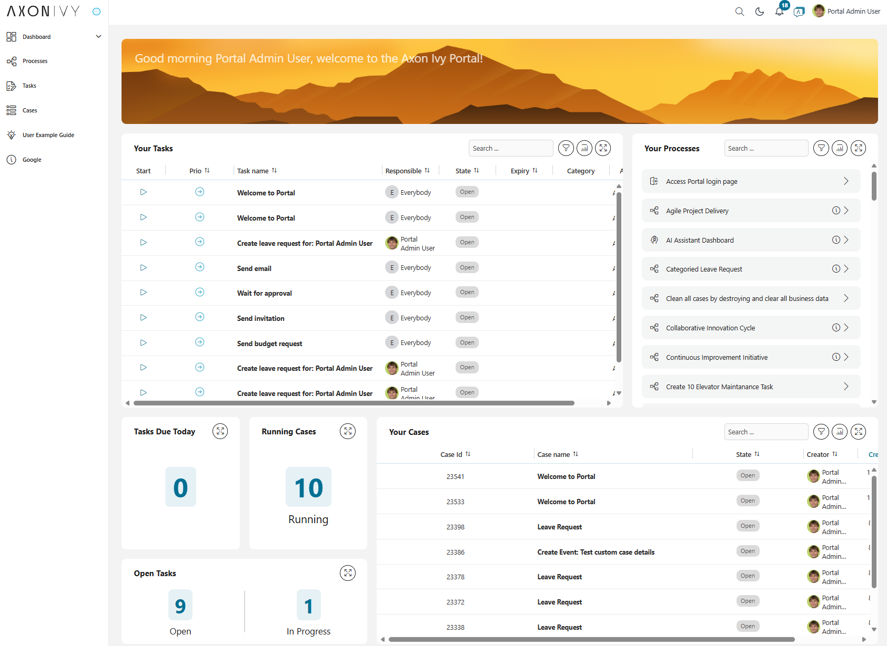
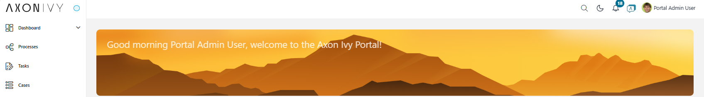
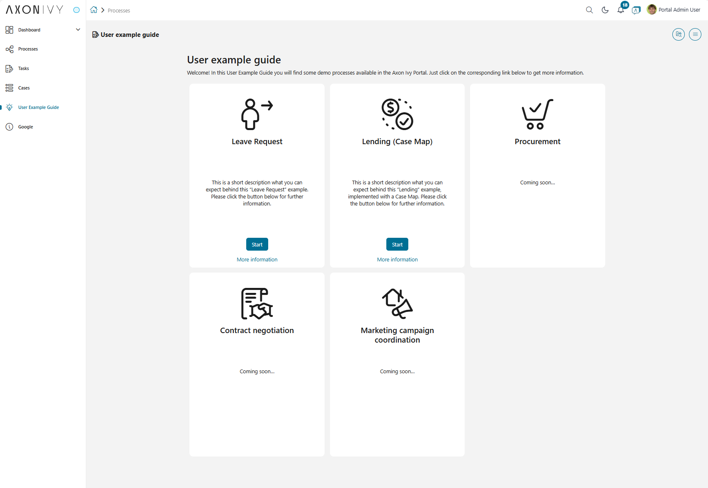

# Axon Ivy Portal
**Axon Ivy Portal** is the centerpiece for your daily work with the applications you / your company implemented using the **Axon Ivy Platform**. 
With a web-based, modern interface the Portal provides you with key functionalities on all your devices:

* Access your / your company's applications and start new cases
* Manage and fulfill tasks assigned to you or your roles
* Understand what is going on by using on-the-spot statistics and historic data on all your cases and tasks
* Improve your Axon Ivy Portal experience and efficiency through the built-in customization options

## Demo

### Axon Ivy Portal Dashboard
To start your **Axon Ivy Portal** experience, use the link provided to you by your administrator.
Following the link, the **Axon Ivy Portal** will ask for your login credentials.

After successful login, you'll see the **Axon Ivy Portal Homepage** and your personal dashboard.
All your activities can be managed from this central entry point.
In detail these are:

* The **Axon Ivy Portal header** on the top is always visible and provides you with a global search, key information about the Portal, and options to configure your personal user account.
See **Portal Header** for details.

* The menu on the left side is always available and gives you access to all **processes**, **cases**, **tasks**, and other features of the **Axon Ivy Portal**.
If the menu is minimized, you could hover to the menu to enlarge it.
You may enlarge permanently the menu by clicking on the pin-icon icon in the top left corner. In the center you see **your personal dashboard** providing you instant access to **your processes**, **cases**, **tasks**, and performance indicators.

### Welcome example
Now, start the **User example guide** process to find some demo processes available in the **Axon Ivy Portal**.
Just click on the corresponding link below to get more information.

## Setup

This section describes the first installation. We recommend reading the document detail in the **Portal guideline** in the section **Developer Guide > Installation**

### Project modules

The application consists of 3 process modules. For detailed information on each module, refer to **Portal Guide**.

* portal-components
* portal
* AxonIvyExpress

### The default users

The default users for demonstration of Portal.

| Username | Description                                                                     |
| -------- | ------------------------------------------------------------------------------- |
| admin    | This user has all Portal permissions, which can access to Portal Admin Settings |
| demo     | This user has permission to manage user absences                                |
| guest    | Default normal user of the Portal                                               |

### Hints

We recommend reading the document detail in the **Portal guideline** in the section **Developer Guide** to get more information about installation **Portal** to your workspaces.
