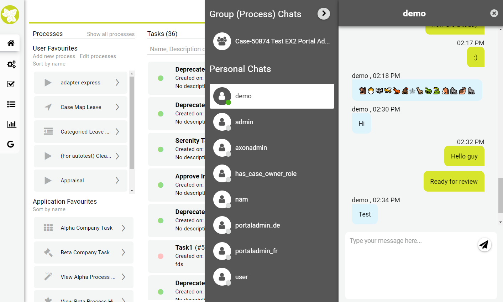
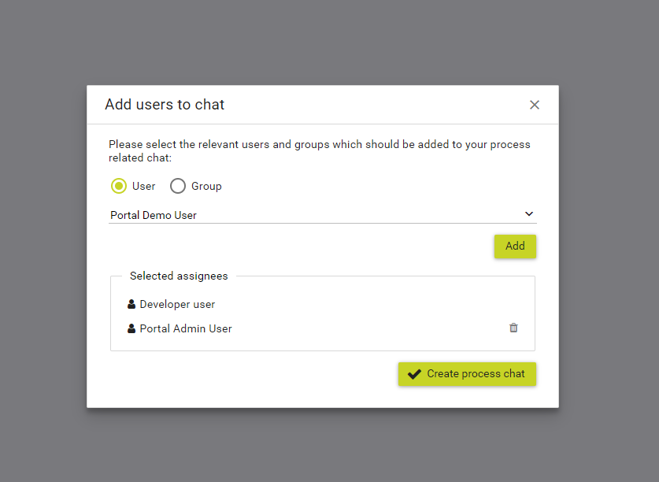
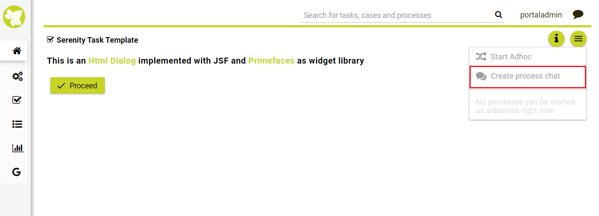

.. _components-portal-chat:

Portal chat
===========

.. _components-portal-chat-chat-feature:

Chat feature
------------

|chat|

.. _components-portal-chat-information:

Information
-----------

Chat feature is reimplemented from Ivy 7.4.

There are two modes of chat: Group chat and Private chat. Both features
are disabled by default.

1. You can turn on private chat with this Global setting:
   **ENABLE_PRIVATE_CHAT**.

2. You can turn on group chat with this Global setting:
   **ENABLE_GROUP_CHAT**.

3. If browsers access Portal through a reverse proxy Nginx, set Global
   setting **CHAT_RESPONSE_TIMEOUT** a number less than Nginx timeout to
   make chat work properly.

How to create a group chat
--------------------------

After turn on group chat feature, go to any task using Task Template, you will see the chat group icon there.

|create-new-group-chat|

Click on group chat icon, the dialog will appear to choose members of group chat. Members could be users or roles.

|chat-group-assignee|

.. tip:: Group chat supports some customizations, refer to
        	   :ref:`Group chat customization <customization-group-chat>` for
        	   more details.

.. _components-portal-chat-limitation:

Limitation of current Portal chat
---------------------------------

1. Do not support multiple tabs. For each browser, user is able to open
   1 Portal tab if he enables Portal chat.

2. Portal Chat does not support cross application chat. That means user is
   able to chat with other users in the current application, but he cannot chat
   with users in other application.

