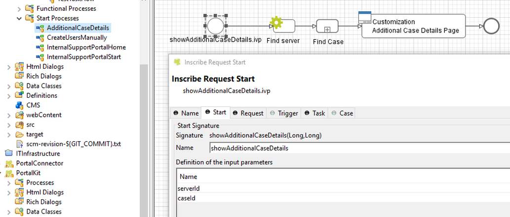

.. _customization-additionalcasedetailspage:

Additional case details page
============================

.. _customization-additionalcasedetailspage.introduction:

Introduction
------------

The additional case details page shows all custom fields of a case by
clicking on "Show business details" link in case details.

You can customize this page for each case by providing a relative URL to
case.

.. _customization-additionalcasedetailspage.customization:

Customization
-------------

1. Create a new additional case details UI and a start process which
   will display the new UI.

   |customization-additional-case-details-page|

2. Store the URL of start process in
   "CUSTOMIZATION_ADDITIONAL_CASE_DETAILS_PAGE" custom fields of case. You
   could use ``SetAdditonalCaseDetailPage.mod`` callable process, and input the
   friendly URL of process as parameter.

   |set-additonal-case-detail-page-callable-process|

   .. tip:: If you want to redirect user to external link, simply store that
      external link to "CUSTOMIZATION_ADDITIONAL_CASE_DETAILS_PAGE"
      custom fields of case.

   For example: redirect user to Google search.

   .. code-block:: java

      ivy.case.customFields().textField(AdditionalProperty.CUSTOMIZATION_ADDITIONAL_CASE_DETAILS_PAGE.toString()).set(https://www.google.com/);

   ..

.. |set-additonal-case-detail-page-callable-process| image:: images/additional-case-details-page/set-additonal-case-detail-page-callable-process.png
