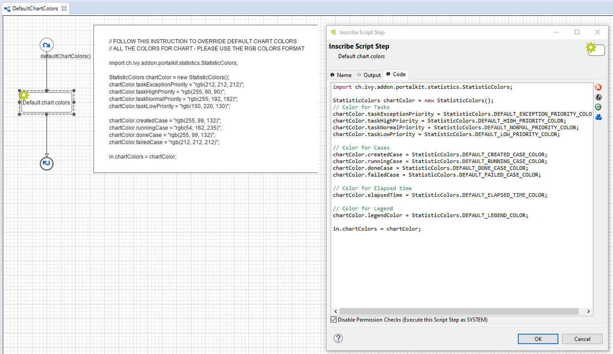

.. _customization-default-chart-colors:

Default chart color
*******************

.. _customization-default-chart-colors-introduction:

Introduction
------------

In Portal, statistic color is set by ``DefaultCharColor`` sub process. But you can create your default chart color.

.. _override-Statistic-colors:

Customization
-------------

Create an override which overrides sub process ``DefaultChartColors`` in PortalKit. This sub process return a list of default chart colors. Follow instruction to create chart color.

|default-chart-color|

Portal introduces **StatisticColors** object. We use it to build **DataSet** color, also provide some default constant, you can refer.

.. code-block:: java

  // Color for Legend and DataSet label
  private String legendColor = DEFAULT_LEGEND_COLOR;

  // For Tasks
  private String taskExceptionPriority = DEFAULT_EXCEPTION_PRIORITY_COLOR;
  private String taskHighPriority = DEFAULT_HIGH_PRIORITY_COLOR;
  private String taskNormalPriority = DEFAULT_NORMAL_PRIORITY_COLOR;
  private String taskLowPriority = DEFAULT_LOW_PRIORITY_COLOR;

  // For Cases
  private String createdCase = DEFAULT_CREATED_CASE_COLOR;
  private String runningCase = DEFAULT_RUNNING_CASE_COLOR;
  private String doneCase = DEFAULT_DONE_CASE_COLOR;
  private String failedCase = DEFAULT_FAILED_CASE_COLOR;

  // For Elapse time
  private String elapsedTime = DEFAULT_ELAPSED_TIME_COLOR;

  // For Task's expire
  private String taskExpiriedColor = DEFAULT_TASK_EXPIRIED_COLOR;
  private String taskExpiriedTodayColor = DEFAULT_TASK_TODAY_COLOR;
  private String taskExpiriedThisWeekColor = DEFAULT_TASK_WEEK_COLOR;
  private String taskExpiriedThisMonthColor = DEFAULT_TASK_MONTH_COLOR;
  private String taskExpiriedThisYearColor = DEFAULT_TASK_YEAR_COLOR;

  // For Task's expire in day
  private String taskExpiriedTodayBefore8Color = DEFAULT_TASK_TODAY_COLOR;
  private String taskExpiriedToday8Color = DEFAULT_TASK_TODAY_COLOR;
  private String taskExpiriedToday9Color = DEFAULT_TASK_TODAY_COLOR;
  private String taskExpiriedToday10Color = DEFAULT_TASK_TODAY_COLOR;
  private String taskExpiriedToday11Color = DEFAULT_TASK_TODAY_COLOR;
  private String taskExpiriedToday12Color = DEFAULT_TASK_TODAY_COLOR;
  private String taskExpiriedToday13Color = DEFAULT_TASK_TODAY_COLOR;
  private String taskExpiriedToday14Color = DEFAULT_TASK_TODAY_COLOR;
  private String taskExpiriedToday15Color = DEFAULT_TASK_TODAY_COLOR;
  private String taskExpiriedToday16Color = DEFAULT_TASK_TODAY_COLOR;
  private String taskExpiriedToday17Color = DEFAULT_TASK_TODAY_COLOR;
  private String taskExpiriedTodayAfter18Color = DEFAULT_TASK_TODAY_COLOR;

  // For Task's expire in week
  private String taskExpiriedMonColor = DEFAULT_TASK_WEEK_COLOR;
  private String taskExpiriedTueColor = DEFAULT_TASK_WEEK_COLOR;
  private String taskExpiriedWedColor = DEFAULT_TASK_WEEK_COLOR;
  private String taskExpiriedThuColor = DEFAULT_TASK_WEEK_COLOR;
  private String taskExpiriedFriColor = DEFAULT_TASK_WEEK_COLOR;
  private String taskExpiriedSatColor = DEFAULT_TASK_WEEK_COLOR;
  private String taskExpiriedSunColor = DEFAULT_TASK_WEEK_COLOR;

  // For Task's expire in month
  private String taskExpiriedFirstWeekColor = DEFAULT_TASK_MONTH_COLOR;
  private String taskExpiriedSecondWeekColor = DEFAULT_TASK_MONTH_COLOR;
  private String taskExpiriedThirdWeekColor = DEFAULT_TASK_MONTH_COLOR;
  private String taskExpiriedFourthWeekColor = DEFAULT_TASK_MONTH_COLOR;
  private String taskExpiriedFifthWeekColor = DEFAULT_TASK_MONTH_COLOR;

  // For Task's expire in year
  private String taskExpiriedJanColor = DEFAULT_TASK_YEAR_COLOR;
  private String taskExpiriedFebColor = DEFAULT_TASK_YEAR_COLOR;
  private String taskExpiriedMarColor = DEFAULT_TASK_YEAR_COLOR;
  private String taskExpiriedAprColor = DEFAULT_TASK_YEAR_COLOR;
  private String taskExpiriedMayColor = DEFAULT_TASK_YEAR_COLOR;
  private String taskExpiriedJuneColor = DEFAULT_TASK_YEAR_COLOR;
  private String taskExpiriedJulyColor = DEFAULT_TASK_YEAR_COLOR;
  private String taskExpiriedAugColor = DEFAULT_TASK_YEAR_COLOR;
  private String taskExpiriedSeptColor = DEFAULT_TASK_YEAR_COLOR;
  private String taskExpiriedOctColor = DEFAULT_TASK_YEAR_COLOR;
  private String taskExpiriedNovColor = DEFAULT_TASK_YEAR_COLOR;
  private String taskExpiriedDecColor = DEFAULT_TASK_YEAR_COLOR;

..

In Portal home, you can override color of Statistic Carousel header by re-define value of below variables in ``customization.scss``:

 - ``$statisticPanelHeader`` to override background color of Carousel header
 - ``$statisticPanelHeaderBorder`` to override border color of Carousel header
 - ``$statisticPanelHeaderText`` to override text color of Carousel header

