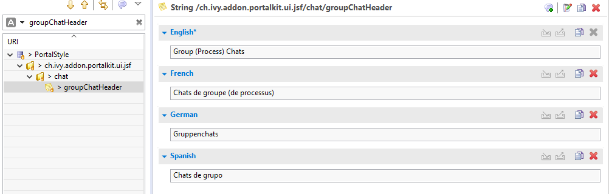
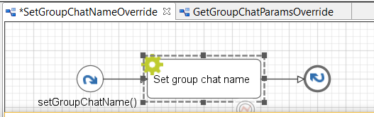
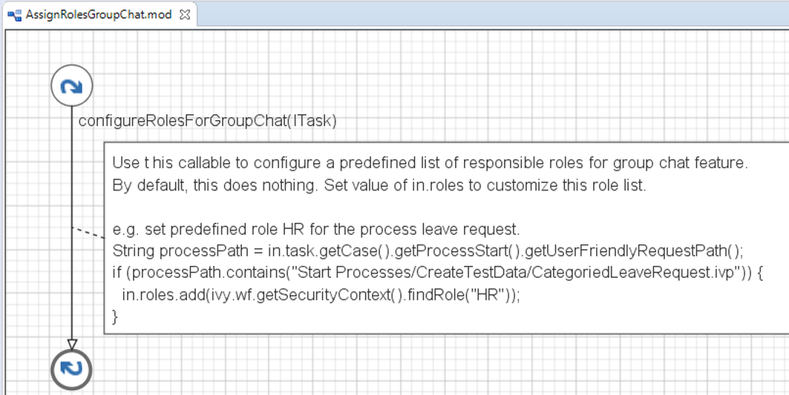

.. _customization-group-chat:

Group chat customization
========================

.. _customization-group-chat-introduction:

Introduction
------------

Group chat feature supports us to customize Group chat header, Group
chat name, Confirgured role list for each process.

.. _customization-group-chat-customize-group-chat-header:

Customize group chat header
---------------------------

Override group chat title/header via ``groupChatHeader`` CMS entry.

|customize-group-chat-header|

.. _customization-group-chat-customize-group-chat-name:

Customize group chat name
-------------------------

1. Introduce an Axon.ivy project which has ``PortalTemplate`` as a
   required library.

2. Override ``SetGroupChatName`` process to customize group chat name,
   follow its note to change group chat name.

   |customize-group-chat-name|

   Open ``Set group chat name`` script and change the name variable to *your group chat name*, for example:

   .. code-block:: java

        out.name = ivy.cms.co("/ch.ivy.addon.portalkit.ui.jsf/common/case") + "-{caseId} {caseName}" + " {groupChatCreator}";
   ..

3. If you have parameters which are not available in GroupChat.java,
   override ``GetGroupChatParams`` callable process and follow its note.

   |customize-group-chat-name-params|

   Open ``Set param`` script and add your parameters to the params variable, for example:
   
   .. code-block:: java
   
        out.params.put("groupChatCreator", ivy.session.getSessionUser().getDisplayName());
   ..

.. _customization-group-chat-customize-predefined-roles:

Customize predefined responsible roles
--------------------------------------

Override ``AssignRolesGroupChat`` process to customize predefined
responsible roles, follow its note to configure.

|customize-predefined-roles|

.. |customize-group-chat-name-params| image:: images/group-chat/customize-group-chat-name-params.png

