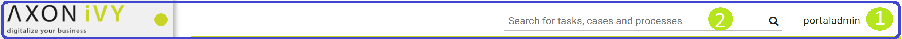
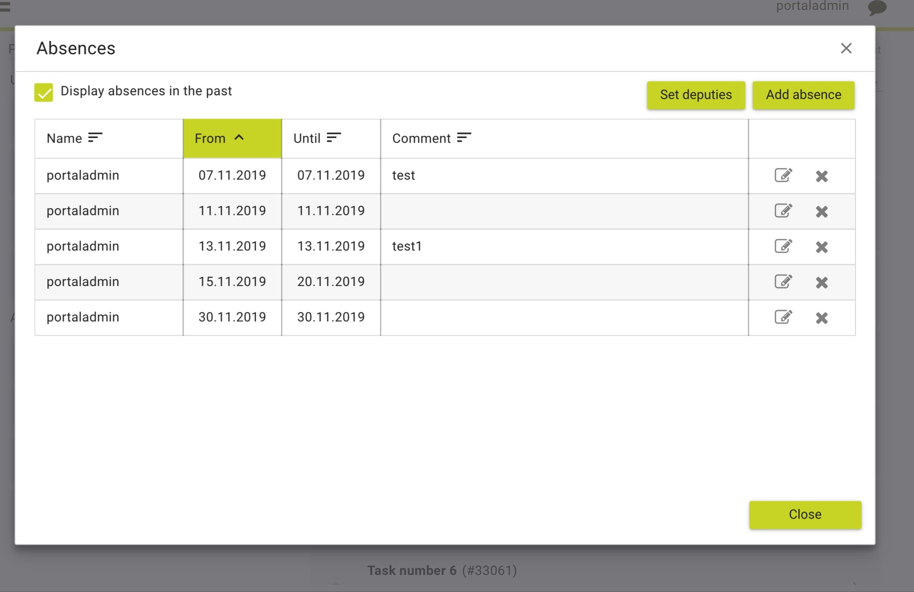
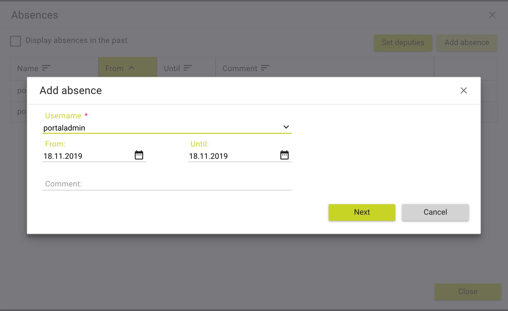
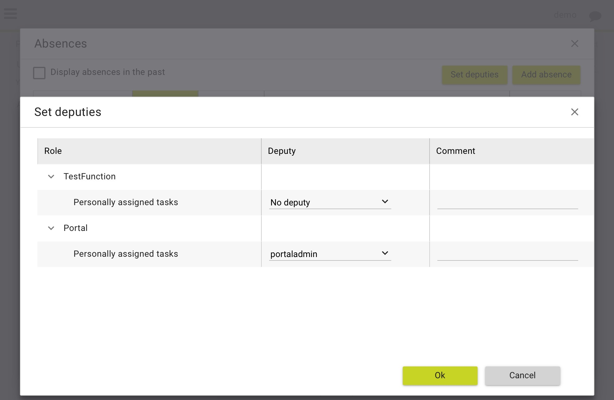
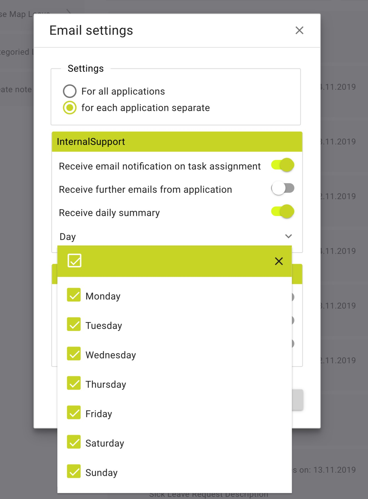
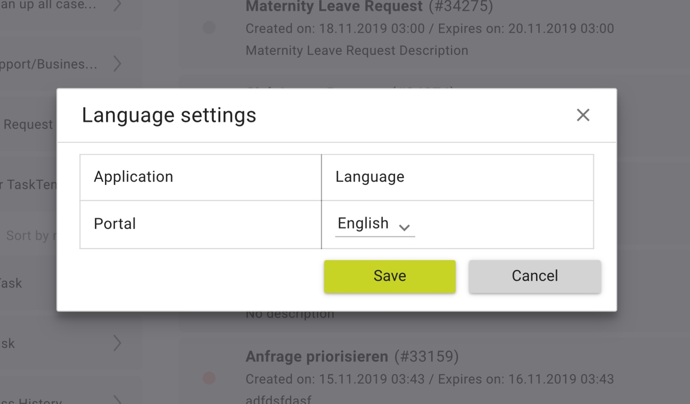
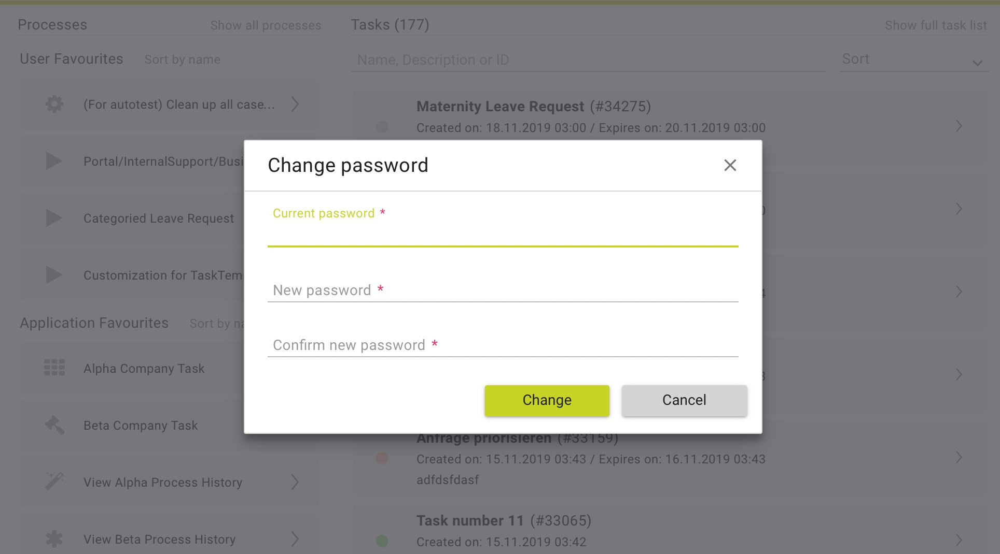
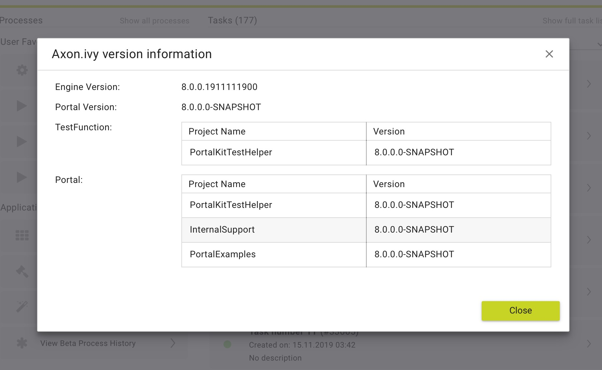
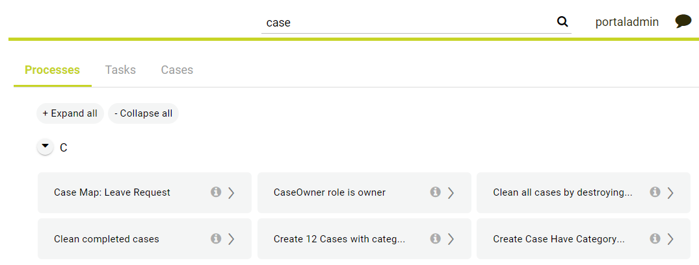

.. _portal-header:

Portal Header
*************

The Axon.ivy Portal header is always visible. On the top right of the
header you find two very useful features:

1. The name of the user you’re logged in with. Additionally, if you
   click on your username you get a menu with options that allow you to
   configure the Axon.ivy Portal to your personal needs. See `User Settings in
   the Axon.ivy Portal`_ for a detailed overview of the configuration options.

2. Next to your username is a |search-icon| **Search Bar** providing you
   with a portal-wide search. This feature is described in detail in 
   `Global Search`_.

User Settings in the Axon.ivy Portal
------------------------------------

When you click on your username in the top right of the Axon.ivy Portal,
a menu is shown allowing you to configure the portal to your personal
needs. These features are described in the following sections below.

Absences
--------

The menu entry **Absences** provides you with an absence management
component. Here you can enter your absences and define delegates for
tasks assigned to you or one of the roles you hold.

.. hint::
   Although you can specify         
   delegates for a role you hold, we recommend specifying only delegates for tasks
   assigned personally to you. Roles are normally held by a group of users, so if
   you’re absent one of your role members is still able to pick up the task.

The dialog shows you all current and upcoming absences. You may show also past
absences by activating the option **Show absences in the past**. Furthermore,
you can edit or delete absences by using the |edit-icon| **Edit** or |delete-icon|
**Delete** action in the row of the respective absence.

HowTo: Add absence
^^^^^^^^^^^^^^^^^^

1. Click on the button **Add absence**

2. The :guilabel:`Add absence` dialog is opened

3. Enter a start date

4. Enter an end date

5. You may provide an explanatory comment

6. Confirm your absence with the button **Next**

7. You are forwarded to the :guilabel:`Set deputies`  dialog (see `HowTo:
   Set deputies`_).

HowTo: Set deputies
^^^^^^^^^^^^^^^^^^^

1. Click on the button **Set deputies**. Alternatively, you’re forwarded
   to this dialog after you added an absence.

2. The :guilabel:`Set deputies` dialog is opened.

3. You see a list with an entry for your personal tasks and for each
   role you hold.

4. Specify a deputy by selecting him from the list.

5. You may add a comment

6. Confirm your deputies with the button **OK**.

Email settings
--------------

The menu entry **Email settings** allows you to configure your
preferences related to standard email notifications send by the Axon.ivy
Engine.

.. hint:: 
   If configured by your company’s application, you might also be able to configure application specific email notifications.   
..

The :guilabel:`Email settings` dialog provides you with the following configuration options:

1. The option **For all applications** allows you to use one
   configuration for all applications. It is important to note, that in the
   background these settings will be applied to all available applications.

2. The option **For each application** separate allows you to provide
   individual settings for each available application.

3. The option **Email notification on task assignment** allows you to
   specify if you want to receive an instant notification when a task is
   assigned to you or one of the roles you hold.

4. The setting **Daily summary at** allows you to specify the weekdays
   when you receive a summary of all tasks assigned to you or one of
   your roles.

5. The option **Further emails from application** allows you to activate
   / deactivate further email notifications.

Language Settings
-----------------

The menu entry **Language settings** allows you to specify your
preferred application language. The setting will affect all Axon.ivy
Portal pages and – if supported – your companies applications pages as
well. The following languages are currently supported in the Axon.ivy
Portal:

-  English

-  German

-  French

-  Spanish

.. hint:: 
   Your application needs to support
   the same language as the one     
   selected in this menu. Otherwise 
   the application specific content 
   will be shown in the standard    
   language of the application. E.g.
   if your application only supports
   English, but you select Spanish  
   as the portal language, your     
   application specific dialogs will
   still be shown in English.       

Change Password
---------------

The menu entry **Change password** allows you to set a new password.

Info
----

The menu entry **Info** provides you with detailed information about the
Axon.ivy Engine, the Axon.ivy Portal and your companies application. You
might be asked for this information in case you issue a support request.

Logout
------

The menu entry **Logout** will terminate your session in the Axon.ivy
Portal. You’ll be routed back to the login page of the Axon.ivy
Portal.

.. hint:: 
   The Axon.ivy Portal will also do
   an automatic logout if you’re   
   inactive for a certain amount of
   time.                           
   
Global Search
-------------

The Global Search is a convenient tool for you to look up
information in the whole Axon.ivy Portal. You may search for any
keyword. By default, the Axon.ivy Portal will search for:

1. Processes

2. Cases

3. Tasks

When you confirm the keyword you’re looking for, the Axon.ivy Portal
will route you to the :guilabel:`Global Search Results` page. For each category
a tab is provided, giving you the results of your search.

.. hint:: 
   Your company’s application may   
   provide further search           
   capabilities which are integrated
   in the Axon.ivy Portal Global    
   Search. You’d find the results on
   the result page accordingly.     
   Contact your administrator for   
   more information.                

.. include:: ../includes/_common-icon.rst  