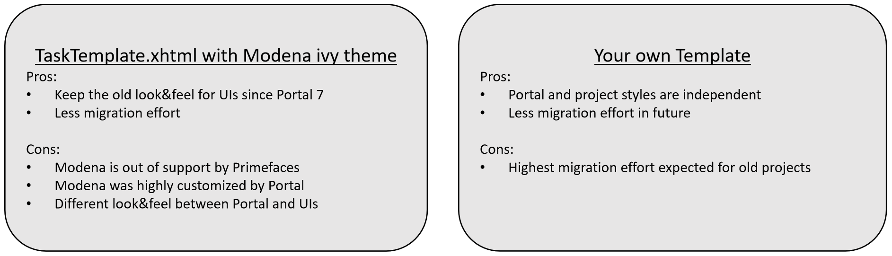

.. _iframe:

IFrame in Portal
****************

Since Portal 8, we introduce new feature that a process/task could be started inside IFrame. It helps separate Portal styles
and your project's style in order to reduce migration effort.

.. _configuration:

How to configure
================

There are 3 levels:

- Task level: in Task custom fields, set the ``embedInFrame`` String field to

	- ``true``: start inside IFrame
	- ``false``: not start inside IFrame
	- ``not set``: check case level

- Case level: in Case custom fields, set the ``embedInFrame`` String field to 

	- ``true``: start inside IFrame 
	- ``false``: not start inside IFrame 
	- ``not set``: check application level

- Application level:

	- Portal Administrator could register an application and choose the option that all of the tasks in this application are started inside IFrame

.. important::
	If there is no configuration, a process/task is started inside IFrame as default.

.. _usage:

How to use
==========

Follow the steps:

1. Configure as the above instruction to start your task inside IFrame
 
2. In your task, open a HTML User Dialog independent from Portal:

	- use your own template to separate your css styles from Portal
	- Or use the :ref:`TaskTemplate <components-layout-templates-task-template>` template
	
	|iframe-template|
	
