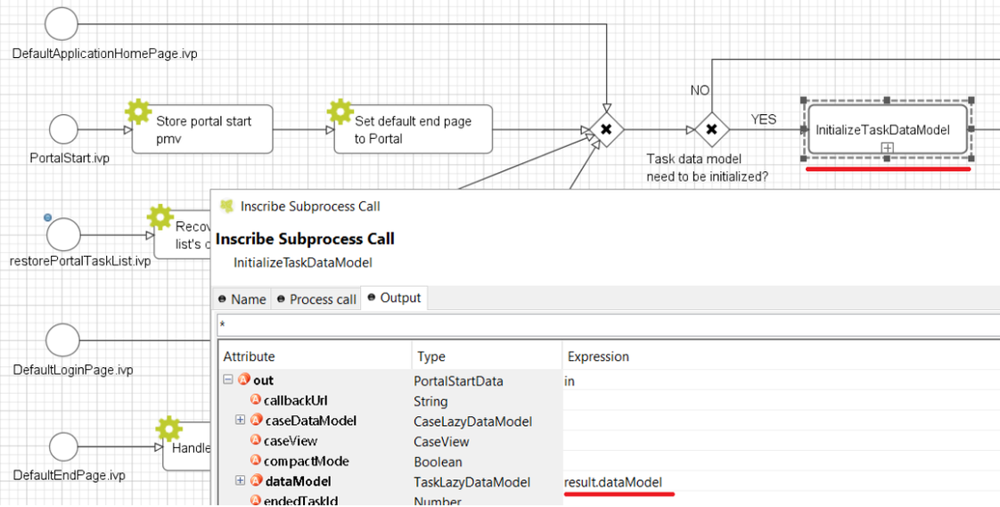

.. _installation:

Installation
************

Installation section describes all steps, that are necessary for install and setup Portal.
If you install your application first time then it’s important to start with Basic installation. It describes all initial steps that must be done for first installation.
If application is already installed and initial prepared, refer
to `Migration notes`_ to migrate it.

Basic installation
==================

Project modules
---------------

The application consists of 4 process modules. For detailed information
of each module, refer to :ref:`architecture` .

-  PortalStyle

-  PortalKit

-  PortalTemplate

-  AxonIvyExpress

The project deployment of Ivy project are described in `project
deployment <http://developer.axonivy.com/doc/latest/EngineGuideHtml/administration.html#administration-deployment>`__
.

.. _installation-basic-portal-mode:

Portal mode
-----------

-  **Single application mode**  : One Portal application on one engine. It must include PortalKit,
   PortalTemplate and PortalStyle modules.

-  **Multi applications mode** : Multiple Portal applications on one engine.
   Each Portal application must include PortalKit, PortalTemplate and PortalStyle modules.

.. important::
   In multi applications mode, if you need overall dashboard, create
   an application named **Portal** with the Portal modules.

Installation
------------

Designer
^^^^^^^^

Import Portal modules to Designer.

.. important:: Designer only supports single application mode.

Engine without license (demo mode)
^^^^^^^^^^^^^^^^^^^^^^^^^^^^^^^^^^

The engine automatically deploys the Portal application with default users. You do
not need to deploy anything (Single application mode).

.. table:: 

   +-----------------------+-----------------------+-----------------------+
   | Username              | Password              | Description           |
   +=======================+=======================+=======================+
   | admin                 | admin                 | This user has all     |
   |                       |                       | Portal permissions,   |
   |                       |                       | can access to Portal  |
   |                       |                       | Admin Settings.       |
   +-----------------------+-----------------------+-----------------------+
   | demo                  | demo                  | This user has         |
   |                       |                       | permission to manage  |
   |                       |                       | user absences.        |
   +-----------------------+-----------------------+-----------------------+
   | guest                 | guest                 | Default normal user   |
   |                       |                       | of portal.            |
   +-----------------------+-----------------------+-----------------------+

Engine with license (production mode)
^^^^^^^^^^^^^^^^^^^^^^^^^^^^^^^^^^^^^

The engine does not deploy anything, you need to deploy and configure Portal application 
manually.

Single application mode
"""""""""""""""""""""""

Create an application and deploy Portal modules.

.. important::

   Only one active application contains Portal modules.

Multi applications mode
"""""""""""""""""""""""

Refer :ref:`settings-admin-settings-setup-multi-portals`.

.. _installation-migration-notes:

Migration notes
===============

This document informs you in detail about incompatibilities that were
introduced between Portal versions and tells you what needs to be done
to make your existing Portal working with current Axon.ivy engine.

How to migrate
--------------
   
.. important:: 
   If you call any Portal API which is not mentioned in the document. It could be changed or removed without inform. Don't forget
   to re-implement the concerning API in your own project.

   In order to migrate Portal, you need to migrate Axon.ivy, refer
   `Axon.ivy migration
   notes <https://developer.axonivy.com/doc/latest/MigrationNotes.html>`__.
   Changes in Axon.ivy could lead to problems if customer project is not
   migrated properly.

In designer
-----------

1. Replace all Portal projects
2. Update PortalTemplate dependency of customer project in pom.xml.
3. If PortalStyle is customized, copy logo, customization.scss,
   font-faces.scss, customized stuff from old to new PortalStyle, run
   maven to compile CSS.
4. Follow detailed migration notes for each version below.
5. If customization needs copying code from Portal, merge changes
   between two versions of Portal for copied code.

..

In engine
---------

1. Convert database schema if needed.
2. If your ivy version is before 7.3.0 : deactivate standard Portal
   application if it's not needed.
3. Redeploy Portal projects (exclude PortalConnector) and customer
   project.
4. Follow detailed migration notes for each version below.

.. _installation-migration-notes-8-0-0:

Migrate from 7.x to 8.0.0
-------------------------

Please following these migration guides.

.. toctree::
   :maxdepth: 2

   migration-notes/8-0-0/installation-migration-notes-8-0-0-less-to-sass
   migration-notes/8-0-0/installation-migration-notes-8-0-0-migrate-font-family
   migration-notes/8-0-0/installation-migration-notes-8-0-0-migrate-templates
   migration-notes/8-0-0/installation-migration-notes-8-0-0-task-body
   migration-notes/8-0-0/installation-migration-notes-8-0-0-case-body

Migrate to 7.4.0
----------------

From 7.4.0, CaseTemplate is deprecated and we don't support it anymore.
If you are using CaseTemplate, please do consider to migrate to
TaskTemplate manually.

Migrate to 7.3.0
----------------

From 7.3.0, Portal supports some permissions to show/hide left menu
item, if you override ``LoadSubMenuItems`` process and want to use these
permissions, refer to
:ref:`Customization Menu <customization-menu-customization>`
for more detail.

There is a small change when initializing statistic chart, so if you
override ``DefaultChart.mod``, take a look at its note to see what is
changed.

Portal connector is removed, so there are many things related to it must
be adjusted. Check list below

-  All ``Remote*`` classes are removed, replaced by the Ivy classes: ICase, ITask,
   IUser, IApplication, etc..
-  Use ``BuildTaskQuery`` and ``BuildCaseQuery`` callable process instead of
   ``BuildTaskJsonQuery``  and  ``BuildCaseJsonQuery``  .
-  If you override TaskLazyDataModel, remove
   ``extendSortTasksInNotDisplayedTaskMap`` method. Use ``criteria`` field instead of
   ``queryCriteria`` or ``searchCriteria``, use ``adminQuery`` field instead of
   ``ignoreInvolvedUser`` .
-  If you override CaseLazyDataModel: remove
   ``extendSortCasesInNotDisplayedTaskMap`` method. Use ``criteria`` field instead of
   ``queryCriteria`` or ``searchCriteria``, use ``adminQuery`` field instead of
   ``ignoreInvolvedUser`` .
-  If you override ChangePassword.mod: change process call from
   ``MultiPortal/PasswordService:changePasswordService(String,String)``  to  ``Ivy Data
   Processes/PasswordService:changePassword(String,String)``  .

Migrate hidden task and case to 7.3.0
-------------------------------------

Portal 7.0.10 has the option to store hidden information in custom field of
task and case instead of additional property to improve performance.
Other versions of Portal store these info in additional property.

If you use hide task/case feature, you need to follow these steps:

1. Deploy this project :download:`MigrateHiddenTaskCase.iar <documents/MigrateHiddenTaskCase.iar>` 
   to all your portal applications.
2. In each application, run start process
   ``MigrateHiddenTaskCase``  to migrate.
3. It's optional to clean up redundant data. After migration finishes
   successfully, run start process  ``RemoveHideAdditionalProperty``  in each
   application to clean up HIDE additional property. It will delete HIDE
   additional property of all tasks and cases in current application, so be
   careful with it.

Migrate 7.1.0 to 7.2.0
----------------------

Portal needs `Apache POI <https://poi.apache.org>`__ for exporting to
Excel features.

If you override task widget's data query described at
:ref:`How to override task widget's data query <customization-task-widget-how-to-override-data-query>`,
follow these steps to migrate

-  Add new start method with signature
   ``buildTaskJsonQuery(Boolean)``  in your overridden file of BuildTaskJsonQuery.mod
   (refer to original file BuildTaskJsonQuery.mod).
-  If you customized
   ``TaskLazyDataModel,``  change  ``withStartSignature("buildTaskJsonQuery()``  to
   ``withStartSignature("buildTaskJsonQuery(Boolean)").withParam("isQueryForHomePage",
   compactMode)``  in your customized  ``TaskLazyDataModel``  class.

There are some changes (DefaultApplicationHomePage, DefaultLoginPage,
GlobalSearch) in PortalStart process of Portal Template. If you have
customized this process in your project, copy the new PortalStart from
Portal Template to your project and re-apply your customization.

   .. important::
      In case you already have PortalStart process in your project, delete
      all elements in that process and copy everything from PortalStart
      process of Portal Template (to prevent start link id change).
      
      Check map param result of callable process after copy to make sure
      it's the same as original process.
      |copy-start-process|

EXPIRY_CHART_LAST_DRILLDOWN_LEVEL global variable is removed. User now
can use a context menu to drilldown Task By Expiry chart.

Migrate 7.0.3 to 7.0.5 (or 7.1.0)
---------------------------------

There are some changes in PortalStart process of Portal Template. If you
have customized this process in your project, copy the new PortalStart
from Portal Template to your project and re-apply your customization.

We introduce new method
``findStartableLinkByUserFriendlyRequestPath(String requestPath)`` in
``ProcessStartCollector`` class. If your project has customized
:ref:`Default user process <customization-default-user-process>`,
use this method to generate link to your process. If user doesn't have
permission to start the process, this method will return empty string.

   .. important::
      In case you already have PortalStart process in your project, delete
      all elements in that process and copy everything from PortalStart
      process of Portal Template (to prevent start link id change).

      Check map param result of callable process after copy to make sure
      it's the same as original process.

      |copy-start-process|

Migrate 7.0.2 to 7.0.3
----------------------

If you have additional columns in your customized task widget, refer 
:ref:`Task widget  <customization-task-widget-how-to-overide-ui-task-header>`  to adapt your
customization in ``taskHeader`` section.

Migrate 7.0.1 to 7.0.2
----------------------

In PortalStyle\pom.xml, update project-build-plugin version to
``7.1.0``\ and run maven to compile CSS.

If changing password is customized, change method call
``PasswordService.mod#changePassword(String,String)`` to
``PasswordService.mod#changePasswordService(String, String)`` in this
customization.

Custom fields in Portal task list can now be sorted properly. The method
``extendSort()`` of ``TaskLazyDataModel`` is changed to have a
``taskQuery`` parameter. If you override this method, change your code
to use the new parameter instead of using the ``criteria`` taskQuery.

Portal does not have separate full task list in the homepage anymore.
It's mean that you don't have to customize the task list in
``/layouts/DefaultHomePageTemplate.xhtml``. You can remove your task
list customization code in ``PortalHome.xhtml``.

If you have added new language to Portal by adding cms entry
``/AppInfo/SupportedLanguages`` in your project. Move this entry to
Portal Style.

Migrate 7.0.0 to 7.0.1
----------------------

**Ajax error handling**: By default, Portal handles all exceptions from
ajax requests. Old configuration, customization of ajax error handling
should be removed.

Migrate 6.x to 7.0.0
--------------------

If you copy the ``PortalStart`` process or the ``PortalHome`` HTMLDialog
for customizations, adapt the changes:

-  The whole process is refactored to be clearer. So it is recommended
   that you copy it again.

-  New process is introduced: restorePortalTaskList.ivp

-  PortalStart: some new ivy scripts are added to handle the navigation
   back to the same page before starting a task.

-  PortalHome: The ``taskView`` parameter is added to the start method.

SQL conversion
^^^^^^^^^^^^^^

From Portal ``7.0`` , we use standard axon.ivy Task Category field to
store task category.

To migrate task categories, deploy
:download:`MigrateTaskCategorySample.iar <documents/MigrateTaskCategorySample.iar>`
to your application and run ``Migrate Task Category`` process to:

1. Migrate data from column ``customVarCharField5`` to ``category`` for
   all tasks in the application.

2. Delete leftover data in ``customVarCharField5`` of all tasks in the
   application.

3. Create CMS entries for task categories in the application.

If you have queries which referring to task category, plese replace
``customVarCharField5()`` part with ``category()`` part.

Migrate 6.4 or 6.5 to 6.6
-------------------------

-  Task header is supported to be customized. The
   ``useOverride``  param, which is used to override the task item's body, is changed
   to  ``useOverrideBody`` 
-  If you customize  ``TaskLazyDataModel`` , remove this customized class and customize as
   :ref:`How to override task widget's data query. <customization-task-widget-how-to-override-data-query>` . 

Migrate 6.4 to 6.5
------------------

-  If compilation error "The type org.apache.axis2.databinding.ADBBean
   cannot be resolved" occurs, use  `Project compilation classpath <https://developer.axonivy.com/doc/latest/doc/migrationNotes/MigrationNotesDesigner7.0.html#projectClasspath>`_  to fix.
-  The relative link in default user processes starts with ivy context
   path instead of "pro". If there are customized default user proceses, append
   context path at the beginning. E.g. in Portal  ``6.4`` , it is
   /pro/.../PortalStart.ivp. In Portal  ``6.5`` , change it to
   /ivy/pro/.../PortalStart.ivp. You may use :  ``ivy.html.startref(...)``  or
   ``RequestUriFactory.createProcessStartUri(...)``  to generate links.

Migrate 6.x (x < 4) to 6.4 (Jakobshorn)
---------------------------------------

Portal appearance
^^^^^^^^^^^^^^^^^

Portal ``6.4`` are redesigned. Therefore many components look different
from the previous version like menu, task list, case list ... . Portal
``BasicTemplate`` does not use ``p:layout`` and ``p:layoutUnit``
anymore. You may need to adapt your pages to this change.

For now the menu customization is not supported.

From ``6.4`` , Portal applies `LESS <http://lesscss.org/>`__ to support
customizing Portal styles. You can customize colors, fonts and Portal's
component styles. For more information about customizing Portal's style
with LESS, refer to
:ref:`PortalStyle customization (logos, colors, date patterns) <customization-portal-logos-and-colors>`
.

Steps to migrate

1. Copy PortalStyle/webContent/resources of Portal ``6.4`` to
   PortalStyle/webContent/resources of the current Portal.

2. Modify PortalStyle/webContent/resources/less/theme.less, update value
   of @body-background-color for the background color and @menu-color
   for the menu and primary button color.

3. Put custom styles to
   PortalStyle/webContent/resources/less/customization.less.

4. Add properties and plugins which are defined in PortalStyle/pom.xml
   of Portal ``6.4`` to PortalStyle/pom.xml of the current Portal.

5. Run the maven command ``mvn lesscss:compile`` in PortalStyle to build
   CSS file.

6. PortalStyle/webContent/resources/css/theme.css is obsolete, remove
   it.

Migrate 5.0 (Rothorn) to 6.0 (Säntis)
-------------------------------------

Database conversion
^^^^^^^^^^^^^^^^^^^

If you are using Portal ``5.0`` , you have to manual configure all
settings (create servers, applications, variables) again since Portal
now doesn't use external database. All settings on from Portal ``6.0``
are stored in Ivy system database. If you are using Portal ``6.0`` , you
don't need to convert database.

Portal appearance
^^^^^^^^^^^^^^^^^

Portal now doesn't use `Modena <http://primefaces.org/eos/modena>`__
theme, it's a big difference to previous ``6.0`` . Therefore many things
in Portal ``5.0`` and ``6.0`` will not look the same in new Portal. Many
things have been redesigned like menu, task list, case list ...

.. _installation-release-notes:

Release notes
=============

This part lists all relevant changes since the last official product
releases of Axon.ivy.

Changes in 8.0
--------------

-  Upgraded to Serenity's theme, refer to :ref:`Migration
   Notes <installation-migration-notes-8-0-0>` for more details.
   
-  Support to see case if user is an owner. Administrator can activate/deactivate it via the ``ENABLE_CASE_OWNER`` Portal settings, default is false.
   
-  Support to start a task in IFrame, refer to :ref:`IFrame in Portal <iframe-in-portal>`.

-  Refactor ``TaskTemplate.xhtml``, refer to :ref:`Migration
   Notes <installation-migration-notes-8-0-0-migrate-templates>` for more details.
   
-  Remove ``caseBody`` inside CaseWidget, refer to :ref:`Migration
   Notes <installation-migration-notes-8-0-0-case-body>` for more details.

-  Introduce new actions button on :ref:`CaseWidget's
   header <customization-case-widget-how-to-override-ui-case-header>`.

-  Introduce new page as the Case item details. The default page is
   portal case details, refer to
   :ref:`Case item details <customization-case-item-details>`
   for the customization.

-  Remove ``taskBody`` inside TaskWidget, refer to :ref:`Migration
   Notes <installation-migration-notes-8-0-0-task-body>` for more details.

-  Introduce two new actions button on :ref:`TaskWidget's
   header <customization-task-widget-how-to-overide-ui-task-header>`.

-  Introduce new page as Task item details. The default page is portal
   task details, refer to
   :ref:`Task item details <customization-task-item-details>`
   for the customization.

-  Task list customization now support responsiveness. refer to :ref:`this
   part <customization-task-widget-responsive-layout>` for more details.

-  Case list customization now support responsiveness. refer to  :ref:`this
   part <customization-case-widget-responsive-layout>` for more details.

-  Start link ivp can not start outside Portal.

Changes in 7.4
--------------

-  New Portal Chat is introduced, now Portal supports Group chat and
   Private chat, refer to
   :ref:`Portal chat<components-portal-chat>`
   for more detail

-  Portal group id is officially configurable, refer to
   :ref:`Change group id <customization-change-group-id>`
   for more detail

-  CaseTemplate is removed, from now on we only use TaskTemplate. Please
   refer to
   :ref:`Migration notes <installation-migration-notes>`
   to see how to migrate CaseTemplate to TaskTemplate

Changes in 7.3
--------------

-  Remove PortalConnector, query data via Ivy API directly to increase
   performance, refer to Migration Notes.

-  Provide the mobile pages. The default page is task list.

-  Provide more permissions to show/hide menu, button and link in
   Portal, refer to :ref:`settings-permission-settings`
   for more detail.

-  Hide Statistic widget can be configured in Admin setting.

-  Hide technical task / case can be configured using additional
   property or custom field (more performance).

Changes in 7.2
--------------

-  Introduce variables to customize task priority and state colors and
   header bar colors

-  Introduce new page: Global search result, and supports the
   customization

-  Override DefaultApplicationHomePage.ivp, DefaultLoginPage.ivp,
   DefaultEndPage.ivp processes, refer to `Replacement
   Project <https://developer.axonivy.com/doc/latest/EngineGuideHtml/administration.html#ServerAdministration-htmlworkflowui>`__,
   check migration notes if you have the customized PortalStart.ivp
   process.

-  Check permission when upload/delete document. User needs permission
   ``IPermission.DOCUMENT_WRITE`` or ``IPermission.DOCUMENT_OF_INVOLVED_CASE_WRITE``
   to upload/delete document.

-  Support disable upload/delete document when a case is done. This
   function can be configured by ``HIDE_UPLOAD_DOCUMENT_FOR_DONE_CASE``
   setting.

-  Support configure upload file extension whitelist. Only file extensions
   appear in this list are allowed to upload to Portal. This function
   can be configured by ``UPLOAD_DOCUMENT_WHITELIST_EXTENSION`` setting.

-  Support script checking function for upload file. You can
   enable/disable this function by configuring
   ``ENABLE_SCRIPT_CHECKING_FOR_UPLOADED_DOCUMENT`` setting.

Changes in 7.1
--------------

-  Support client side timeout: informs user when session is about to
   expire and auto logout when expired.

-  Hide technical cases (the HIDE additional property is set), so that
   they and their related task are not displayed in any Portal case
   lists.

-  More search criteria for user in Case list are added and allowed to
   customize.

-  User can add new language. Refer to
   :ref:`Language settings <settings-language>`
   for detail.

-  Axon ivy express has custom end page. It can be turned off or
   customized.

-  User can create default start process with permission check. If the
   user doesn't have permission to start the process, it won't appear in
   favorite processes. Refer to
   :ref:`Default user process  <customization-default-user-process>`
   for detail.

Changes in 7.0 (Jakobshorn)
---------------------------

-  More search criteria for user in Task list are added and allowed to
   customize.

-  Task delegate customization is supported.

-  The same task list is displayed before and after a task. Set default
   end page to another project to remove this feature.

-  Task category of Portal is now stored in new Task category field of
   ivy.

   Refer to
   :ref:`Migration notes  <installation-migration-notes>`
   to learn how to migrate data from ``customVarCharField5`` to new
   ``category`` field.

-  Hide technical tasks (the HIDE additional property is set), so that
   they are not displayed in any Portal task lists.

-  Change password is supported to be customized. Refer to
   :ref:`Change password process <customization-change-password-process>`
   to know how to customize this feature.

Changes in 6.6 (Jakobshorn)
---------------------------

-  Task widget's customization is extended with task header and task
   data query.

-  Hide technical roles (the HIDE property is set), so that they are not
   displayed anywhere (e.g. delegate, absence mgmt). The default hidden
   role is AXONIVY_PORTAL_ADMIN.

Changes in 6.0 (Säntis)
-----------------------

-  Portal has 2 level menu with animation.

-  All components such as button, text field ...have been re-styled, not
   applied Modena's styles.

-  Support responsiveness with 3 screen widths: 1920, 1366 and 1024.
   Refer to
   :ref:`Responsiveness <components-layout-templates-responsiveness>`
   for more details.

-  Some customizations are not supported in this release: main menu,
   case header.

.. |server-address-settings| image:: images/installation/server-address-settings.png
