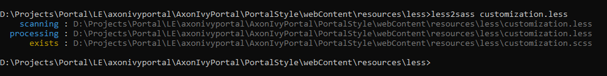

.. _installation-migration-notes-8-0-0-less-to-sass:

Convert `LESS <http://lesscss.org>`__ to `SASS <https://sass-lang.com/>`__ preprocessor
^^^^^^^^^^^^^^^^^^^^^^^^^^^^^^^^^^^^^^^^^^^^^^^^^^^^^^^^^^^^^^^^^^^^^^^^^^^^^^^^^^^^^^^^^^^
From Portal version 8.0.0, we use theme Serenity by default. 
Therefore, if your project is using ``LESS`` preprocessor for
customizing styles, you have to convert them to new ``SASS``.

If ``customization.less`` file is used for customizing Portal colors with variables and not 
using other ``LESS`` syntax, you do not need to convert by tool, just change file type from ``*.less``
to ``*.scss`` manually and jump to :ref:`Put scss files to specific folder <put-scss-files-to-specific-folder>` step.

Please follow below step to do automation step convert your less file by
plugin ``less2sass.``

The **less2sass** converter is pretty good and maintained
https://www.npmjs.com/package/less2sass.

-  Install
   NodeJS on your system (can get by this page  https://nodejs.org/en/download). Once installed, restart your
   system.
-  Open Cmd command line and run command:

   .. code-block:: bash

      npm install -g less2sass

-  Once installed you can simply run:

   .. code-block:: bash
   
      less2sass 'path_to_less_file_or_directory'

   E.g for path_to_less_file_or_directory:

   ``C:\Projects\Portal\axonivyportal\AxonIvyPortal\PortalStyle\webContent\resources\less\customization.less``

   |less-2-sass|

   After run above command, you also see a new
   \*.scss file is created into same folder.
   ``C:\Projects\Portal\axonivyportal\AxonIvyPortal\PortalStyle\webContent\resources\less\customization.scss``

.. _put-scss-files-to-specific-folder:

-   Put ``*.scss`` files to new folder as ``..\webContent\resources\sass\ivy``
-  Update customized variables manually:

.. table:: 

   +-----------------------------------------+-----------------------------------------+
   | Old version                             | New version                             |
   +=========================================+=========================================+
   | @body-background-color                  | $bodyBackgroundColor                    |
   +-----------------------------------------+-----------------------------------------+
   | @announcement-background-color          | $announcementBackgroundColor            |
   +-----------------------------------------+-----------------------------------------+
   | @announcement-border-color              | $announcementBorderColor                |
   +-----------------------------------------+-----------------------------------------+
   | @action-button-border-radius            | $actionButtonBorderRadius               |
   +-----------------------------------------+-----------------------------------------+
   | @action-button-color                    | $primaryColor (default from theme)      |
   +-----------------------------------------+-----------------------------------------+
   | @cancel-button-background-color         | $cancelButtonBackgroundColor            |
   +-----------------------------------------+-----------------------------------------+
   | @context-button-color                   | $contextButtonBackgroundColor           |
   +-----------------------------------------+-----------------------------------------+
   | @context-button-border-radius           | $contextButtonBorderRadius              |
   +-----------------------------------------+-----------------------------------------+
   | @first-header-bar-color                 | $firstHeaderBarColor                    |
   +-----------------------------------------+-----------------------------------------+
   | @second-header-bar-color                | $secondHeaderBarColor                   |
   +-----------------------------------------+-----------------------------------------+
   | @third-header-bar-color                 | $thirdHeaderBarColor                    |
   +-----------------------------------------+-----------------------------------------+
   | @login-logo-height                      | $loginLogoHeight                        |
   +-----------------------------------------+-----------------------------------------+
   | @home-logo-height                       | $homeLogoHeight                         |
   +-----------------------------------------+-----------------------------------------+
   | @task-priority-low-color                | $taskPriorityLowColor                   |
   +-----------------------------------------+-----------------------------------------+
   | @task-priority-normal-color             | $taskPriorityNormalColor                |
   +-----------------------------------------+-----------------------------------------+
   | @task-priority-high-color               | $taskPriorityHighColor                  |
   +-----------------------------------------+-----------------------------------------+
   | @task-priority-exception-color          | $taskPriorityExceptionColor             |
   +-----------------------------------------+-----------------------------------------+
   | @task-state-open-color                  | $taskStateOpenColor                     |
   +-----------------------------------------+-----------------------------------------+
   | @task-state-in-progress-color           | $taskStateInProgressColor               |
   +-----------------------------------------+-----------------------------------------+
   | @task-state-done-color                  | $taskStateDoneColor                     |
   +-----------------------------------------+-----------------------------------------+
   | @task-state-zombie-destroyed-color      | $taskStateZombieDestroyedColor          |
   +-----------------------------------------+-----------------------------------------+
   | @task-state-reserved-color              | $taskStateReservedColor                 |
   +-----------------------------------------+-----------------------------------------+
   | @task-state-system-color                | $taskStateSystemColor                   |
   +-----------------------------------------+-----------------------------------------+
   | @process-chain-menu-color               | $processChainMenuColor                  |
   +-----------------------------------------+-----------------------------------------+
   | @menu-color                             | Removed                                 |
   +-----------------------------------------+-----------------------------------------+
   | @sidebar-opacity-transition-duration    | Removed                                 |
   +-----------------------------------------+-----------------------------------------+
   | @sidebar-dimension-transition-duration  | Removed                                 |
   +-----------------------------------------+-----------------------------------------+

..

-  Run ``mvn libsass:compile`` to compile your ``scss`` to ``css`` file.

