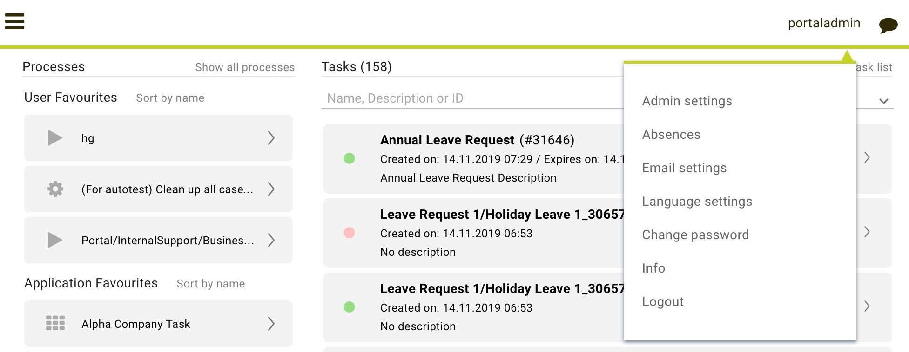
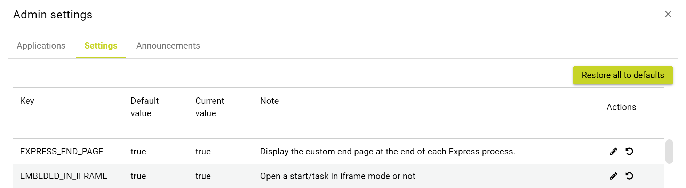
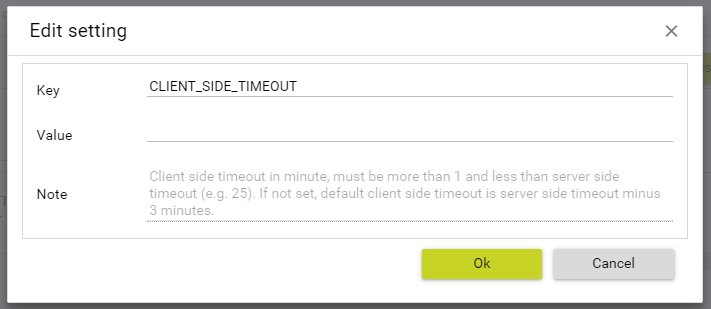
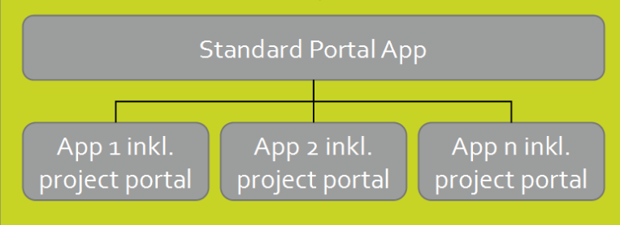
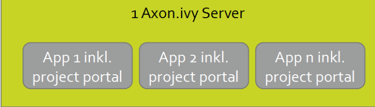
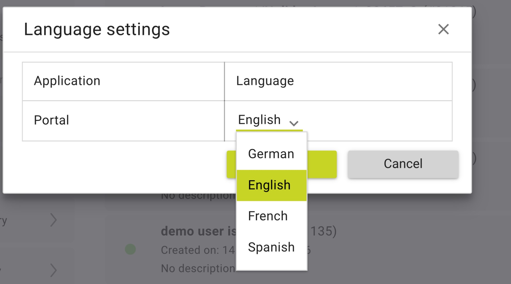
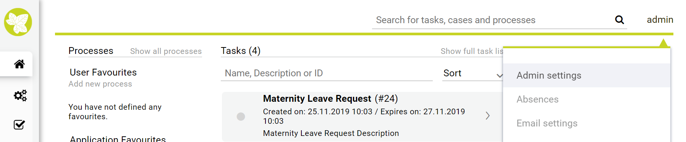
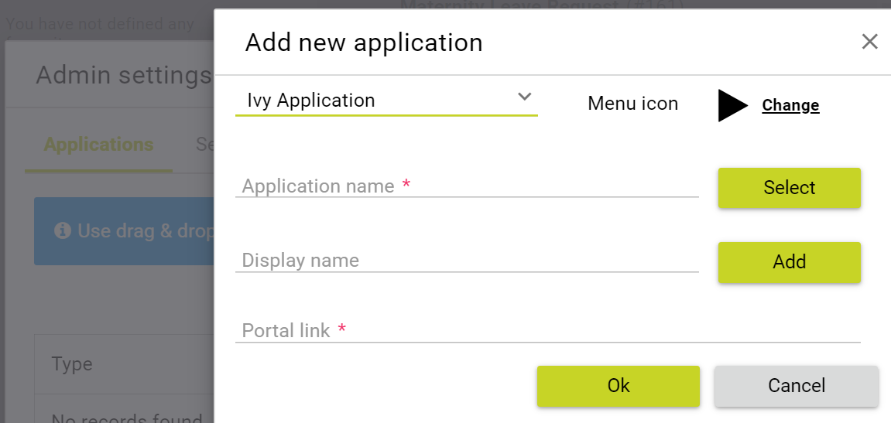

.. _settings:

Settings
********

This section covers Portal role, permissions and some settings in User menu

|portal-header|

.. _settings-admin-settings:

Admin settings
==============

User needs to have role ``AXONIVY_PORTAL_ADMIN`` to see this menu item,
it is used to configure Portal configuration, see different Portal
configurations in
:ref:`Portal mode <installation-basic-portal-mode>`

How to open Admin Settings
--------------------------

Open ``Admin Settings`` by selecting the item in ``UserMenu`` on the
topbar, if your page using layout of ``PortalTemplate`` .

|multi-portal-open-settings|

.. important:: 
   If your application does not use templates of PortalTemplate project, you
   have to create a page and use AdminSettings component inside.

Global settings
---------------

Global settings for Portal can be set in Settings tab. All available
settings with their default value and description are listed in this
place.

|global-settings|

You can edit value for a specific setting

|global-setting-edit|

You can also get back the default value for each setting by clicking
reset button on each row, or reset all values of all settings by
clicking ``Restore All To Defaults`` button

.. _settings-admin-settings-setup-multi-portals:

Setup Portal multi applications
-------------------------------

Portal provides two types of multi applications: ``Multi applications with overview`` and ``Multi applications (without overview)``

Multi applications with overview
""""""""""""""""""""""""""""""""
.. important::

   Used for related applications App1, App2, App3... of which we need to see all
   tasks/cases in one page. Task/Case list of application named ``Portal`` would display all
   tasks/cases of applications App1, App2, App3...

|multi-application-with-portal|

-  Create a new application named ``Portal``. Deploy portal (kit,
   template ..) to this application.

-  Create new applications: App1, App2, App3... Deploy portal
   (kit, template ..) to new applications.

-  Configure multi-apps Portal: login by Portal
   Admin, configure applications: App1,
   App2, App3...

-  Note that, ``do not`` add the application named ``Portal``, it is reserved
   for displaying all tasks/cases... from all configured
   applications.

-  Dashboard menu is only visible when logged-in user exists in
   Portal application.

Multi applications (without overview)
"""""""""""""""""""""""""""""""""""""
.. important::

   Used for independent applications App1, App2, App3... of which we ``do not`` need to see all
   tasks/cases in one page.

|multi-application-without-portal|

-  Create new applications: App1, App2, App3... Deploy portal(kit,
   template ..) to new applications. Note: must not create an
   application named ``Portal``.

-  Configure multi-apps Portal: login by Portal
   Admin, configure applications: App1,
   App2, App3...

How to add a new application
""""""""""""""""""""""""""""

Choose ``Application`` tab on ``Admin Settings`` dialog and click on
``New`` button to add new application. Here you can choose application
type either as Ivy application or Third Party application.

|multi-portal-add-application|

.. tip::

   -  ``Application name`` is the name of the application when you
      create it. ``Display name`` is the name of the application to be
      shown on Portal UI.

   -  ``Portal link`` specifies the link will be redirected when
      selecting the application on the application menu. It could be an
      absolute link (e.g.
      http://10.123.1.30:8000/ivy/pro/.../DefaultApplicationHomePage.ivp) or relative
      link (e.g. /ivy/pro/.../DefaultApplicationHomePage.ivp). If your application
      could be accessed from multiple domains, use relative link so that
      you can access the link from different domains.

   -  For multiple languages of application display name, you need to
      create the "AppInfo/SupportedLanguages" CMS which defines how many
      languages your application supports. See the below "Language
      settings" for more details.

.. _settings-language:

Language settings
=================

-  Below is applied language setting precedence:

   |language-precedence|

   If user email language setting is application default, language would
   be applied by application email language setting.

   If user selects a language in email setting, language would be
   appplied by this selection.

-  To configure languages of Portal applications, select
   ``Language Settings`` in ``User Settings`` .

-  UI reads current languages settings for all applications.

-  To change language for application, select one in the languages
   dropdown list of application. When the change is saved, the language
   will be set for application (Click on the application in header menu
   to reload application and see the change of language).

   |language-settings|

-  For multiple languages, the CMS key ``/AppInfo/SupportedLanguages``
   must exist in your application. From Portal 7.1, this CMS entry is
   moved to Portal Style. It contains list of all languages supported by
   your application, separated by comma.

   -  Must not contain spaces
   -  Same as display name of Locale
   -  Separated by comma
   -  Process model version, which has this CMS, must active

-  To add new language to Portal, what you have to do is

   -  Add new language locale to cms entry of Portal Style ``/AppInfo/SupportedLanguages`` 
   -  Export all CMS entries of Portal Style to excel file
   -  Add translation of new language for all CMS entries
   -  Import file excel back, then redeploy Portal Style
   -  This is sample how to add new Spanish to portal

      |add-new-language|

Role configuration
==================

.. table:: 

   +-----------------------------------+-----------------------------------+
   | PortalKit roles                   | Rights                            |
   +===================================+===================================+
   | AXONIVY_PORTAL_ADMIN              | User belong to this role can      |
   |                                   | handle AdminUI page, configure    |
   |                                   | the internal role properties,     |
   |                                   | create public filters. Users who  |
   |                                   | own this role need some           |
   |                                   | permissions.                      |
   |                                   |                                   |   
   +-----------------------------------+-----------------------------------+

.. _settings-permission-settings:

Permission settings
===================

Permissions can be configured in `Cockpit
<http://developer.axonivy.com/doc/latest/engine-guide/tool-reference/engine-cockpit.html#security>`_.
In the security area, you will find all these permission in the Group
"PortalPermissions"

Absences
--------

-  READ

   This function will be disabled if session user does not have
   ``IPermission.USER_READ_OWN_ABSENCES`` and
   ``IPermission.USER_READ_ABSENCES``.

-  CREATE/MODIFY

   This function will be disabled if session user does not have
   ``IPermission.USER_CREATE_OWN_ABSENCE`` and
   ``IPermission.USER_CREATE_ABSENCE``.

-  DELETE

   This function will be disabled if session user does not have
   ``IPermission.USER_DELETE_OWN_ABSENCE`` and
   ``IPermission.USER_DELETE_ABSENCE``.

-  MANAGE EVERY USER ABSENCES

   User can read, add, delete absences of all users. This function will
   be disabled if session user does not have all of the following
   permissions: ``IPermission.USER_CREATE_ABSENCE`` ,
   ``IPermission.USER_DELETE_ABSENCE`` ,
   ``IPermission.USER_READ_ABSENCES``.

Substitute
----------

-  CREATE OWN SUBSTITUTE

   This function will be disabled if session user does not have
   ``IPermission.USER_CREATE_OWN_SUBSTITUTE`` and
   ``IPermission.USER_CREATE_SUBSTITUTE``.

-  MANAGE EVERY USER SUBSTITUTES

   This function will be disabled if session user does not have
   ``IPermission.USER_CREATE_SUBSTITUTE`` or
   ``IPermission.USER_READ_SUBSTITUTES``.

Personal task permission
------------------------
-  ADD NOTE

   Refer to :ref:`Display add note button<display-add-note-button>`.

-  DELEGATE

   User can delegate his personal or group tasks if he has permission
   ``TaskWriteActivatorOwnTasks`` (This permission belongs to Portal
   permission group and it is not assigned to role Everybody by
   default). User can delegate all the tasks he see in his task list if
   he has permission ``IPermission.TASK_WRITE_ACTIVATOR``.

   .. important::
      Task state cannot be one of the following values:
      DONE, DESTROYED, RESUMED, FAILED.

   This function will be hidden if session user does not have permission
   ``PortalPermission.TASK_DISPLAY_DELEGATE_ACTION``.

-  RESET

   This function will be enabled if session user has permission
   ``IPermission.TASK_RESET_OWN_WORKING_TASK`` or
   ``IPermission.TASK_RESET``.

   .. important::
      Task state has to be one of following values: RESUMED, PARKED.

   This function will be hidden if session user does not have permission
   ``PortalPermission.TASK_DISPLAY_RESET_ACTION``.

-  RESERVE

   This function will be enabled if session user has permission
   ``IPermission.TASK_PARK_OWN_WORKING_TASK``.

   .. important::
      Task state has to be one of following values: CREATED, RESUMED, SUSPENDED.

   This function will be hidden if session user does not have permission
   ``PortalPermission.TASK_DISPLAY_RESERVE_ACTION``.

-  CHANGE TASK NAME

   This function will be enabled if session user has
   ``IPermission.TASK_WRITE_NAME``.

   .. important::
      Task state cannot be one of following values: 
      DONE, DESTROYED, FAILED.

-  CHANGE TASK DESCRIPTION

   This function will be enabled if session user has
   ``IPermission.TASK_WRITE_DESCRIPTION``.

   .. important::
      Task state cannot be one of following values:
      DONE, DESTROYED, FAILED.

-  CHANGE DEADLINE

   This function will be enabled if session user has
   ``IPermission.TASK_WRITE_EXPIRY_TIMESTAMP``.

   .. important::
      Task state cannot be one of following values:
      DONE, DESTROYED, FAILED.

-  CHANGE PRIORITY

   This function will be disabled if session user does not have
   ``IPermission.TASK_WRITE_ORIGINAL_PRIORITY``.

   .. important::
      Task state cannot be one of following values:
      DONE, DESTROYED, FAILED.

-  DISPLAY ADDITIONAL OPTIONS

   This function will be hidden if session user does not have permission
   ``PortalPermission.TASK_DISPLAY_ADDITIONAL_OPTIONS``.

Personal case permission
------------------------

-  ADD NOTE

   Refer to :ref:`Display add note button<display-add-note-button>`.

-  DELETE CASE

   Delete case function will be enabled if session user has
   ``IPermission.CASE_DESTROY``.

   .. important::
      Case state has to be RUNNING.

-  CHANGE CASE NAME

   Delete case function will be enabled if session user has
   ``IPermission.CASE_WRITE_NAME``.

   .. important::
      Case state cannot be DONE, DESTROYED.

-  CHANGE CASE DESCRIPTION

   Delete case function will be enabled if session user has
   ``IPermission.CASE_WRITE_DESCRIPTION``.

   .. important::
      Case state cannot be DESTROYED.

-  SEE RELATED TASKS OF CASE

   Session user can see all related tasks of case if he has
   ``IPermission.TASK_READ_OWN_CASE_TASKS`` or
   ``IPermission.TASK_READ_ALL``.

   .. important::
      Case state cannot be DESTROYED.

   Link to show all tasks of case will be hidden if session user does
   not have permission ``PortalPermission.SHOW_ALL_TASKS_OF_CASE`` .

-  DISPLAY SHOW DETAILS LINK

   This link will be hidden if session user does not have permission
   ``PortalPermission.SHOW_CASE_DETAILS``.
   This permission is not assigned to role Everybody by default.

Upload/delete document permission
---------------------------------

Upload/delete document function will be enabled if session user has
``IPermission.DOCUMENT_WRITE`` or
``IPermission.DOCUMENT_OF_INVOLVED_CASE_WRITE``.

Express Workflow permission
---------------------------

-  CREATE EXPRESS WORKFLOW

   Create Express Workflow function will be enabled if session user has
   ``PortalPermission.EXPRESS_CREATE_WORKFLOW`` (This permission belongs
   to Portal permission group, assigned to role Everybody by default).

Statistics permission
---------------------

-  ADD DASHBOARD CHART

   Add new charts function will be enabled if session user has
   ``PortalPermission.STATISTIC_ADD_DASHBOARD_CHART`` (This permission
   belongs to Portal permission group, assigned to role Everybody by
   default).

-  ANALYZE TASK

   Filter tasks and export data to excel for advanced analysis. This
   function will be enabled if session user has
   ``PortalPermission.STATISTIC_ANALYZE_TASK`` (This permission belongs
   to Portal permission group and it is not assigned to role Everybody
   by default).

Portal general permission
-------------------------

-  ACCESS TO FULL PROCESS LIST

   User cannot see "Processes" on the left menu and link "Show all
   processes" (on Dashboard) if he does not have permission
   ``PortalPermission.ACCESS_FULL_PROCESS_LIST``.

-  ACCESS TO FULL TASK LIST

   User cannot see "Tasks" on the left menu and link "Show full task
   list" (on Dashboard) if he does not have permission
   ``PortalPermission.ACCESS_FULL_TASK_LIST``.

-  ACCESS TO FULL CASE LIST

   User cannot see "Cases" on the left menu if he does not have
   permission ``PortalPermission.ACCESS_FULL_CASE_LIST``.

-  ACCESS TO FULL STATISTIC LIST

   User cannot see "Statistics" on the left menu and link "Show all
   charts" (on Dashboard) if he does not have permission
   ``PortalPermission.ACCESS_FULL_STATISTICS_LIST``.

   .. _display-add-note-button:
-  DISPLAY ADD NOTE BUTTON

   "Add note" button will be hidden in Task/Case detail if session user does not have permission
   ``PortalPermission.TASK_CASE_ADD_NOTE``.

-  DISPLAY SHOW MORE NOTE BUTTON

   This button will be hidden if session user does not have permission
   ``PortalPermission.TASK_CASE_SHOW_MORE_NOTE``.

Administrator permission can see all tasks/cases in the application
-------------------------------------------------------------------

Normal users can only see their tasks/cases they can work on.

Administrator can see all tasks/cases in the application.

Permissions needed: ``IPermission.TASK_READ_ALL`` ,
``IPermission.CASE_READ_ALL`` .

Administrator permission can interact with all workflows in the application
---------------------------------------------------------------------------

Normal users can updates and deletes workflows which created by him and
can interact with workflow's task which assigned to him.

Administrator can creates, updates and deletes all workflows in the
application.

Global variables
================

.. table:: 

   +---------------------------+-------------+---------------------------+
   | Variable                  | Default     | Description               |
   |                           | value       |                           |
   +===========================+=============+===========================+
   | PortalStartTimeCleanObsol | 0 0 6 \* \* | Cron expression define    |
   | etedDataExpression        | ?           | the time to clean up data |
   |                           |             | of obsoleted users. E.g.: |
   |                           |             | expression for at 6AM     |
   |                           |             | every day is              |
   |                           |             | ``0 0 6 * * ?`` . Refer   |
   |                           |             | to                        |
   |                           |             | `crontrigger <http://quar |
   |                           |             | tz-scheduler.org/document |
   |                           |             | ation/quartz-2.1.x/tutori |
   |                           |             | als/crontrigger>`__       |
   |                           |             | . Restart Ivy engine      |
   |                           |             | after changing this       |
   |                           |             | variable.                 |
   +---------------------------+-------------+---------------------------+
   | PortalDeleteAllFinishedHi | false       | If set to ``true``, the   |
   | ddenCases                 |             | cron job runs daily (at   |
   |                           |             | 6.AM as default) will     |
   |                           |             | clean all finished hidden |
   |                           |             | cases in engine.          |
   |                           |             | Otherwise, just hidden    |
   |                           |             | cases which were          |
   |                           |             | generated by Portal will  |
   |                           |             | be deleted.               |
   +---------------------------+-------------+---------------------------+
   | PortalGroupId             | ch.ivyteam. | Maven group id of Portal. |
   |                           | ivy.project |                           |
   |                           | .portal     |                           |
   +---------------------------+-------------+---------------------------+
   | PortalHiddenTaskCaseExclu | true        | By default, Portal will   |
   | ded                       |             | query tasks and cases     |
   |                           |             | which don't have hide     |
   |                           |             | information. Set it to    |
   |                           |             | ``false``, portal will    |
   |                           |             | ignore this additional    |
   |                           |             | property.                 |
   +---------------------------+-------------+---------------------------+

.. |language-precedence| image:: images/settings/language-precedence.png

.. |add-new-language| image:: images/settings/add-new-language.png

