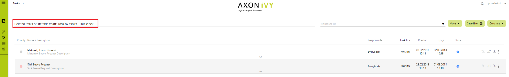

.. _components-drilldown:

Change Last Drilldown Level Of Task By Expiry Chart
===================================================

.. _components-expiry-chart-task-by-expiry-chart:

Task by expiry chart
--------------------

|task-by-expiry-chart|

.. _components-expiry-chart-for-users-who-want-to-change-last-drill-down-level:

For users who want to change last drilldown level of Task by expiry chart
-------------------------------------------------------------------------

By default, the last drilldown level of a expiry chart is HOUR. It means
that, to open a related tasks list of this chart, users must navigate
from YEAR -> MONTH -> WEEK -> DAY -> HOUR, clicking on a column of HOUR
chart to open the tasks.

To change this last drilldown level, users can set the value of
``EXPIRY_CHART_LAST_DRILLDOWN_LEVEL`` in ``Global settings``.

For example, to navigate to task list immediately when clicking on a
week column, set ``EXPIRY_CHART_LAST_DRILLDOWN_LEVEL = WEEK``:

|related-tasks-of-expiry-chart|

.. |task-by-expiry-chart| image:: images/task-by-expiry-chart/task-by-expiry-chart.png

