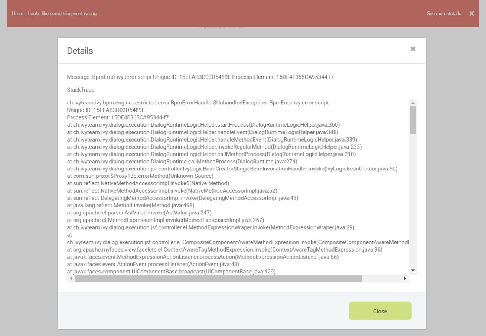
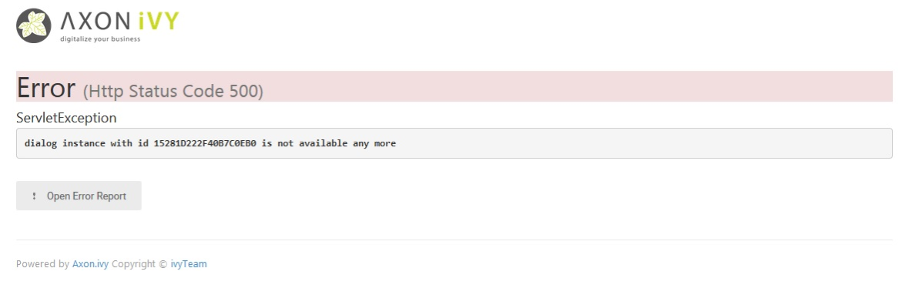
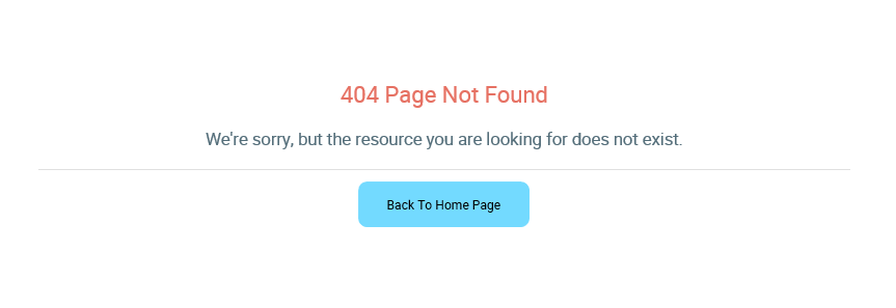
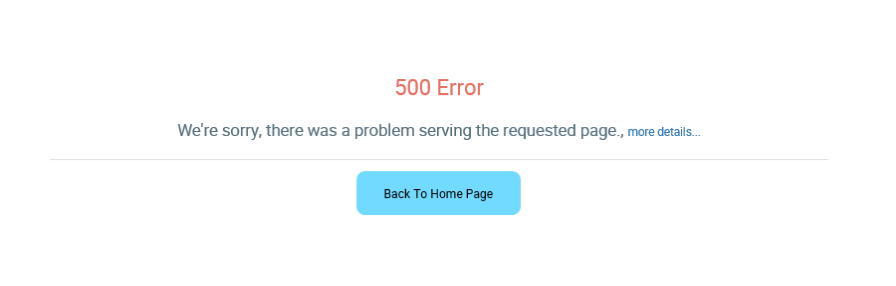

.. _components-error-handling:

Error handling
==============

In this section, we introduce 2 kinds of errors, when and how to handle
them in Portal.

-  Ajax error : this kind of errors occur during a JSF ajax requests,
   for example when the user clicks on the show full mode button to tell
   the task widget switches to full mode, without handling the end user
   would not get any form of feedback if the action was successfully
   performed or not.

-  Non-ajax error : this kind of errors occur when user access to Portal
   from a url which could not be handled successfully by server side, or
   being navigated by a corrupted url. For example, when the user clicks
   on a link to start a task which does not exist.

.. _components-error-handling-ajax-error-handling:

Ajax error handling
-------------------

.. _components-error-handling-ajax-error-handling-introduction:

Introduction
------------

By default, Portal handles all exceptions from ajax requests.

When an exception occurs, Portal will show an error notification with
the exception type and message to end user. The exception details is
available when user click on show details button.

Stacktrace on error messages can be showed/hid depend on ivy system
property ``Errors.ShowDetailsToEndUser``.

   .. note:: 

      This feature is only available if using the portal default template:
      BasicTemplate
      or its extension.

.. _components-error-handling-ajax-error-handling-result:

Result
------

|portal-ajax-error-handler|

.. _components-error-handling-nonajax-error-handling:

Non-ajax error handling
-----------------------

.. _components-error-handling-nonajax-error-handling-introduction:

Introduction
------------

By default, when the server has any error such as : ``HTTP 404``,
``HTTP 500``, or exception while page's loading, AxonIvyEngine will show
an default error page. E.g.:

|default-ivy-error|

You can find content of this page is the file located on
``${AxonIvyEngineFolder}/webapp/ivy/ivy-error-page.xhtml``, but the
error page is not user friendly, too much technical information that
normal user may not understand. Thus, Axon Ivy Portal provides an
alternative solution to make this page nicer.

.. _components-error-handling-nonajax-error-handling-howtoconfigure:

How to configure
----------------

Download the zip file below to configure on your own engine (or
designer).

   .. important:: 
      Read README.txt

:download:`PortalErrorPageConfiguration.zip <documents/error-handling/portal-error-page-configuration.zip>` 

.. _components-error-handling-nonajax-error-handling-result:

Result
------

HTTP 404 Page Not Found

Example testing URL: 404

|404|

HTTP 500 Error

Example testing URL: 500

|500|

