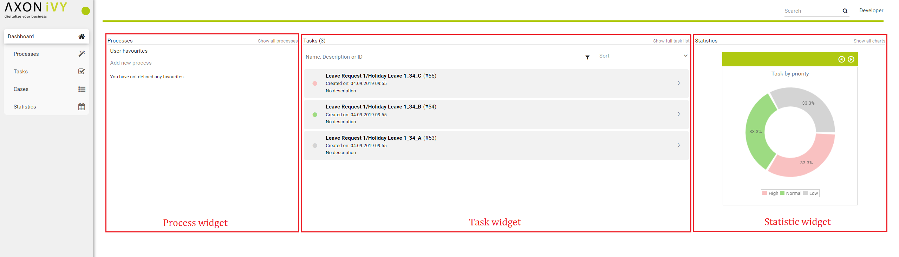
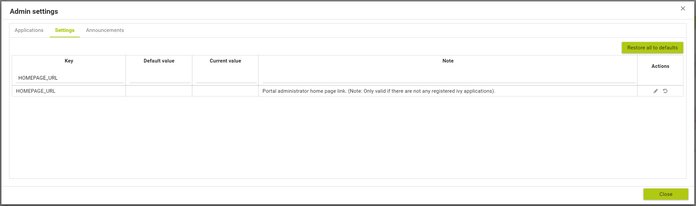

.. _customization-portal-home:

Portal home
===========

.. _customization-portal-home-before-beginning:

Before beginning
----------------

This guide assumes that you are already familiar with CSS to integrate
your own widgets.

.. _customization-portal-home-introduction:

Introduction
------------

The default home page of Portal has three built-in widgets in order:
``Process widget``, ``Task widget``, ``Statistic widget``. If it does
not fit your needs, you can replace it by your own one. We decided that
based on screen size, widget may become hidden, not smaller.

|home-page-template|

.. _customization-portal-home-basic-usage:

Basic usage
-----------

Following these steps to have your own Portal Home:

1. Create a new home page which uses the
   ``DefaultHomePageTemplate.xhtml`` template. By doing this, your new
   home page will inherit the widgets from the default home page and has
   a place holder for your own widgets.

   Your custom home page should look like below:

   .. code-block:: html
   
      <ui:composition template="/layouts/DefaultHomePageTemplate.xhtml">
      <ui:define name="customWidget">
      ...
      </ui:define>
      </ui:composition>

2. *In case of single Portal:* Create a new process start for the new
   home page. Now you will use this process start as the entry point of
   your portal instead of the default one. **To let portal know about
   your new portal home, you have to go to the portal settings and set
   the portal home url to the new one. e.g:
   HOMEPAGE_URL=http://localhost:8081/ivy/pro/designer/CustomizePortalHome/157454FCA39C3844/start.ivp**

   |set-home-page-url|

   *In case of multi Portal:* refer to :ref:`Setup multi portals <settings-admin-settings>` to setup.

..

   .. note:: Currently, responsive custom home page is not supported.

.. _customization-portal-home-advanced-usage:

Advanced usage
--------------

The ``DefaultHomePageTemplate.xhtml`` template supports some
customizations.

.. _customization-portal-home-advanced-usage-display-hide-the-default-widgets:

Display/hide the default widgets
--------------------------------

The template has three parameters: ``displayProcessWidget``,
``displayTaskWidget``, ``displayStatisticWidget`` to display or hide the
default widgets. Their default values are true, you can set them to
boolean values (true/false) to display or hide them as you need.

.. code-block:: html

   <ui:composition template="/layouts/DefaultHomePageTemplate.xhtml">
   <ui:param name="displayTaskWidget" value="false" />
   </ui:composition>
..

   .. tip:: Task widget now is hidden.

.. _customization-portal-home-advanced-usage-customize-the-default-widget-sections:

Customize the default widget's sections
---------------------------------------

The template has the placeholders to redefine the default widgets'
sections.

.. code-block:: html

   <ui:composition template="/layouts/DefaultHomePageTemplate.xhtml">
   <ui:define name="statisticWidget">
   

   <h:panelGroup layout="block" styleClass="js-statistic-widget" id="statistic-widget-container">
   <!-- KEEP THE STATISTIC WIDGET -->
   <ic:ch.ivy.addon.portalkit.component.StatisticWidget id="statistics-widget" compactMode="true" tasks="#{tasks}"> 
   <!-- ADD THE WEATHER WIDGET BELOW STATISTIC WIDGET -->
   <ic:my.namespace.WeatherWidget />
   </h:panelGroup>
   

   </ui:define>
   </ui:composition>

.. _customization-portal-home-advanced-usage-add-your-own-widgets:

Add your own widgets
--------------------

The template has a placeholder to add your own widgets. Your own
widgets' default positions are next to statistic widget, you can change
them by setting the default widgets' positions.

.. code-block:: html

   <ui:composition template="/layouts/DefaultHomePageTemplate.xhtml"  >
   <ui:define name="customWidget">
   <ic:my.namespace.ComponentName  />
   </ui:define>
   </ui:composition>
..

   .. tip:: This custom widget will show below the 3 default widget

.. _customization-portal-home-advanced-usage-change-the-pages-title:

Change the page's title
-----------------------

The default page title is Cockpit. Apply the following code to change
it:

.. code-block:: html

   <ui:composition template="/layouts/DefaultHomePageTemplate.xhtml" >
   <ui:define name="pageTitle">YOUR PAGE'S TITLE</ui:define>
   </ui:composition>

