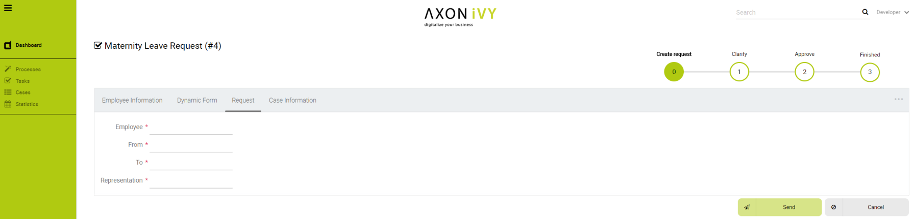

.. _components-layout-templates:

Layout templates
================

.. _components-layout-templates-templates-for-development:

Templates for development
-------------------------

Your Portal Project is dependent on PortalTemplate project, in which
there are 7 templates that can be used directly.

1. Basic template

2. Two column template

3. Task template

4. Task list template

5. Case list template

6. Default homepage template

These templates have the same header, which is a menu of applications
that you configure in Administration page. Since version 8.0, Portal
officially supports responsiveness, every templates has its default
responsiveness, you can refer to
:ref:`Responsiveness <components-layout-templates-reponsiveness>`
to override it. Besides, there are user settings like: Absences, Email,
Language Settings and Administration (for admin only). Details about
user settings can be found in
:ref:`Settings <settings>`.

|portal-header|

.. _components-layout-templates-basic-template:

Basic template
--------------

Basic template provides basic layout where user can put their custom
content. It lacks Portal menu and Case details. We recommend to use task
template for your process.

.. _components-layout-templates-basic-template-how-to-use-basic-template:

How to use Basic template
~~~~~~~~~~~~~~~~~~~~~~~~~

1. Create a new HTML User Dialog and then use ``ui:composition`` to
   define the template inside and reuse the default responsiveness
   behavior. To override it, please use ``pageContent`` instead of
   ``simplePageContent`` and
   :ref:`Responsiveness <components-layout-templates-reponsiveness>`.

   .. code-block:: html
   
      <ui:composition template="/layouts/BasicTemplate.xhtml">
      <ui:define name="pageTitle">Sample Page</ui:define>
      <ui:define name="simplePageContent">
      This is sample content.
      </ui:define>
      </ui:composition>

2. See the result after using Basic template for example:

|basic-template|

.. _components-layout-templates-two-column-template:

Two column template
-------------------

Two column template inherits Basic Template. It has 2 columns which user
can customize their contents. Normally, the first column is for
navigation, the second for displaying corresponding content.

.. _components-layout-templates-two-column-template-how-to-use-two-columntemplate:

How to use Two column template
~~~~~~~~~~~~~~~~~~~~~~~~~~~~~~

1. Create a HTML User Dialog, define template in ``ui:composition`` and
   insert content of second column and third column using ``ui:define``.

  .. code-block:: html
     :linenos:
     :emphasize-lines: 4,7

     <ui:composition template="/layouts/TwoColumnTemplate.xhtml">
     <ui:define name="pageTitle">Sample Page</ui:define>
     <ui:define name="navigationRegion">
     Navigation Region
     </ui:define>
     <ui:define name="contentRegion">
     Content Region
     </ui:define>
     </ui:composition>

2. See the result after using Two column template for example:

|two-column-template|

.. _components-layout-templates-task-template:

Task template
-------------

Task template is used for displaying task functionality and related
information to support completing the task. There are a lot of regions
to be filled with your custom content:

-  Request name

-  Process chain

-  Errors

-  Information

-  Dynamic tabs

-  Request form

-  Case information tab

-  Buttons at footer

.. _components-layout-templates-task-template-how-to-use-task-template:

How to use template TaskTemplate.xhtml
~~~~~~~~~~~~~~~~~~~~~~~~~~~~~~~~~~~~~~

1.  Create a new HTML User Dialog and then use ``ui:composition`` to
    define template which you use inside.

  .. code-block:: html
  
     <ui:composition template="/layouts/TaskTemplate.xhtml">

..
2.  Set ``task`` value so that the ``taskName`` is available to users
    where they can see the task name of request. It is mandatory.

  .. code-block:: html
  
     <ui:param name="task" value="#{ivy.task}" />

..

    |task-name-template|

3.  Set ``caseId`` value so that the ``Case information tab`` is
    available to users where they can see info of case, documents,
    related tasks and history. It is mandatory.
  .. code-block:: html
  
     <ui:param name="caseId" value="#{ivy.case.id}" />

..

    |task-template-case-info|
4.  Set data to ``actualStepIndex`` and ``steps`` variables which are
    used for ProcessChain component in template. It is mandatory.

  .. code-block:: html
  
     <ui:param name="actualStepIndex" value="#{data.actualStepIndex}" />
     <ui:param name="steps" value="#{data.steps}" />

..

    |task-template-process-chain|
5.  Set data to ``processChainDirection`` variable to set direction for
    for ProcessChain component in template. There are two values:
    "HORIZONTAL" and "VERTICAL". Direction of ProcessChain component is
    "HORIZONTAL" by default.
  .. code-block:: html
  
     <ui:param name="processChainDirection" value="VERTICAL" />

..
6.  Set data to ``processChainShape`` variable to set shape for for
    ProcessChain component in template. There are two values: "CIRCLE"
    and "LINE". Shape of ProcessChain component is "CIRCLE" by default.

    .. code-block:: html
    
     <ui:param name="processChainShape" value="LINE" />
     
..

    |process-chain-shape|
7.  Inserts contents for ``taskName``, ``errorsZone``, ``infoZone``. It
    is optional.

    .. code-block:: html
    
        <ui:define name="taskName">...</ui:define>
        <ui:define name="errorsZone">...</ui:define>
        <ui:define name="infoZone">...</ui:define>

..
8.  Inserts some new tabs, refers some segment of code as below. If your
    application has multiple tabs, use it and turn off request form by
    set ``showTaskFormTab`` to false.

    .. code-block:: html
    
        <ui:param name="showTaskFormTab" value="false" />
        <ui:define name="dynamicTabs">
        <p:tab title="My first tab">
        <p:inputText id="first-name" value="#{data.firstname}"/>
        </p:tab>
        <p:tab title="My second tab">
        <p:inputText id="last-name" value="#{data.lastname}"/>
        </p:tab>
        </ui:define>

..
9.  Overwrite contents of default tab. Use it when your application need
    only 1 tab.

    .. code-block:: html
    
       <ui:define name="taskForm">
       <h:form>
       <p:outputLabel name="myCustomLabel" />
       ...
       </h:form>
       </ui:define>

..
10. Set visible/invisible for default tab case information. Set
    following variables as ``true`` if you want to visible and vice
    versa.

    .. code-block:: html
    
       <ui:param name="showCaseStatusInfoTab" value="true" />

..
11. Inserts left buttons and right buttons which stay at the bottom of
    the page. It is optional. You can use it to define your action
    button. Consider using ``partialSubmit`` to submit your data im
    tabs.

    .. code-block:: html
    
        <ui:define name="leftButtons">
        <p:commandButton value="Save" actionListener="#{logic.save}" partialSubmit="true" 
        process="first-name last-name" update="first-name last-name" />
        </ui:define>
        <ui:define name="rightButtons">
        <p:commandButton value="Cancel" actionListener="#{logic.cancel}" immediate="true" />
        </ui:define>

..        

.. _components-layout-templates-default-homepage-template:

Default homepage template
-------------------------

Default homepage template is used to create pages that have the look as
default homepage of Portal. Besides, users can customize it by disabling
default widgets, add new widgets, change position of widgets. For more
details including basic and advanced customization, refer to
:ref:`Portal home <customization-portal-home>`

.. _components-layout-templates-default-homepage-template-how-to-use-default-homepage-template:

How to use default homepage template
~~~~~~~~~~~~~~~~~~~~~~~~~~~~~~~~~~~~

Create a new HTML User Dialog and then use ``ui:composition`` to define
template.
  .. code-block:: html

     <ui:composition template="/layouts/DefaultHomePageTemplate.xhtml">

.. _components-layout-templates-task-list-template:

Task list template
------------------

Task list template is used to display task list where user can see tasks
and their details.

|task-list-template|

.. _components-layout-templates-task-list-template-how-to-use-task-list-template:

How to use task list template
~~~~~~~~~~~~~~~~~~~~~~~~~~~~~

1. Create a new HTML User Dialog and then use ``ui:composition`` to
   define template.

  .. code-block:: html
  
      <ui:composition template="/layouts/PortalTasksTemplate.xhtml">
      </ui:composition>

2. Data class of this dialog should have an attribute named ``taskView``
   with type ``ch.ivy.addon.portal.generic.view.TaskView``. By changing
   this attribute, user can modify title of the task list widget,
   collected tasks (through ``dataModel``) and more. The following is a
   sample to build a taskView.

  .. code-block:: java

      import ch.ivy.addon.portalkit.datamodel.TaskLazyDataModel;
      import ch.ivy.addon.portalkit.bo.MainMenuNode;
      import ch.ivy.addon.portal.generic.view.TaskView;
      TaskLazyDataModel dataModel = new TaskLazyDataModel();
      dataModel.setAdminQuery(true);
      dataModel.setSortField(ch.ivy.addon.portalkit.enums.TaskSortField.PRIORITY.toString(), true);
      MainMenuNode category = new MainMenuNode();
      category.setValue("My Task List");
      out.taskView = TaskView.create().dataModel(dataModel).pageTitle("My Task List").hideTaskFilter(true).category(category)
      .showHeaderToolbar(false).createNewTaskView();

.. _components-layout-templates-case-list-template:

Case list template
------------------

Case list template is used to display case list where user can see cases
and their details.

|case-list-template|

.. _components-layout-templates-case-list-template-how-to-use-case-list-template:

How to use case list template
~~~~~~~~~~~~~~~~~~~~~~~~~~~~~

1. Create a new HTML User Dialog and then use ``ui:composition`` to
   define template.

  .. code-block:: html
 
     <ui:composition template="/layouts/PortalCasesTemplate.xhtml>
     </ui:composition>

2. Data class of this dialog should have an attribute named ``caseView``
   with type ``ch.ivy.addon.portal.generic.view.CaseView``. By changing
   this attribute, user can modify title of the case list widget,
   collected cases (through ``dataModel``) and more. The following is an
   example to build a caseView.

  .. code-block:: java
  
      import ch.ivy.addon.portalkit.datamodel.CaseLazyDataModel;
      import ch.ivy.addon.portal.generic.view.CaseView;
      CaseLazyDataModel dataModel = new CaseLazyDataModel();  
      out.caseView = CaseView.create().dataModel(dataModel).withTitle("My Cases").buildNewView();

.. _components-layout-templates-handle-required-login-in-templates:

Handle required Login in templates
----------------------------------

All templates require login to access by default. But templates also
provide functionality to access page without login by adding the
``isNotRequiredLogin`` parameter.

.. _components-layout-templates-handle-required-login-in-templates-how-to-handle-required-login-in-template:

How to handle required login in template
~~~~~~~~~~~~~~~~~~~~~~~~~~~~~~~~~~~~~~~~

1. Create a new **HTML User Dialog** and then use ``ui:param`` to define
   the template inside

  .. code-block:: html
  
     <ui:composition template="/layouts/BasicTemplate.xhtml">
     <ui:param name="isNotRequiredLogin" value="#{data.isNotRequiredLogin}" />
     <ui:define name="pageContent">
     This is sample content.
     </ui:define>
     </ui:composition>

2. Result after using template for example (All user settings and
   application menus will not visible).

.. _components-layout-templates-reponsiveness:

Responsiveness
--------------

Since version 8.0, Portal has simplified ResponsiveToolKit and now
Portal supports various screen solutions, not fit to 3 screen widths as
before.

To apply your styles for the specific resolution, you can add your own
media query css:

.. code-block:: css

    @media screen and (max-width: 1365px) {/*.....*/}

In Portal's new design, the main container's width should be changed
according to menu state (expand/colapse).

To adapt the change, you need to initialize the ``ResponsiveToolkit``
Javascript object and introduce 1 object to handle screen resolutions
and your object has to implement the ``updateMainContainer`` method.

Portal templates define their own responsiveness, you can redefine the
footer section to override:

E.g. Initialize ``ResponsiveToolkit`` for TaskList page.

  .. code-block:: html
  
      <ui:define name="footer">
      
      </ui:define>

.. |task-list-template| image:: images/layout-templates/task-list-template.png

