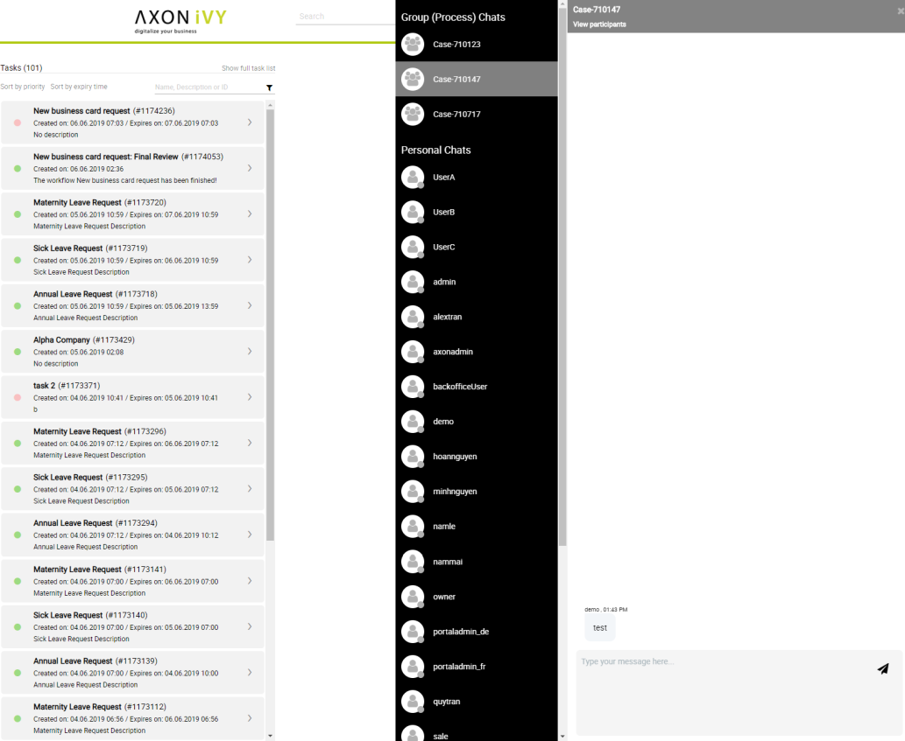

.. _axonivyportal.components.portalchat:

Portal chat
===========

.. _axonivyportal.components.portalchat.portalchatfeature:

Chat feature
------------

|image0|

.. _axonivyportal.components.portalchat.information:

Information
-----------

Chat feature is reimplemented from Ivy 7.4.

There are two modes of chat: Group chat and Private chat. Both features
are disabled by default.

1. You can turn on private chat with this Global setting:
   **ENABLE_PRIVATE_CHAT**.

2. You can turn on group chat with this Global setting:
   **ENABLE_GROUP_CHAT**.

   After turn on group chat feature, go to any task using Task Template,
   you will see the chat group icon there.

   Click on group chat icon, the dialog will appear to choose members of
   group chat. Members could be users or roles.

      **Tip**

      Group chat supports some customizations, refer to
      `#axonivyportal.customization.groupchat <#axonivyportal.customization.groupchat>`__
      for more details.

3. If browsers access Portal through a reverse proxy Nginx, set Global
   setting **CHAT_RESPONSE_TIMEOUT** a number less than Nginx timeout to
   make chat work properly.

.. _axonivyportal.components.portalchat.limitation:

Limitation of current Portal chat
---------------------------------

1. Do not support multiple tabs. For each browser, user is able to open
   1 Portal tab if he enables Portal chat.

2. Do not support multiple applications. User is able to chat with other
   users in current application, cannot chat with users in other
   application.

