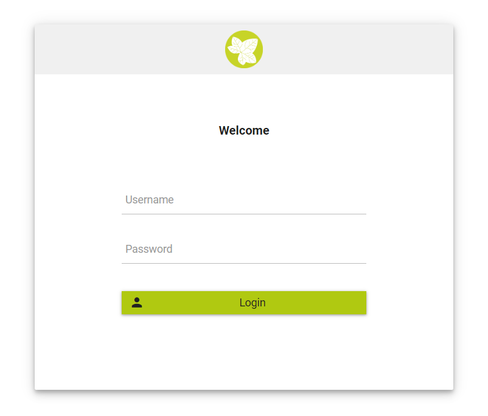

.. _axonivyportal.customization.login:

Login
=====

Login page
----------

|image0|

To replace default login page, extends existing templates with
``ui:define name="login"`` to define your new login component like below

``<ui:composition template="/layouts/BasicTemplate.xhtml">``

``<ui:define name="login">``

``<ic:internaltest.ui.YourOwnLoginComponent />``

``</ui:define>``

``</ui:composition>``

