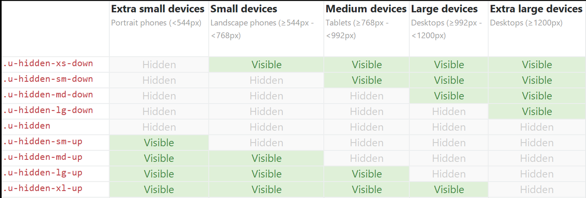

.. _axonivyportal.customization.responsivecss:

Responsive CSS
==============

.. _axonivyportal.customization.responsivecss.introduction:

Introduction
------------

Portal has some utility css classes to support show/hide elements on
different resolutions.

.. _axonivyportal.customization.responsivecss.detail:

Bootstrap based responsive css
------------------------------

These classes was created base on bootstrap responsive.

|image0|

