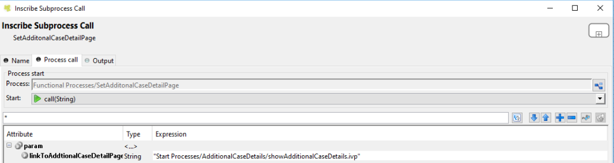

.. _axonivyportal.customization.additionalcasedetailspage:

Additional case details page
============================

.. _axonivyportal.customization.additionalcasedetailspage.introduction:

Introduction
------------

The additional case details page shows all custom fields of a case by
clicking on "Show details" link in case details.

You can customize this page for each case by providing a relative URL to
case.

.. _axonivyportal.customization.additionalcasedetailspage.customization:

Customization
-------------

1. Create a new additional case details UI and a start process which
   will display the new UI.

   |image0|

2. Store the URL of start process in
   "CUSTOMIZATION_ADDITIONAL_CASE_DETAILS_PAGE" additional property of
   case. You could use ``SetAdditonalCaseDetailPage.mod`` callable
   process, and input the friendly URL of process as parameter.

   |image1|

..

   **Tip**

   If you want to redirect user to external link, simply store that
   external link to "CUSTOMIZATION_ADDITIONAL_CASE_DETAILS_PAGE"
   additional property of case.

.. |image0| image:: images/AdditionalCaseDetailsPage/CustomizationAdditionalCaseDetailsPage.png

