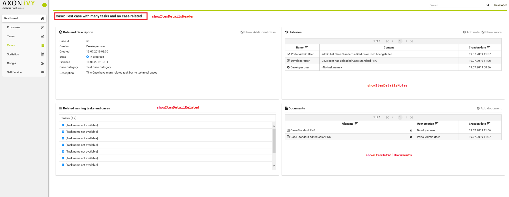
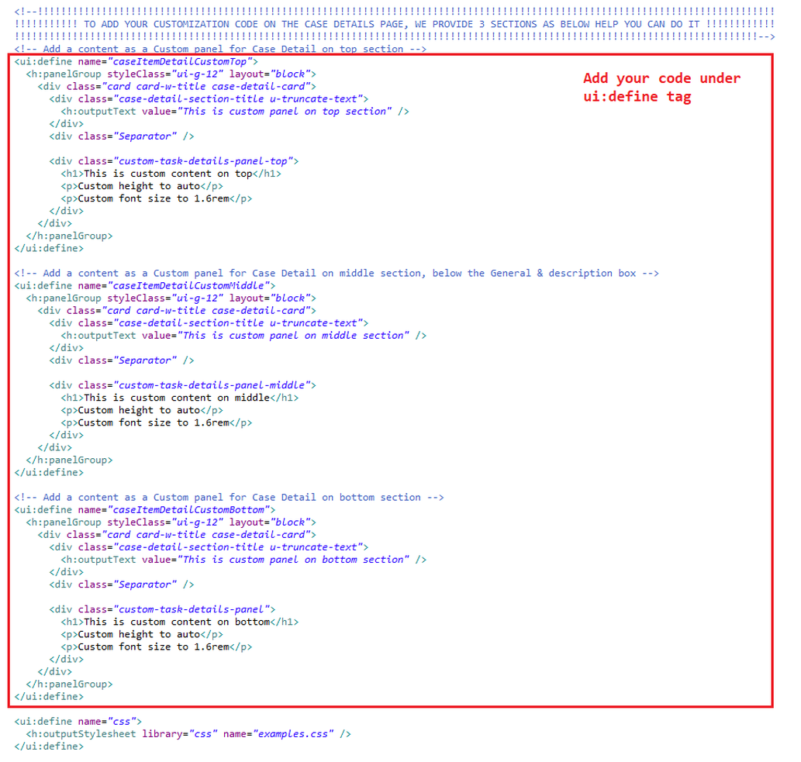
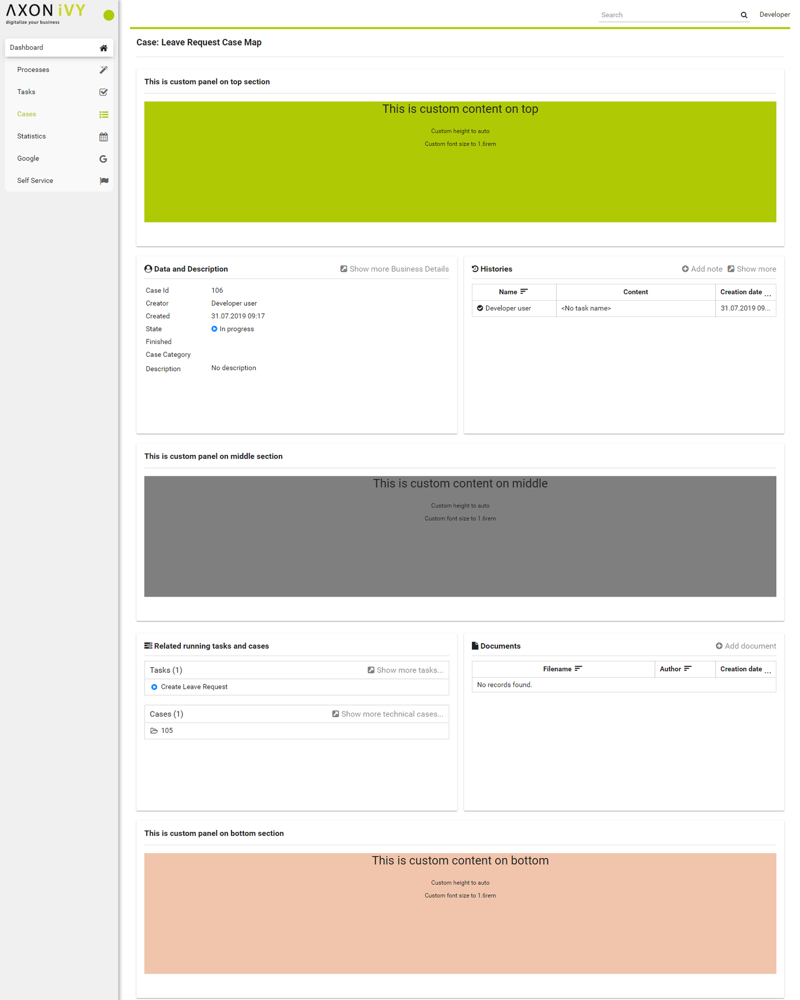
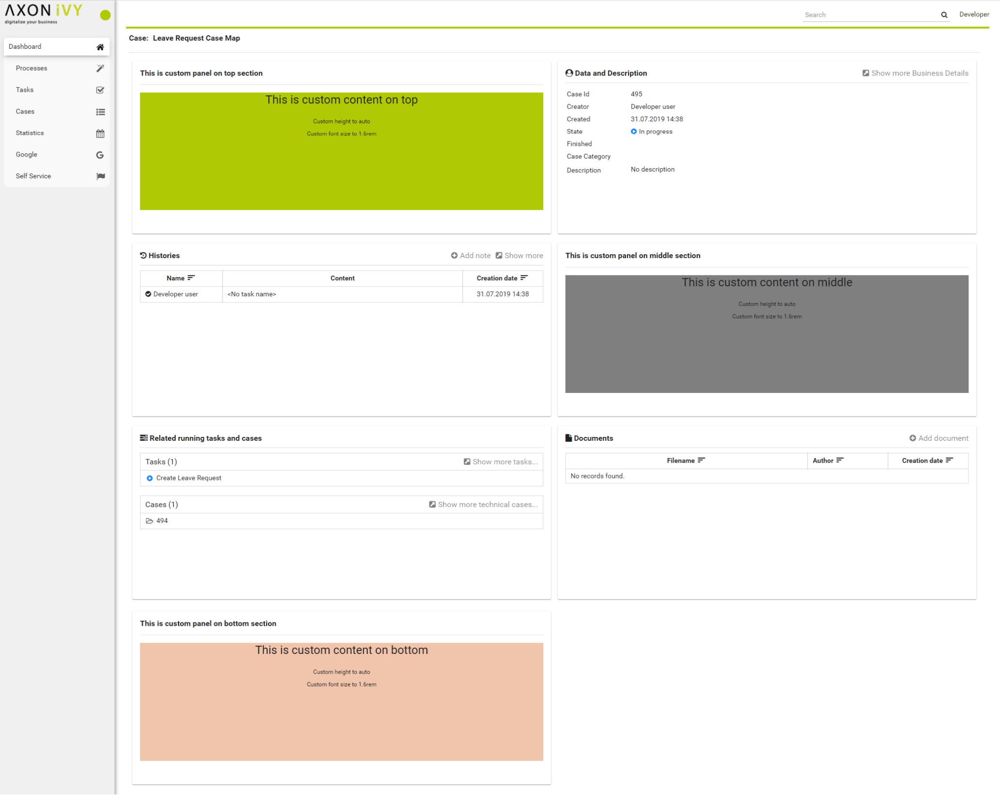

.. _customization-case-item-details:

Case item details
=================

CaseItemDetails is a built-in component of Portal which contains the
case info which users can interact with. In order to show needed case's
information, Portal supports overriding concept for CaseItemDetails.

Each CaseItemDetails contains

-  CaseItemDetailsHeader

-  CaseItemDetailsRelated

-  CaseItemDetailsHistories

-  CaseItemDetailsDocuments

-  CaseItemDetail custom panel: caseItemDetailCustomTop,
   caseItemDetailCustomMiddle, caseItemDetailCustomBottom

|case-standard|

   .. important:: "Data and Description" panel always displays, we cannot override its
                 content or hide/show this panel.
   
.. _customization-case-item-details-how-to-override-ui:

How to custom Case item details UI
----------------------------------

Refer to ``PortalExamples`` project for examples.

1. Introduce an Axon.ivy project which has ``PortalTemplate`` as a
   required library.

2. To customize case item detail, you must customize Portal Home first.
   Refer to :ref:`Customize Portal
   home <customization-portal-home>` to set new home
   page.

3. Copy the ``PortalStart`` process from ``PortalTemplate`` to your
   project. Point PortalHome element to your custom home page in
   previous step. This process is new home page and administrator should
   register this link by Portal's Admin Settings.

4. Custom the Case item details:

   -  Introduce a new HTMLDialog which uses template
      ``/layouts/PortalCaseDetailsTemplate.xhtml``. You can take a look
      at ``PortalCaseDetails.xhtml`` to see how to customize it.

         .. tip:: Highly recommend to copy the ``PortalCaseDetails`` HTMLDialog
            in PortalTemplate. Remove ``ui:remove`` and change the copied
            one's view.

   -  Use Axon.ivy Override to override the
      ``OpenPortalCaseDetails`` callable. The original implementation of this
      callable is calling ``PortalCaseDetails``, change it to call the customized
      Page introduced in the step above. The signature of this callable is
      ``call(ICase)`` and customized page must receive this ICase instance, put in
      the dialog's ``Data`` with the exact name ``caseData`` .

5. After previous steps, you can override Case item details UI elements
   as shown/hidden element by keywords:

   To show/hide, please using ``showItemDetailsHeader``,
   ``showItemDetailRelated``, ``showItemDetailsHistories``,
   ``showItemDetailDocuments`` code. For more details, please refer to
   :ref:`Show/Hide
   components <customization-case-item-details-how-to-override-ui-show-hidden-ui>`.

   And to add a new elements, please refer to :ref:`Add new Custom
   panel <customization-case-item-details-how-to-overide-ui-custom-body>`
   code

.. _customization-case-item-details-how-to-override-ui-show-hidden-ui:

Show/Hide components by keywords
~~~~~~~~~~~~~~~~~~~~~~~~~~~~~~~~

Refer to the ``ui`` tag list in ``PortalCaseDetails.xhtml`` of
PortalTemplate. In case, we want to show/hide any elements on
CaseItemDetails, we should override value of ``ui:param``

List valid parameters:

-  ``ui:param name="showItemDetailsHeader" value="true"``

   To show/hide Case header, by default it's true. You should set as
   false in case we set alwaysShowDetails for CaseItem.

-  ``ui:param name="showItemDetailsHistories" value="true">``

   To show/hide Case Histories component, by default it's true.

-  ``ui:param name="showItemDetailDocuments" value="true"``

   To show/hide Case Documents component, by default it's true.

-  ``ui:param name="showItemDetailRelated" value="true"``

   To show/hide Case Related Tasks/Cases component, by default it's
   true.

.. _customization-case-item-details-how-to-overide-ui-custom-body:

Add new Custom panel
~~~~~~~~~~~~~~~~~~~~

Refer to the ``caseItemDetailCustom*`` section in
``PortalCaseDetails.xhtml`` of PortalTemplate.

-  We need to define ``ui:define`` with a valid name such as
   ``caseItemDetailCustomTop``, ``caseItemDetailCustomMiddle`` and
   ``caseItemDetailCustomBottom``.

   The ``caseItemDetailCustomTop``: will be shown on the top of the
   component

   The ``caseItemDetailCustomMiddle``: will be shown on the middle of
   the component

   The ``caseItemDetailCustomBottom``: will be shown on the bottom of
   the component

-  Add your custom code into tags above.

-  Finally, your custom panel will be displayed inside of
   :ref:`CaseItemDetails <customization-case-item-details>`
   page.

-  Below is example code for override custom panel box of case details

   |custom-panel-example-code|

-  After applied above code to your custom page, custom panels will be
   displayed as below

   |case-customized|

-  Other example, we have a full flexibility page if we use ``ui-g-*``
   class to define the width of panel

   We used ``ui-g-6`` class to define width for 3 custom panels in the
   custom page below

   |case-customized-fit|

