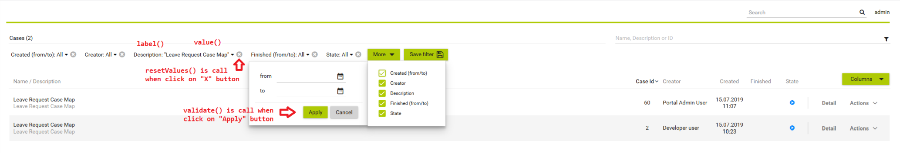
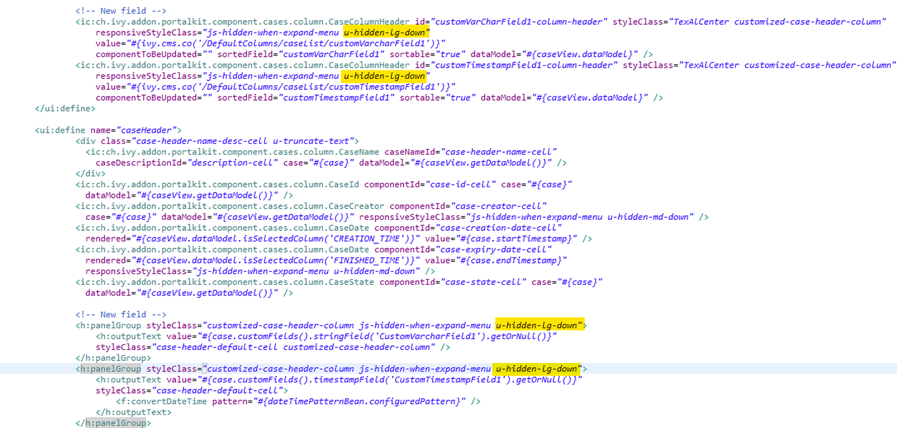
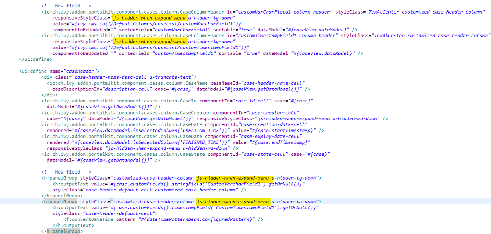

.. _axonivyportal.customization.casewidget:

Case widget
===========

CaseWidget is a built-in component of Portal which contains the cases
which users can interact with. In order to show needed case's
information, Portal supports overriding concept for CaseWidget. Each
CaseWidget contains 2 parts:

1. `UI <#axonivyportal.customization.casewidget.howtooverideui>`__ :
   CaseListHeader, CaseHeader and CaseFilter

2. `Data
   query <#axonivyportal.customization.casewidget.howtooverridedataquery>`__
   : display the cases as you want by modifying data query

..

   **Important**

   1. Case header customization currently support responsive design.
      Refer to `this
      part <#axonivyportal.customization.casewidget.responsivelayout>`__
      for more detail.

   2. Case header's buttons cannot be modified (they stay where they
      are)

.. _axonivyportal.customization.casewidget.howtooverideui:

How to override case widget's UI
--------------------------------

Refer to ``PortalExamples`` project for examples

1. Introduce an Axon.ivy project which has ``PortalTemplate`` as a
   required library.

2. To customize case widget, you must customize Portal Home first. Refer
   to `Customize Portal
   home <#axonivyportal.customization.portalhome>`__ to set new home
   page.

3. Copy the ``PortalStart`` process from ``PortalTemplate`` to your
   project. Point PortalHome element to your custom home page in
   previous step. This process is new home page and administrator should
   register this link by Portal's Admin Settings.

4. Override Case widget in: CaseList page, Case Search result.

   -  Introduce a new HTMLDialog which uses template
      ``/layouts/PortalCasesTemplate.xhtml`` (refer to
      `Responsiveness <#axonivyportal.components.layouttemplates.reponsiveness>`__
      to override responsiveness). You can take a look at
      ``PortalCases.xhtml`` to see how to customize it.

         **Tip**

         Highly recommend to copy the ``PortalCases`` HTMLDialog in
         PortalTemplate and change the copied one's view.

   -  Use Axon.ivy Override to override the
      OpenPortalCases
      callable. The original implementation of this callable is calling
      PortalCases
      , change it to call the customized Page introduced in the step
      above. The signature of this callable is
      useView(CaseView)
      and customized page must receive this
      CaseView
      instance, put in the dialog's
      Data
      with the exact name
      caseView
      .

5. After previous steps, you can override `CaseHeader and
   CaseListHeader <#axonivyportal.customization.casewidget.howtooverideui.caseheader>`__
   and
   `CaseFilter <#axonivyportal.customization.casewidget.howtooverideui.casefilter>`__

.. _axonivyportal.customization.casewidget.howtooverideui.caseheader:

Case List Header and Case Header
~~~~~~~~~~~~~~~~~~~~~~~~~~~~~~~~

Refer to the ``caseListHeader`` and ``caseHeader`` sections in
``PortalCases.xhtml`` of PortalTemplate. In case your case widget has
new columns, you should override CaseLazyDataModel to make the sort
function of these columns work:

-  Introduce a java class extends CaseLazyDataModel

-  Override the ``extendSort`` method and extend the sort function for
   the added columns (see the method's Javadoc comments)

-  Default caseList supports user to config display/hide column

   -  In case you have new columns, override method
      ``getDefaultColumns`` of the extended class from CaseLazyDataModel
      to display checkboxes in Config columns panel and display/hide
      sortFields (see the methods' Javadoc comments)

   -  To add cms for checkboxes's label, add new entries to folder
      ``/ch.ivy.addon.portalkit.ui.jsf/caseList/defaultColumns/`` in
      ``PortalStyle`` or override method ``getColumnLabel``\ (see the
      methods' Javadoc comments)

   -  In ``caseListHeader`` section, use ``CaseColumnHeader`` component

   -  In ``caseHeader`` section, use ``CaseCustomField`` component for
      each additional column. This component will handle display/hide
      new columns on case list.

      Currently, CaseCustomField only supports text field. If you want
      to create your own component, remember to add
      ``rendered="#{caseView.dataModel.isSelectedColumn('YOUR_CUSTOM_COLUMN')}"``

      For example: Show custom field ``customer name`` which stored in
      ``case.customVarCharField1``

      ``<ic:ch.ivy.addon.portalkit.component.cases.column.CaseCustomField id="case-customer-name-component" panelGroupId="customVarCharField1-column-case-header-panel" componentId="customVarCharField1-column-case-header-text" column="customVarCharField1" dataModel="#{caseView.dataModel}" labelValue="#{case.customVarCharField1}" />``

-  Use Axon.ivy Override to override the ``InitializeCaseDataModel``
   callable and initialize data model by your customized one.

-  In your customized portal cases HTMLDialog, the customized data model
   should be passed as a parameter to components (refer to
   ``PortalCases.xhtml``).

.. _axonivyportal.customization.casewidget.howtooverridecasefilter:

Case filter
~~~~~~~~~~~

-  Refer to the ``caseFilter`` section in ``PortalCases.xhtml`` of
   PortalTemplate.

-  In order to introduce new filter, create a new java class extends
   CaseFilter and override its methods (see javadoc comments)

   |image0|

-  Introduce a java class extends CaseFilterContainer. This filter
   container contains your filters, you can reuse default filters, refer
   to ``DefaultCaseFilterContainer.java``

      **Tip**

      StateFilter is added as default to container. If you don't need
      it, use this code in constructor: ``filters.remove(stateFilter);``

-  Introduce a java class extends CaseLazyDataModel. Override the
   ``initFilterContainer`` method and initialize filter container (see
   javadoc comments)

-  Use Axon.ivy Override to override the ``InitializeCaseDataModel``
   callable and initialize data model by your customized one.

-  In your customized portal cases HTMLDialog, the customized data model
   and filter container should be passed as parameters to components
   (refer to ``PortalCases.xhtml``).

-  Portal supports storing/restoring filters. Your filter class (extends
   ``CaseFilter``) is stored in business data. Properties stored user
   input values should be persisted, properties controlled logic should
   not be persisted to reduce persisted data size in business data. Use
   annotation ``@JsonIgnore`` to exclude properties. By default, Portal
   takes care storing/restoring filters. If you want to customize
   storing/restoring filter data, do it in your data model class
   (extends ``CaseLazyDataModel`` class).

-  By default, filters are stored/restored in process model level. You
   can change this by setting the ui:param ``filterGroupId`` in
   ``PortalCases.xhtml`` to a new Long value.

      **Tip**

      If you have multiple case lists in your project, you may want to
      set ``filterGroupId`` to an unique identifier for each of your
      ``PortalCases.xhtml`` across your projects

.. _axonivyportal.customization.casewidget.howtooverridedataquery:

How to override case widget's data query
----------------------------------------

Override the ``BuildCaseQuery`` callable process of PortalKit and build
your own query to effect the data of case widget.

Apply the following steps in case you would like to provide data for
case list after navigating to case list from your page:

-  Use the ``OpenPortalCases`` callable process with the ``CaseView``
   parameter. It is used to define which information are displayed in
   CaseWidget.

-  Refer to CaseView, CaseSearchCriteria to build your CaseView

::

   CaseLazyDataModel dataModel = new CaseLazyDataModel();
   dataModel.getCriteria().setCustomCaseQuery(YOUR_CASE_QUERY); // Set your CaseQuery
   dataModel.getCriteria().setAdminQuery(true); // Display the cases of all users
   out.caseView = CaseView.create().dataModel(dataModel)
   .withTitle("My Cases").buildNewView();
               

.. _axonivyportal.customization.casewidget.responsivelayout:

How to make reponsive case list
-------------------------------

If you have customized case list and want it responsive on different
screen sizes, please follow below steps.

You can refer to ``PortalExamples`` project for examples

1. Add responsiveStyleClass param (in case you're using Portal
   component), or styleClass (in case you're using Primefaces or JSF
   component) with the same responsive css class for both caseListHeader
   and caseHeader. You can find responsive class in `this
   part. <#axonivyportal.customization.responsivecss>`__

   |image1|

      **Tip**

      Hint: ``CaseCustomField`` component has default
      responsiveStyleClass is ``u-hidden-sm-down``

2. Responsiveness could be broken when you anchor left menu. In this
   case, to maintain the responsiveness, you could hide some columns by
   add ``js-hidden-when-expand-menu`` to responsiveStyleClass or
   styleClass param of caseListHeader and caseHeader.

   |image2|

      **Tip**

      Hint: The smallest browser width you can anchor the left menu is
      1025. So you could reduce width of browser to 1025 to test and
      decide which columns need to be hidden.

