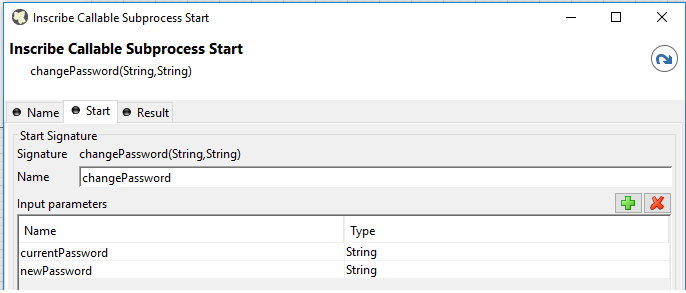
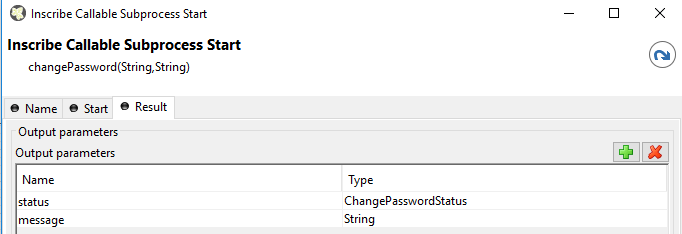
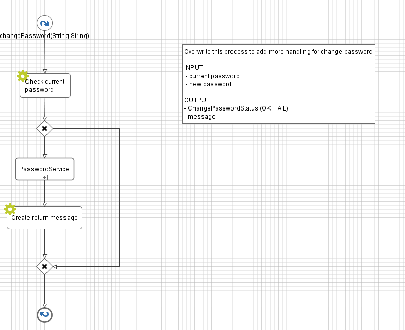

.. _customization-change-password-process:

Change password process
=======================

.. _customization-change-password-process-introduction:

Introduction
------------

In Portal, the ``Change password process`` helps users to change their
current password, you can customize this process to add more handling
when user change password.

.. _customization-change-password-process-customization:

Customization
-------------

Create a callable sub process in your project with the
``changePassword(String,String)`` signature, make sure this signature is
unique in your application. It must return an enums
``ChangePasswordStatus`` and the ``message`` showing to user (you can
override this process in PortalKit):

