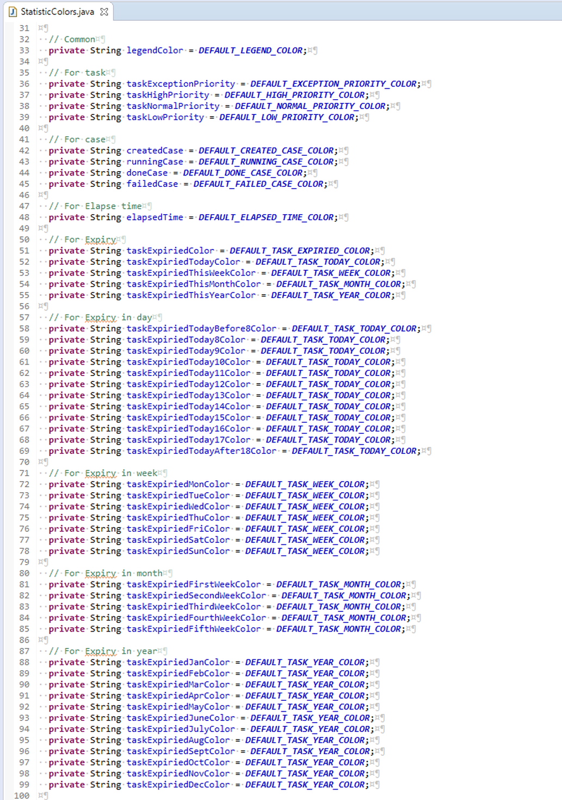

.. _customization-default-chart-colors:

Default chart color
*******************

.. _customization-default-chart-colors-introduction:

Introduction
------------

In Portal, statistic color is set by ``DefaultCharColor`` sub process. But you can create your default chart color.

.. _override-Statistic-colors:

Customization
-------------

Create an override which overrides sub process ``DefaultChartColors`` in Portal Kit. This sub process return a list of default chart colors. Follow instruction to create chart color.

.. figure:: images/default-chart-colors/default-chart-color.png

.. centered:: :guilabel:`Default chart color`

Portal introduces **StatisticColors** object. We use it to build **DataSet** color, also provide some default constant, you can refer.

.. centered:: :guilabel:`Statistic color`

In Portal home, you can override color of Statistic Carousel header by re-define value of below variables in ``customization.scss``:

 - ``$statisticPanelHeader`` to override background color of Carousel header
 - ``$statisticPanelHeaderBorder`` to override border color of Carousel header
 - ``$statisticPanelHeaderText`` to override text color of Carousel header