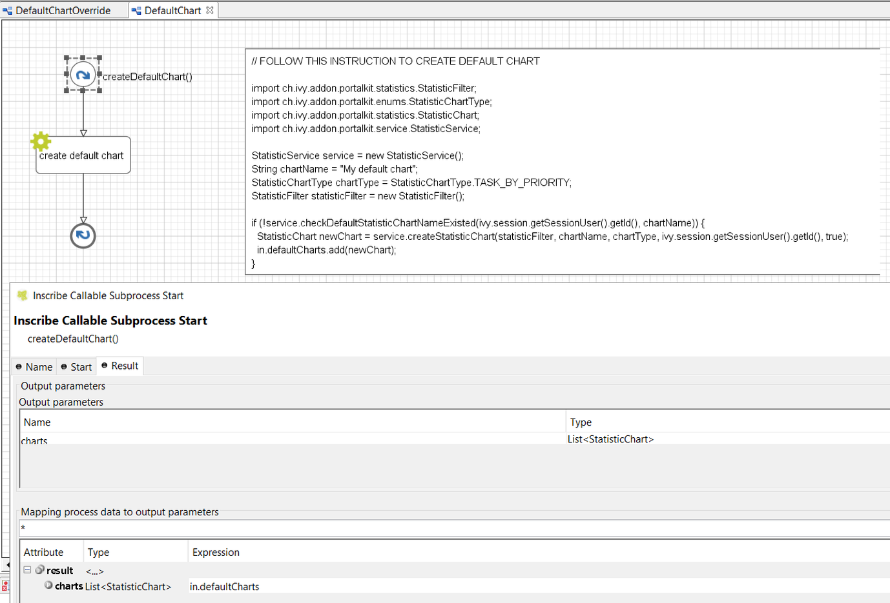

.. _customization-default-chart:

Default chart
=============

.. _customization-default-chart-introduction:

Introduction
------------

In Portal homepage, by default there is a chart named "Tasks by
Priority". But you can create your default chart.

.. _customization-default-chart-customization:

Customization
-------------

Create an override which overrides sub process ``DefaultChart`` in
Portal Kit. This sub process return a list of default charts. Follow
instruction to create charts.

|default-chart|

