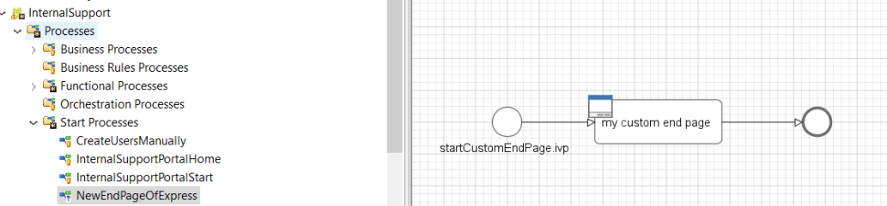
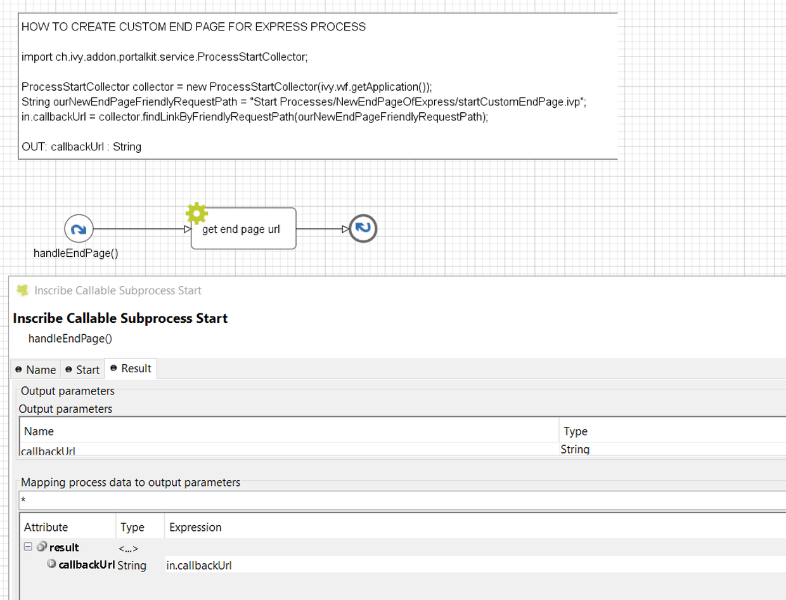

.. _customization-express-endpage:

Express end page
================

.. _customization-express-endpage-introduction:

Introduction
------------

When the last task of Axon Express finish, express end page will be
displayed. You can customize this by provide your own page.

.. _customization-express-endpage-customization:

Customization
-------------

1. Create a new UI and start link of the new end page.

   |new-end-page|

2. Create a callable sub process in your project with the
   ``handleEndPage()`` signature, make sure this signature is unique in
   your application. It must return start link of new end page you
   define in step 1.

   |handle-express-end-page|

