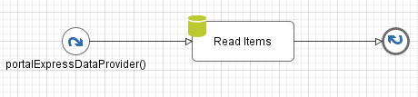
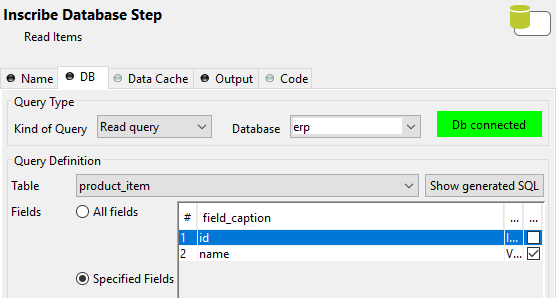

.. _customization-express-external-data-provider:

Express external data provider
==============================

.. _customization-express-external-data-provider-introduction:

Introduction
------------

In portal express we can provide the external data for checkbox values
when creating form, like a product catalogue can be maintained in the
background and the process calls this data provider.

.. _customization-express-external-data-provider-customization:

Customization
-------------

1. Create a callable subprocess that has signature
   "portalExpressDataProvider"

   |callable-sub-process|

   The subprocess return the list of String:

   |callable-sub-process-result|

   Below is an example that use Database element to read the data from
   DB as a data provider.

   In the DB tab:

   -  Kind of Query: choose "Read query"

   -  Database: select the database name

   -  Table: select the table name

   -  Fields: choose "Specified Fields" and tick one column that use for
      data provider.

   |database|

   In the Output tab, set the value for the output variable:

   ``out.items = recordset.getColumn("[name of the column]")``

   |database-output|

2. Create new Express Workflow

   In the form creation, choose Checkbox and select the data provider in
   the dropdown list. Then fill the label of check box and press Create
   button. You can drag and drop the checkbox element to the Placement
   of form elements and preview the values of the checkbox.

   Note: The first item in the dropdown list is "Special static data
   provider", it means that user will provide the values of the checkbox
   manually.

   |express-workflow|

