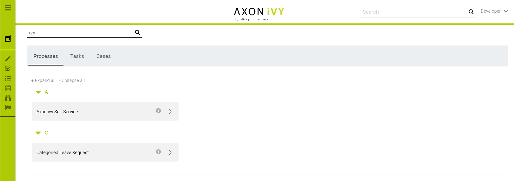
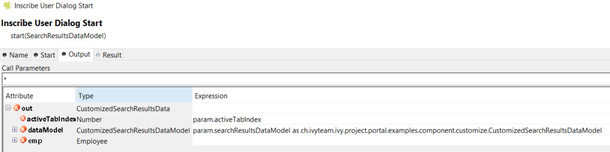
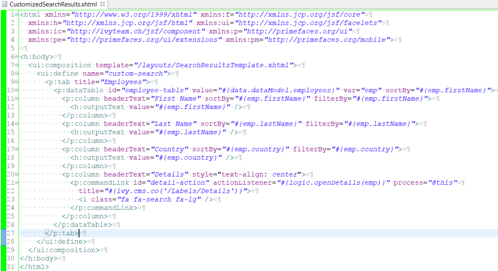

.. _axonivyportal.customization.globalsearchresult:

Global Search Result
====================

Global Search Result
--------------------

|image0|

Follow these steps to customize the global search page:

1. Introduce an Axon.ivy project which has ``PortalTemplate`` as a
   required library.

2. Copy the ``PortalStart`` process from ``PortalTemplate`` to your
   project. This process is new home page and administrator should
   register this link by global

3. Refer to `Customize Portal
   home <#axonivyportal.customization.portalhome>`__ to set new home
   page.

4. Create the customized search data model extends
   ``SearchResultsDataModel``, and override the ``search`` method to
   filter your objects.

      **Tip**

      Note: it is recommended that lazy loading or pagination should be
      applied for custom tabs to have a good performance.

5. Create the HTML dialog using
   ``/layouts/SearchResultsTemplate.xhtml``, recommended to copy the
   ``SearchResults`` HTML dialog in PortalTemplate. In dataclass, change
   the ``dataModel`` to the above one, and in logic, also cast it.

   |image1|

6. Define the ``custom-search`` section to add your customized tabs:

   |image2|

7. Override the ``OpenPortalSearch`` callable process and change the
   HTML dialog to your customized one.

..

   **Tip**

   Hint: refer to the example in the PortalExamples project:
   CustomizedSearchResultsDataModel.java, CustomizedSearchResults HTML
   dialog, OpenPortalSearchOverride callable process

