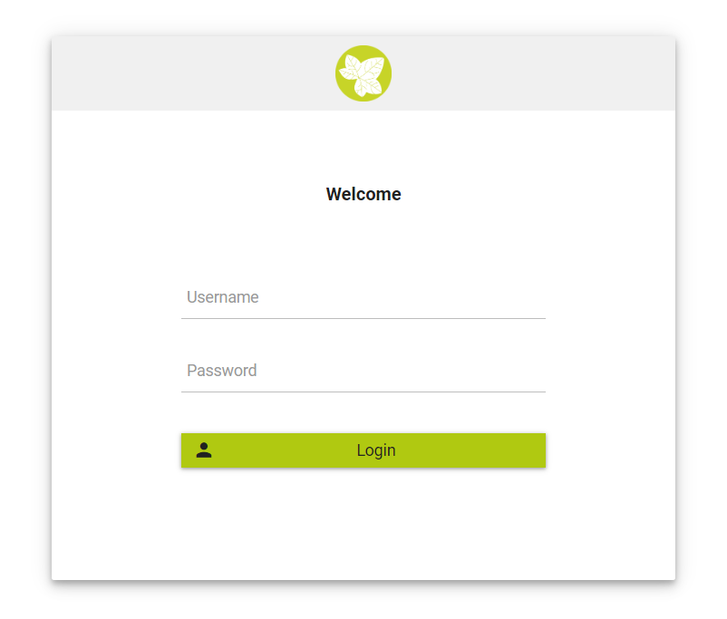

.. _customization-login:

Login
=====

Login page
----------

|login-default|

To replace default login page, extends existing templates with
``ui:define name="login"`` to define your new login component like below

.. code-block:: html

    <ui:composition template="/layouts/BasicTemplate.xhtml">
    <ui:define name="login">
    <ic:internaltest.ui.YourOwnLoginComponent />
    </ui:define>
    </ui:composition>

