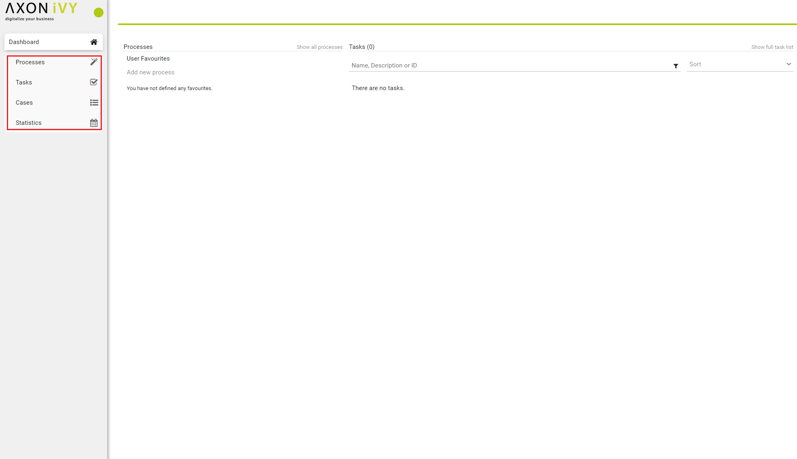
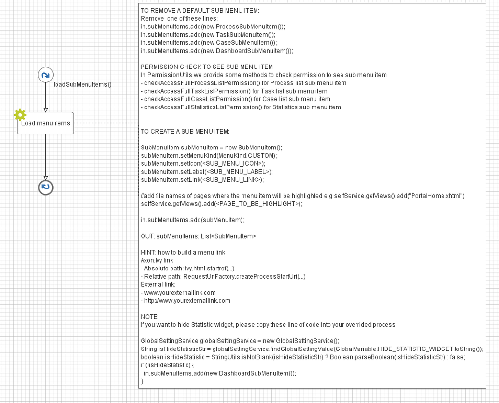

.. _customization-menu:

Menu
====

.. _customization-menu-introduction:

Introduction
------------

By default Portal main menu has 4 items: Processes, Tasks, Cases and
Statistics. You can remove these items or add your own items.

.. _customization-menu-customization:

Customization
-------------

Create a callable sub process in your project with the
``loadSubMenuItems()`` signature, make sure this signature is unique in
your application and follow the hints. User can hide Statistic widget in
`#axonivyportal.settings.adminsettings <#axonivyportal.settings.adminsettings>`__.
Therefore, if you want to hide Statistic widget in your overrided
process, please take a look on NOTE section of ``LoadSubMenuItems`` in
PortalTemplate.

