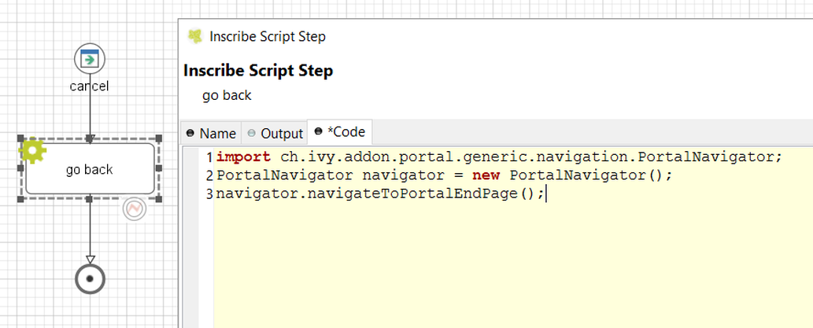

.. _customization-navigateback:

Navigate back
=============

.. _customization-navigateback.introduction:

-  When a task finish, Portal will navigate back to previous page. For
   example if a task is started from homepage, then go back to homepage.
   In case task is started from task list, then go back to task list
   after finish.

-  Developer can also apply this feature to their own button e.g Cancel
   a task.

-  Just call ``PortalNavigator.navigateToPortalEndPage()`` in your
   button function

   |navigate-back|

