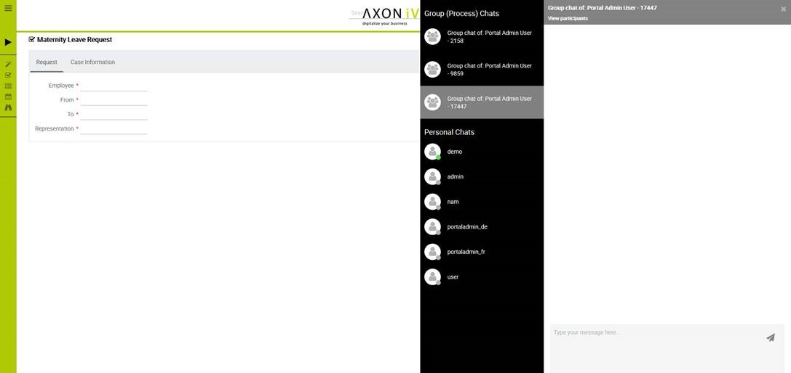
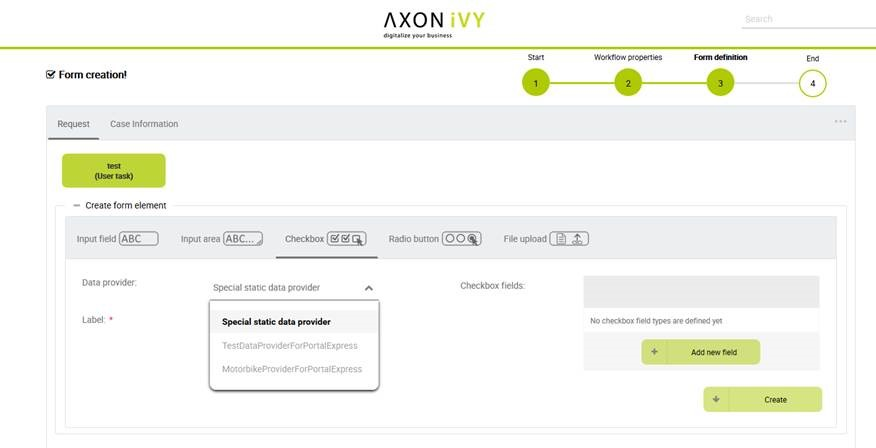
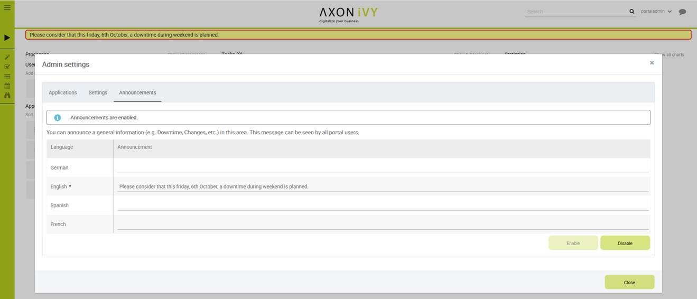

.. _axonivyportal.introduction:

Introduction
************

.. _axonivyportal.introduction.mainfeatures:

Main features
-------------

-  Repository of reusable components

-  Fast integration of process applications to the portal

-  Provide customers and other system vendors the flexibility to build
   their own portals, but reuse portal components of Ivy

.. _axonivyportal.introduction.newandnoteworthy:

New and Noteworthy
-----------------

.. _axonivyportal.introduction.newandnoteworthy.portalgroupchat:

Portal Group Chat
~~~~~~~~~~~~~~~~~

|image0|

-  Specific Case Related Chat

-  Activate/Deactivate independently

-  Define a Chat Group on runtime

-  Define a Chat Group during design

-  Customize the Group Chat Name

-  Chat information is stored and can be used for reporting

.. _axonivyportal.introduction.newandnoteworthy.dataproviderexpress:

Data Provider for Express
~~~~~~~~~~~~~~~~~~~~~~~~~

|image1|

-  Developers can prepare several Data Providers for Express

-  Citizen Developer can use these libraries as Data Provider in Express
   Workflow creation

.. _axonivyportal.introduction.newandnoteworthy.announcementportal:

Announcements in Portal
~~~~~~~~~~~~~~~~~~~~~~~

|image2|

-  Announce some important information like Downtimes directly in the
   portal

-  Multilanguage support

.. _axonivyportal.introduction.newandnoteworthy.furtherimprovement:

Further Improvements
~~~~~~~~~~~~~~~~~~~~

-  Enhance Filter Selection in Task and Case List

-  Chart Title in Dashboard

-  Visibility of Done Tasks and Cases

-  Enhanced Process List Navigation

-  Integrated AdHoc Workflows available

