.. _settings:

Settings
********

.. _settings-the-first-section:

User Settings provide options for configuring Portal applications:

-  :ref:`Admin settings <settings-admin-settings>`

-  :ref:`Absence and substitute settings <settings-absence-and-substitute-settings>`

-  :ref:`Email settings <settings-email>`

-  :ref:`Language settings <settings-language>`

|portal-header|

.. _settings-admin-settings:

Admin settings
==============

User needs to have role ``AXONIVY_PORTAL_ADMIN`` to see this menu item,
it is used to configure Portal configuration, see different Portal
configurations in
:ref:`General concept <installation-basic-installation-specify-servers-general-concept>`

Global settings
---------------

Global settings for Portal can be set in Settings tab. All available
settings with their default value and description are listed in this
place.

|global-settings|

You can edit value for a specific setting

|global-setting-edit|

You can also get back the default value for each setting by clicking
reset button on each row, or reset all values of all settings by
clicking ``Restore All To Defaults`` button

.. _settings-admin-settings-setup-multi-portals:

Setup multi portals
-------------------

.. important:: 
   
   There are 2 ways to configure portals: ``two levels`` and
   ``single level``

   -  Two levels portal

      |multi-application-with-portal|

      -  Used for related applications which we need an overview of all
         tasks and cases.

      -  Create a new application named Portal. Deploy portal (kit,
         template ..) to this application.

      -  Create new applications: App1, App2, App3... Deploy portal
         (kit, template ..) to new applications.

      -  Configure multi-apps Portal on single server: login by Portal
         Admin. Configure 1 server then configure applications: App1,
         App2, App3...

      -  Note that, ``do not`` add Portal application, it is reserved
         for displaying all tasks/cases... from all configured
         applications.

      -  Dashboard menu is only visible when logged-in user exists in
         Portal application.

   -  Single level portal

      |multi-application-without-portal|

      -  Used for independent applications.

      -  Create new applications: App1, App2, App3... Deploy portal(kit,
         template ..) to new applications. Note: must not create an
         application named Portal.

      -  Configure multi-apps Portal on single server: login by Portal
         Admin. Configure 1 server then configure applications: App1,
         App2, App3...

Open ``Admin Settings`` by selecting the item in ``UserMenu`` on the
topbar, if your page using layout of ``PortalTemplate`` .

|multi-portal-open-settings|

.. important:: 
   If your application does not use templates of PortalTemplate project, you
   have to create a page and use AdminSettings component inside.

..

.. tip:: To be able to open Admin Settings dialog, user needs to have role
      AXONIVY_PORTAL_ADMIN .

Add a new application

Choose ``Application`` tab on ``Admin Settings`` dialog and click on
``New`` button to add new application. Here you can choose application
type either as Ivy application or Third Party application.

|multi-portal-add-application|

   .. tip::

      -  ``Application name`` is the name of the application when you
         create it. ``Display name`` is the name of the application to be
         shown on Portal UI.

      -  ``Portal link`` specifies the link will be redirected when
         selecting the application on the application menu. It could be an
         absolute link (e.g.
         http://10.123.1.30:8000/ivy/pro/.../PortalStart.ivp) or relative
         link (e.g. /ivy/pro/.../PortalStart.ivp). If your application
         could be accessed from multiple domains, use relative link so that
         you can access the link from different domains.

      -  For multiple languages of application display name, you need to
         create the "AppInfo/SupportedLanguages" CMS which defines how many
         languages your application supports. See the below "Language
         settings" for more details.

.. _settings-absence-and-substitute-settings:

Absence and substitute settings
===============================

-  Choose ``Absences`` from ``User Settings`` options.

-  To create new Absence, click ``New Absence`` to open the dialog as
   below:

   |absence-settings|

   -  ``till/from date`` must not be empty.

   -  ``till date`` must be greater than or equal ``from`` .

   -  ``till date`` must not be in the past (greater than or equal
      today).

-  User can edit or delete Absences by click edit/delete on the Absences
   list.

-  Deputies area will display all the information of deputy on each
   application.

   |deputy-settings|

-  User cannot set deputies for hidden roles.

-  All the items will be saved after click Save button.

.. _settings-email:

Email settings
==============

-  To configure mails of Portal applications, select ``Email Settings``
   in ``User Settings`` .

-  You can configure one email setting for all applications or each
   application separately.

   |email-settings|

-  There are 2 types of emails notification: Ivy email notification sent
   when task is assigned (More information about the email notification
   can be found
   `here <http://developer.axonivy.com/doc/latest/EngineGuideHtml/administration.html#administration.emailnotification>`__)
   and other emails sent from processes of customer project.

-  All the items will be saved when click save button.

.. _settings-language:

Language settings
=================

-  Below is applied language setting precedence:

   |language-precedence|

   If user email language setting is application default, language would
   be applied by application email language setting.

   If user selects a language in email setting, language would be
   appplied by this selection.

-  To configure languages of Portal applications, select
   ``Language Settings`` in ``User Settings`` .

-  UI reads current languages settings for all applications.

-  To change language for application, select one in the languages
   dropdown list of application. When the change is saved, the language
   will be set for application (Click on the application in header menu
   to reload application and see the change of language).

   |language-settings|

-  For multiple languages, the CMS key ``/AppInfo/SupportedLanguages``
   must exist in your application. From Portal 7.1, this CMS entry is
   moved to Portal Style. It contains list of all languages supported by
   your application, separated by comma.

   -  Must not contain spaces
   -  Same as display name of Locale
   -  Separated by comma
   -  Process model version, which has this CMS, must active

-  To add new language to Portal, what you have to do is

   -  Add new language locale to cms entry of Portal Style ``/AppInfo/SupportedLanguages`` 
   -  Export all CMS entries of Portal Style to excel file
   -  Add translation of new language for all CMS entries
   -  Import file excel back, then redeploy Portal Style
   -  This is sample how to add new Spanish to portal

      |add-new-language|

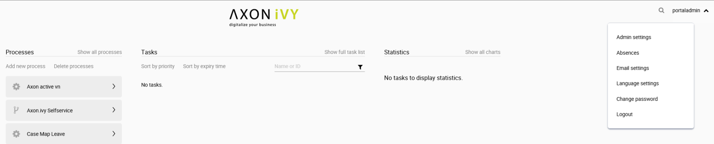
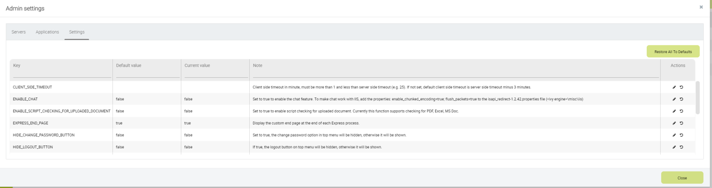
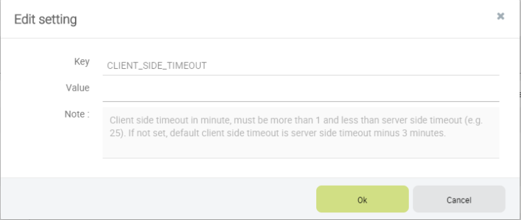
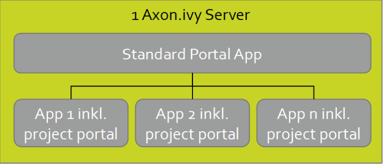
.. |multi-application-without-portal| image:: images/settings/multi-application-without-portal.png
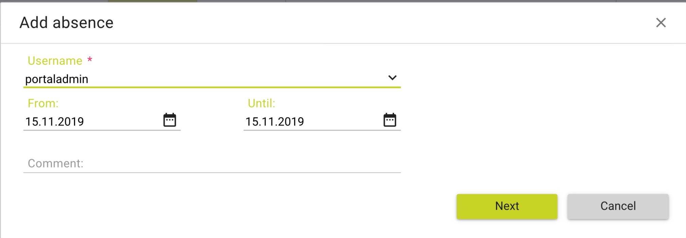
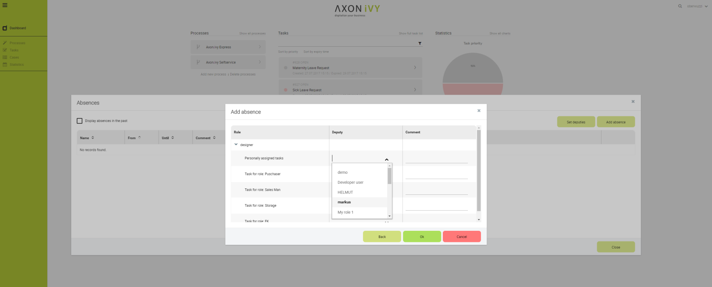
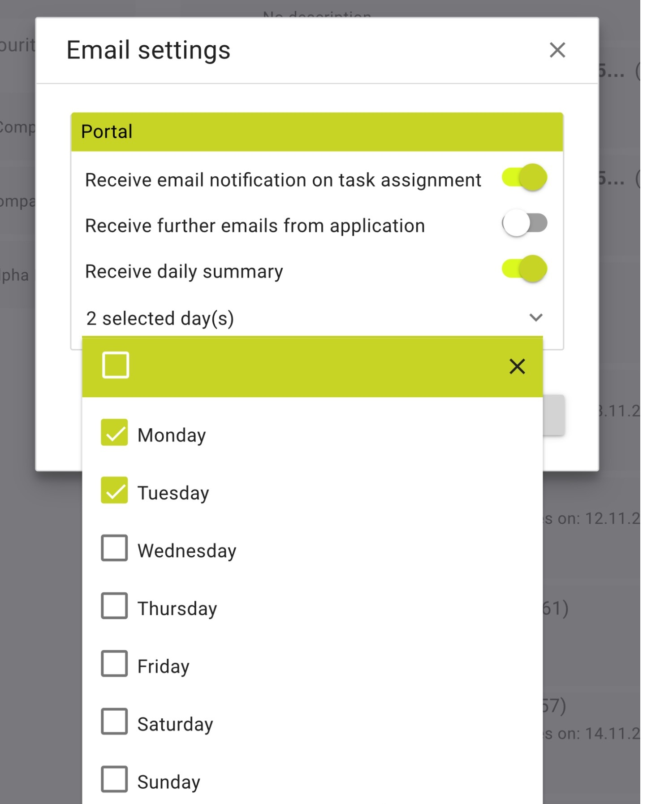
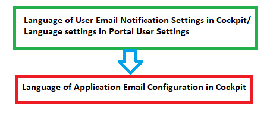
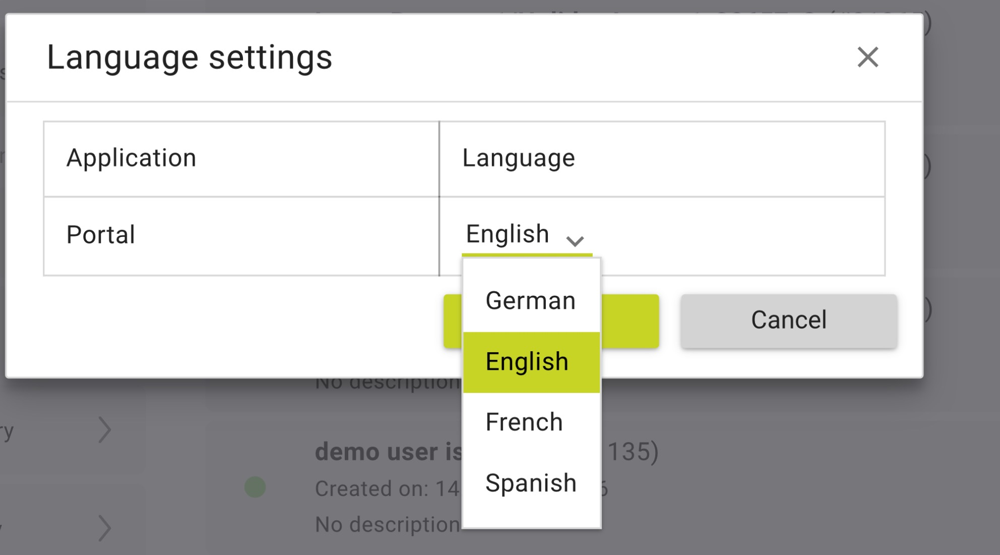
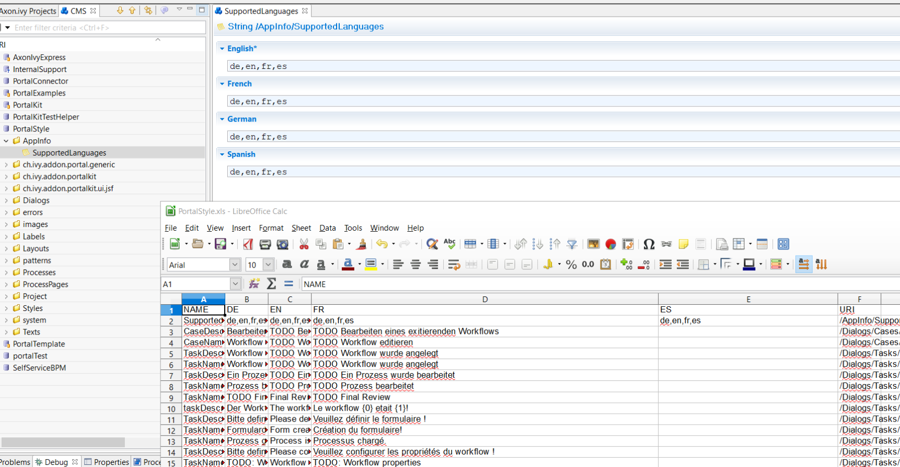
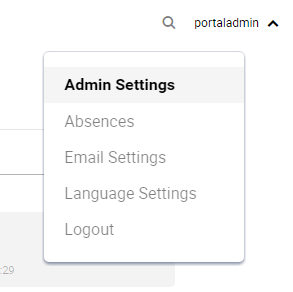
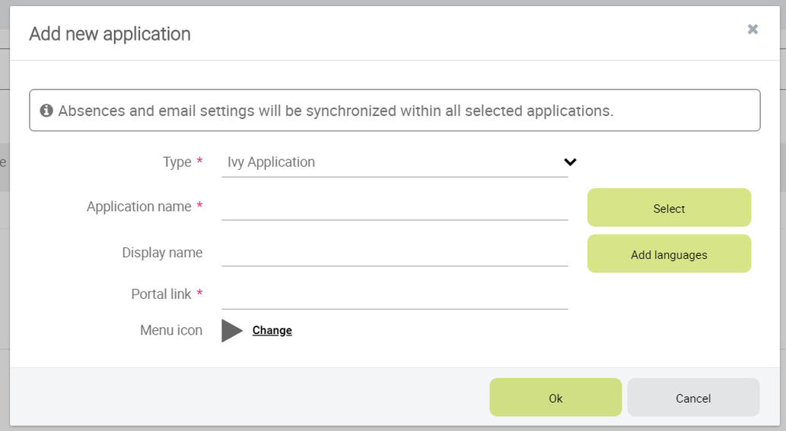

