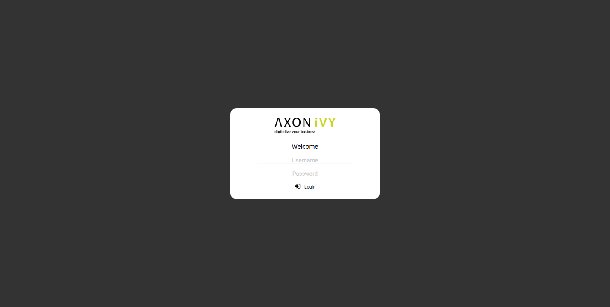
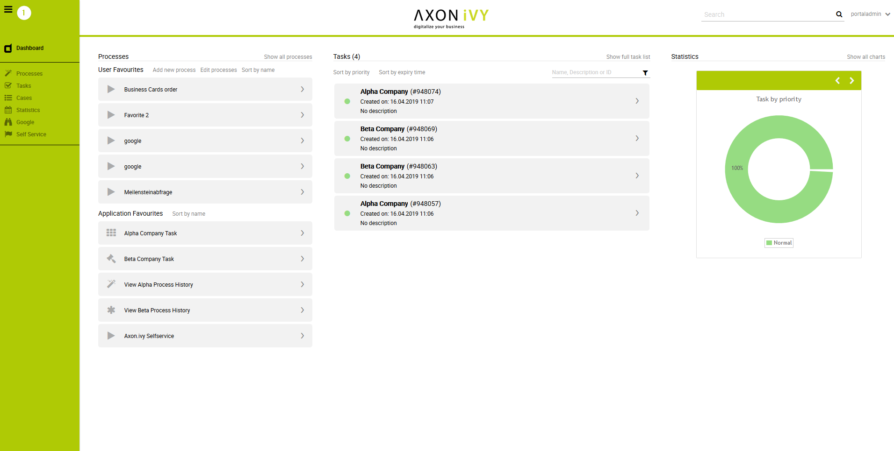
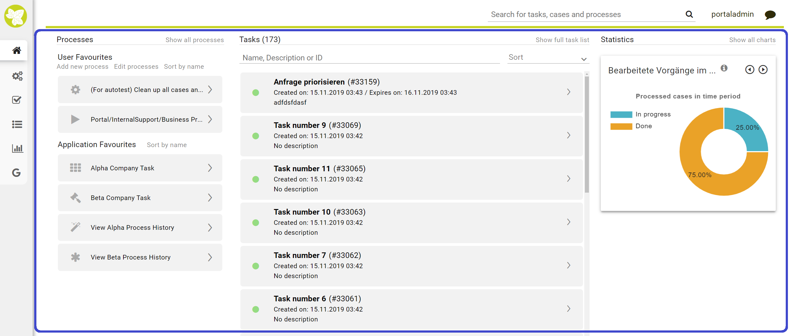

.. _axon-ivy-portal:

Axon.ivy Portal
***************
   
The :guilabel:`Axon.ivy Portal` is the centerpiece for your daily work with the
applications you / your company implemented using the Axon.ivy Digital Business
Platform. With a web-based, modern interface the Portal provides you with key
functionalities on all your devices:

-  Access your / your company’s applications and start new cases

-  Manage and fulfil tasks assigned to you or your roles

-  Understand what’s going on by using on-the-spot statistics and
   historic data on all your cases and tasks

-  Improve your Axon.ivy Portal experience and efficiency through the
   built-in customization options

This document provides you – as a business user – with a comprehensive
overview about the Axon.ivy Portal, its features and functionalities.

.. Hint::
	The look and feel shown in the screenshots of this document, as well as the
	presented features are part of the default standard Axon.ivy Portal. However,
	the Axon.ivy Portal is highly configurable, thus your company’s portal might
	have a different look and feel, and some features might be disabled by your
	administrator.

To start your Axon.ivy Portal experience, use the link provided to you by your
administrator. Following the link, the Axon.ivy Portal will ask for your login
credentials.

   
.. Hint:: 
   Depending on your company’s infrastructure, you might be automatically logged in
   by the single-sign-on (SSO). In this case you’ll directly be forwarded to the
   Axon.ivy Portal Dashboard. 

After successful login, you’ll see the Axon.ivy Portal Homepage and your
personal dashboard. All your activities can be managed from this central entry
point. In detail these are:
   
1. The Axon.ivy Portal header on the top is always visible and provides
   you with a global search, key information about the portal and options to
   configure your personal user account. See  :ref:`portal-header`  for
   details.
   

2. The menu on the left side is always available and gives you access to
   all processes, cases, tasks and other features of the Axon.ivy Portal. You
   may enlarge or minimise the menu using the **Toggle Menu** button
   in the top left corner.
   

3. In the center you see your personal dashboard providing you instant
   access to your processes, tasks and performance indicators. See
   :ref:`dashboard` for a detailed introduction.

.. include:: ../includes/_common-icon.rst

