.. _dashboard:

Dashboard
*********

The Axon.ivy Portal :guilabel:`Dashboard` is the first page you encounter after
successful login. You can always get back to the dashboard using the 
**Dashboard** link in the Axon.ivy Portal menu. Alternatively, you can click on
the Axon.ivy logo in the header.

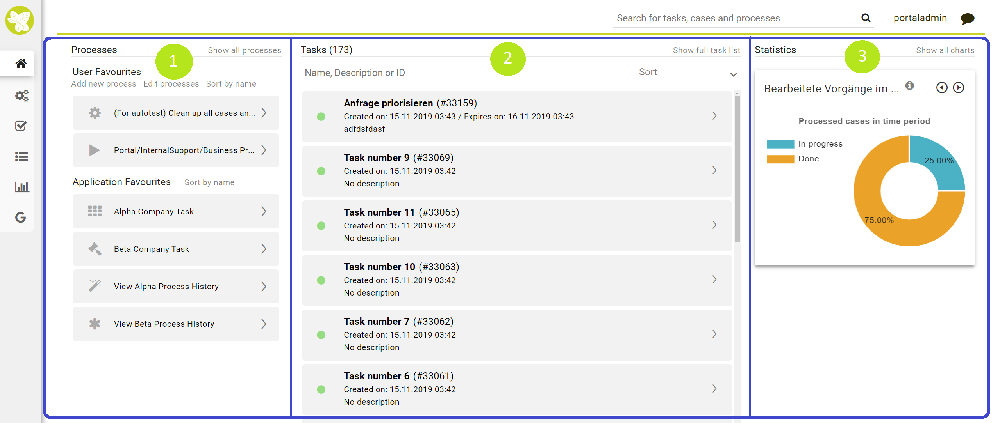

The dashboard itself is separated in 3 sections:

   1. The :guilabel:`Processes`  section on the left side. Here you find and
      manage quick links to the processes you use most often in your daily work. The
      section Processes is described in detail `Process Favorites`_.

   2. The :guilabel:`Tasks`  section in the center. Here you see all the open tasks
      assigned to your or your organizational unit. These tasks require
      your personal attention. The section is described in detail `Personal Tasks`_.

   3. The :guilabel:`Statistics` section on the right side. The charts in this
      section provide you with basic information on the performance of your
      cases and tasks. This section is described in detail in `Statistics`_.

Process Favorites
-----------------

The  **Process favorites** you find under the heading :guilabel:`Processes` on the
left side of your dashboard. They provide you with a quick and easy access to
the processes you need most in your daily work. Therefore, the process favorites
are a key feature to enhance your Axon.ivy Portal experience and increase your
efficiency. To make full use of this feature the Axon.ivy Portal offers you an
easy way to configure the process favorites to your personal needs. 

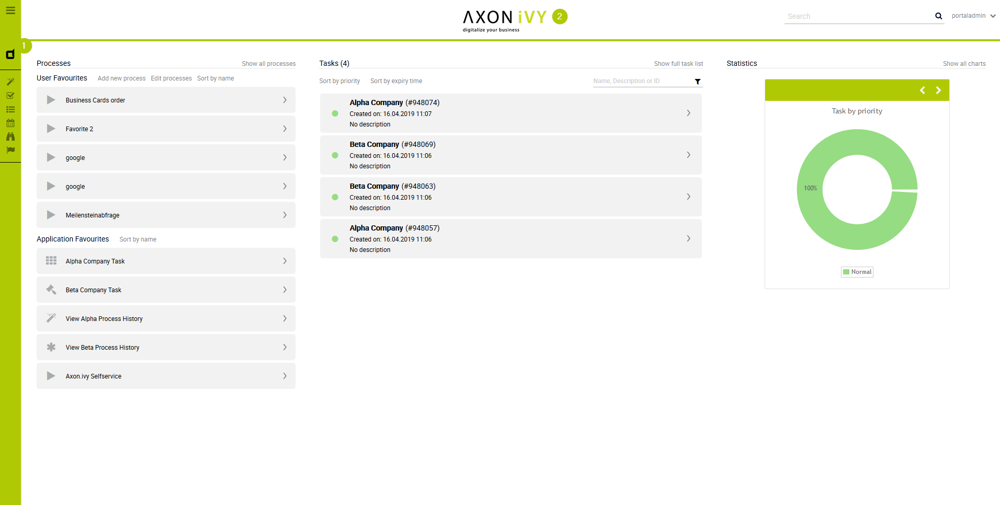

When you have a look at the process favorites you see two areas:

-  On the top you find the :guilabel:`User Favorites` which you need to
   configure before you can use them. You may add processes here as well
   as external links.

-  Below you find the :guilabel:`Application Favorites`. They are centrally
   configured by your administrator. Therefore, you may use but not
   change them.

Furthermore, next to the heading you find a link :guilabel:`Show all processes`.
This quick link routes you the **Full Process List** page of the
Axon.ivy Portal. Please refer to :ref:`full-process-list` for more detail information.

.. _howto-add-a-process-as-a-user-favorite:

HowTo: Add a process as a user favorite
---------------------------------------

1. Select the link **Add new process** which you find next to the
   heading **User Favorites**.

2. The dialog :guilabel:`Add new user process` is opened.

3. For the **Process type** keep the initial setting *Process start
   link*.

4. For the **Process name** use the dropdown menu to select the process
   you want to add.

5. The **Start link** is automatically filled by the Axon.ivy Portal.

6. You may change the **Icon** for the process by using the link
   |change-icon| **Change** and selecting your preferred icon.

7. Confirm your configuration with the button **Add**.

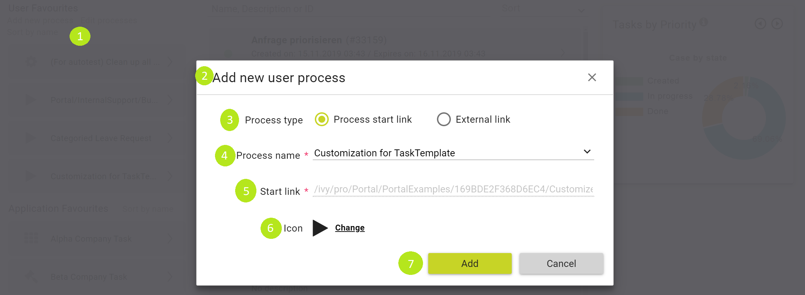

.. hint:: 
   The list of processes in the dropdown menu shows only the processes which are
   accessible to you depending on your roles.     
                                 
   Furthermore, the list shows only processes which are not added to your user
   favourites so far. You cannot add a process multiple time.

HowTo: Delete a process as a user favorite
------------------------------------------

1. Select the link **Edit processes** next to the heading **User
   Favorites**.

2. Click on the |trash-icon| **Delete** symbol next to process / processes
   you wish to remove from your user favorites.

3. Confirm the removal with the link **Save** next to the heading **User
   Favorites**.

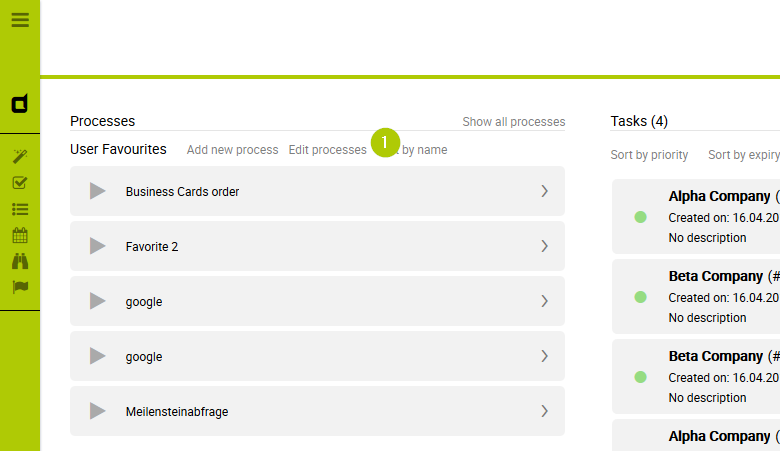

.. figure:: images/how-to-delete-process-favorites-2.png

HowTo: Reorder user favorites
-----------------------------

There are two ways to order the processes in your :guilabel:`User Favorites`.

I. Sort by name 
^^^^^^^^^^^^^^^

   To order your processes and external links in an alphabetical order
   you can use the link **Sort by name** next to the heading **User
   Favorites**.

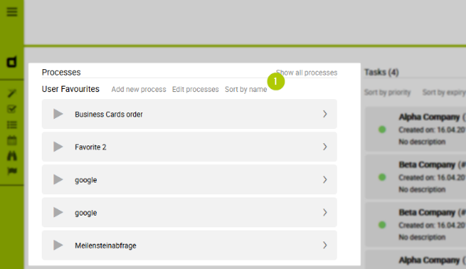

II. Edit processes
^^^^^^^^^^^^^^^^^^

1. To order your processes in an individual order, select the link
   **Edit processes** next to the heading **User Favorites**.

2. Change the order of your processes using drag and drop.

3. Confirm the reorder with the link **Save** next to the heading **User
   Favorites**.

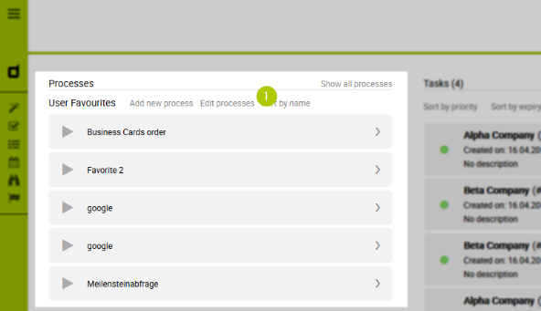

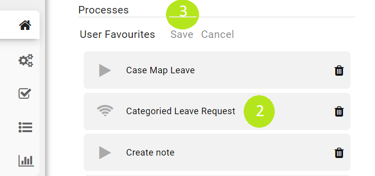

HowTo: Add an external link as user favorite
--------------------------------------------

1. Select the link **Add new process** which you find next to the
   heading **User Favorites**.

2. The dialog :guilabel:`Add new user process` is opened.

3. For the **Process type** change the initial setting to *External
   link*.

4. For the **Process name** you can choose a name which best describes
   the external link.

5. For the **Start link** add the URL of your external link.

6. You may change the **Icon** for the process by using the link
   |change-icon| **Change** and selecting your preferred icon.

7. Confirm your configuration with the button **Add**.

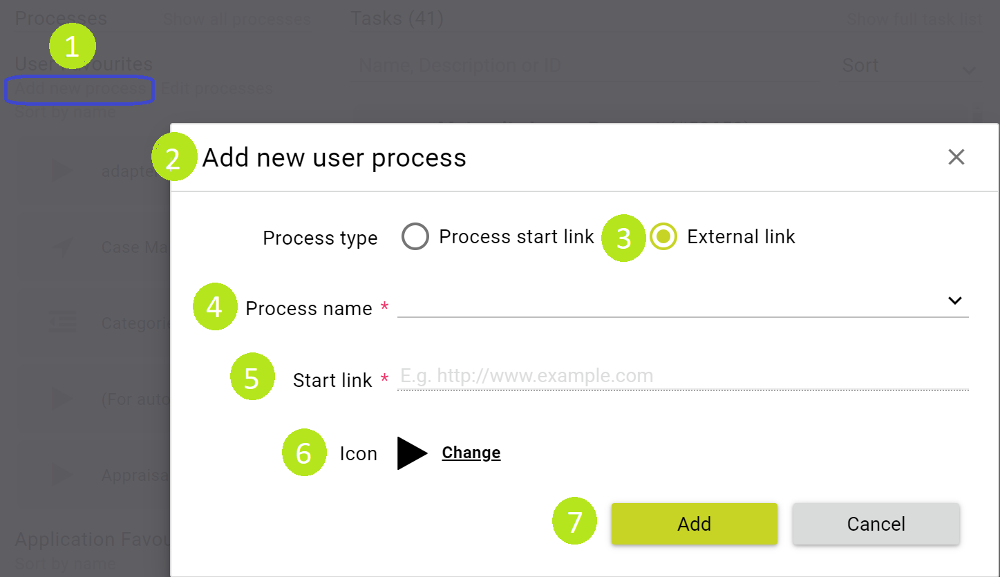

Personal Tasks
--------------

The personal tasks you find under the heading :guilabel:`Tasks` in the center of
your dashboard. You see here all tasks that are assigned to you or any of the
roles you hold within the application. Therefore, this section is key in
understanding your workload within the application. You may pick up any task
from the task list and start working on it.

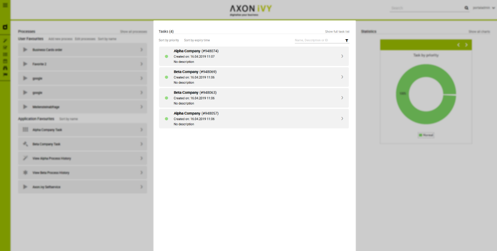

   

At first glance, you see the number of tasks right next to the heading
:guilabel:`Tasks`. Further to the right you find the link **Show full task
list**. This quick link routes you to the :guilabel:`Task List` page of the
Axon.ivy Portal. Please refer to :ref:`full-task-list` for more
detailed information.

Right below the heading :guilabel:`Task` you find the following features which
support you in finding the correct tasks:

1. The Axon.ivy Portal searches for your keyword in the task ID, name and
   description of the tasks in your task list.
2. On the right side of the Tasks section you can find the sort by :guilabel:`Creation Date` :guilabel:`Expiry` :guilabel:`Priority`  

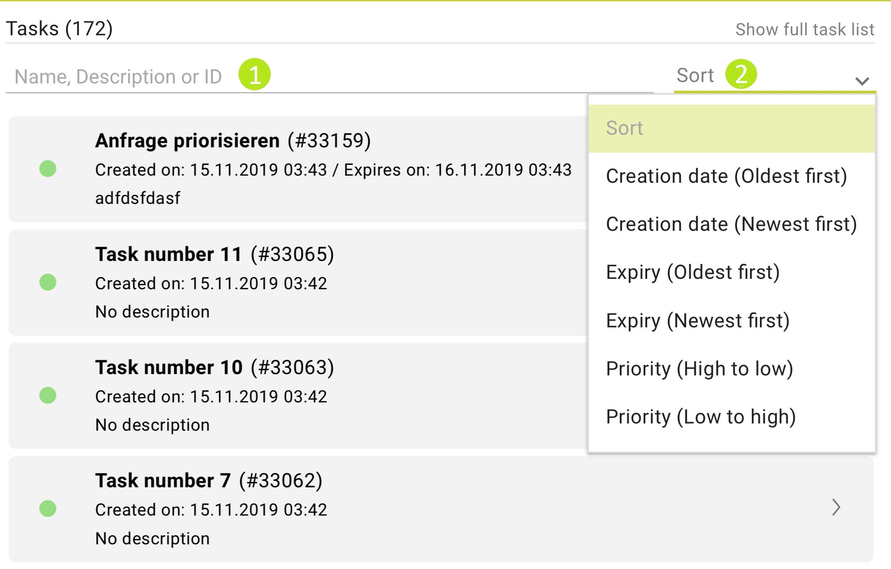

  

Each task in your task list has an own entry. The entry provides you
with key information about the task allowing you an easy identification.
The following information can be found in the task entries:

1. The :guilabel:`Task Priority`

2. The :guilabel:`Task Name` 

3. The :guilabel:`Task ID` 

4. The :guilabel:`Creation Date`

5. The :guilabel:`Expiry Date` which is the due date until when the task should
   be completed.

6. The :guilabel:`Task Description`

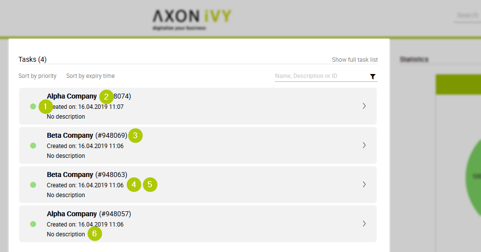

Statistics
----------

The statistics you find under the heading :guilabel:`Statistics` on the
right-hand side of your dashboard. The charts in this section allow you to grasp
the overall situation at a glance.

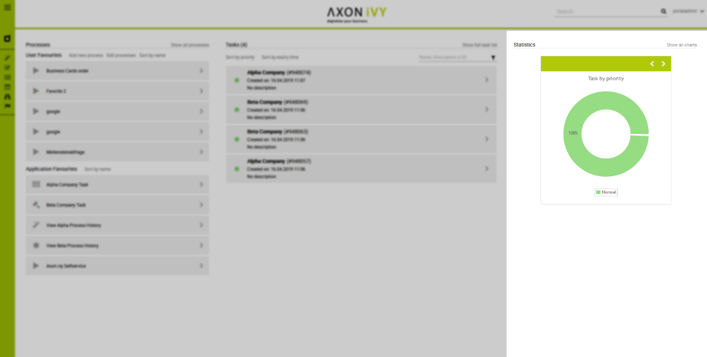

Next to the heading you find a link **Show all charts**. This quick link
routes you the :guilabel:`Statistics` page of the Axon.ivy Portal. Please refer
to :ref:`full-statistic-list`  for more detailed information.

Within the green header of the chart, you find two navigation buttons
(|pre-icon|, |next-icon|) allowing you to toggle between the available
charts. Each chart then provides you with the following information:

1. The :guilabel:`Chart Title`  helping you to understand the content of the
   chart

2. The :guilabel:`Chart` itself, which gives you a graphical representation of
   the data. Furthermore, you see the exact figures in the chart as
   well.

3. The :guilabel:`Legend` explains the different elements of the charts.

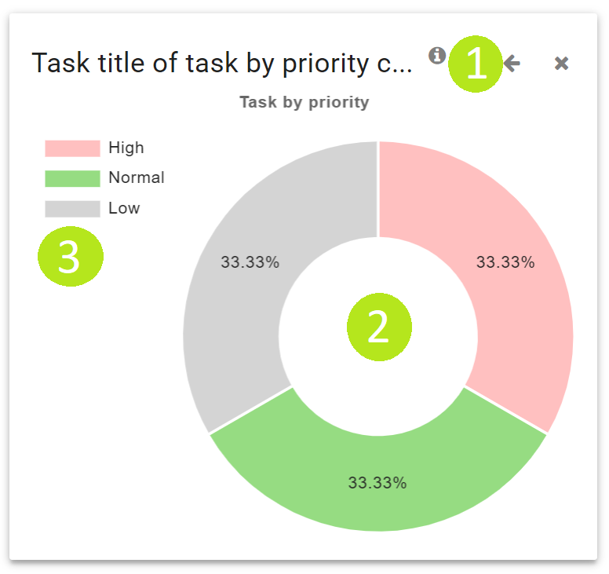

If you require more or different charts, you need to create them first.
Chapter :ref:`howto-create-chart` explains in detail how to create new
charts.

.. include:: ../includes/_common-icon.rst