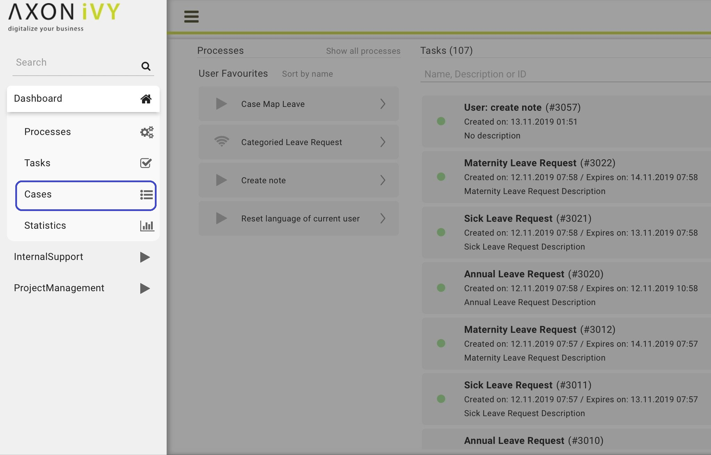
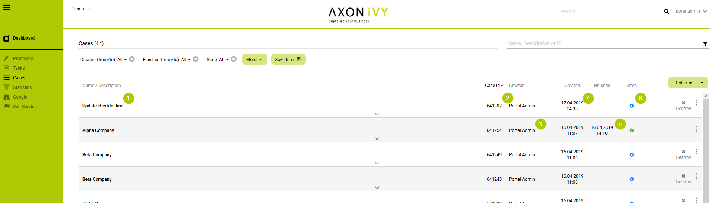
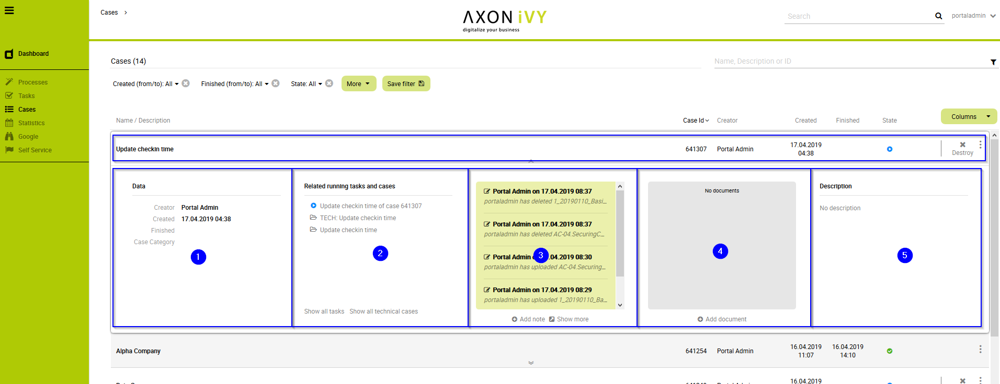
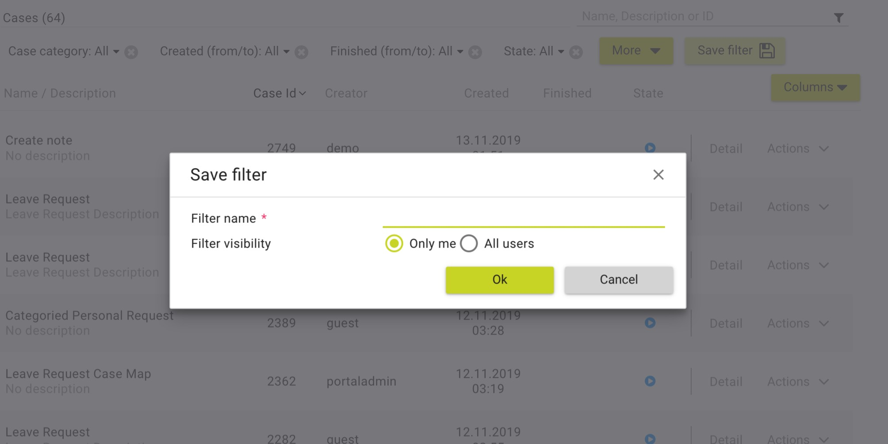
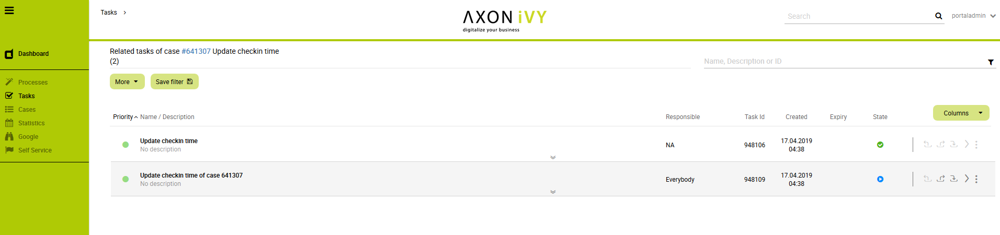
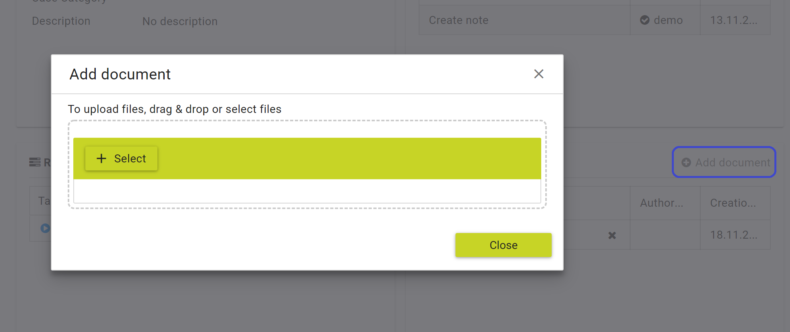
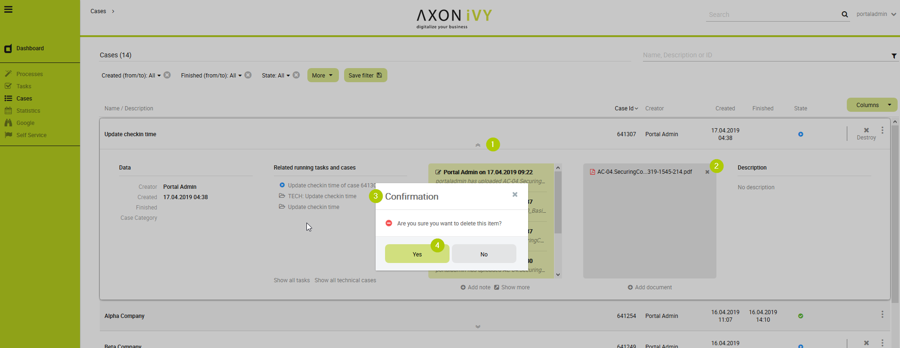
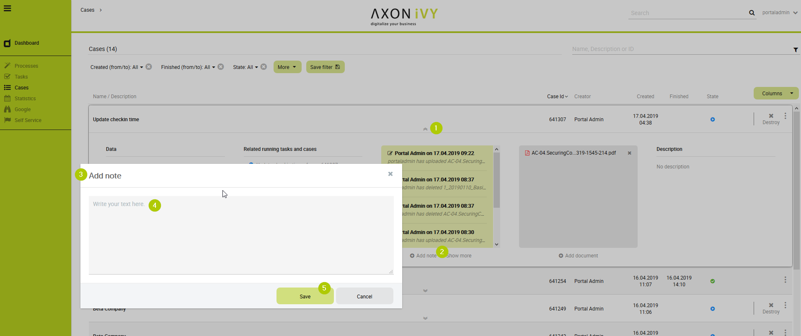
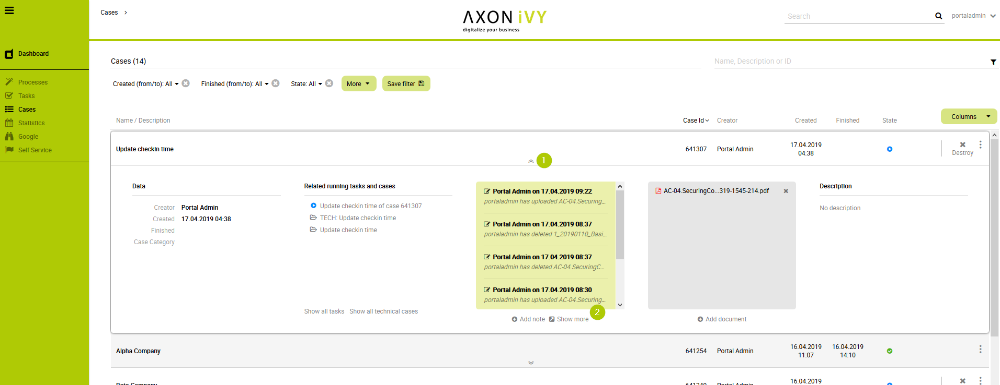
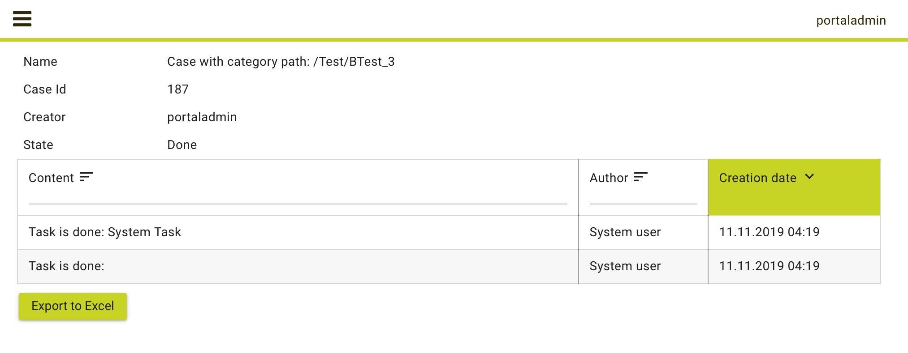

.. _full-case-list:

Full Cases List
***************

The :guilabel:`Full Cases List` page shows you all cases you’re involved in.
This page provides you with extended information on the cases, as well
as advanced search and filter capabilities. You can reach the page by
using the |case-icon| **Cases** link in the Axon.ivy Portal menu.

.. hint:: 
   Depending on the roles you hold in the application and the configuration of
   the Axon.ivy Portal, you might see not only the cases you’re involved in but
   all cases.                      

   Navigate to Full Cases List page

On the top of the :guilabel:`Full Case List` page you see next to the heading :guilabel:`Cases`
in brackets the overall number of cases shown to you. Further to the right you
find a |filter-icon| **Search** feature which you might use if you’re looking for a
specific case. Below you find the filter feature. The usage will be explained in
the HowTo’s further down this chapter. Finally, you see the list of cases.

For each case the following key information is shown in the list:

1. Name and Description

2. Case ID

3. Creator

4. Creation Date

5. Finished Date

6. Status

   Case key information

Furthermore, at the end of each column you find a set of key features in
handling cases:

1. |delete-icon| **Destroy** to delete a case

2. |more-icon| **More** for further actions

Finally, you have the possibility to access the full set of the case
data by using the |down-icon| **Show Details** button in the center of
each case column. You may hide them again using the |up-icon| **Hide
Details** button accordingly.

   
   Case details

The case details are separated in 5 different sections:

1. On the left-hand side, you find various metadata concerning the case.

2. On the center-left, you find a list of all related running cases and
   tasks. Moving the mouse over the tasks shows you the state and the
   responsible user of the task. To show all related tasks see the HowTo
   below.

3. In the center you find a notes area. The Axon.ivy Portal adds notes
   here for state changes of the case. You may add additional notes
   which is described below.

4. On the center-right, you find an area for documents that were
   attached to the case. You may add or delete documents which his
   described in the HowTo’s below.

5. On the right-hand side, you find the case description.

.. _howto-use-existing-filter-1:

HowTo: Use existing filter
--------------------------

.. hint:: 
   If there are no public filters and you didn’t create any filters so far,
   there might be no filters available. In this case, you must create a filter
   first. This is described in detail in :ref:`howto-create-new-filter-1`.
   

1. Click on the dropdown menu next to the label **Filter:**

2. Select the filter you want to use.

.. _howto-create-new-filter-1:

HowTo: Create new filter
------------------------

1. Click on the button **More** to select one of the available filters.
   For a list of available filters, see Table 3: Case filter criterias.

2. Click on the newly added filter and configure it.

3. Add more filters by clicking on the button **More** again.

4. Drop filters by clicking on the |delete-attachment-icon| **Delete** button next to
   the filter.

5. When finished, click on the button **Save filter**.

6. The dialog :guilabel:`Save filter` is opened.

7. Under **Filter name**, provide a recognizable name for the filter.

8. Under **Filter visibility**, you can select if the filter is only
   visible for you or shall be available to all users.

9. Save the filter by clicking the button **Ok**.

   
   HowTo create case filter

+-----------------------------------+-----------------------------------+
| Criteria                          | Description                       |
+===================================+===================================+
| Created (from / to)               | The filter lets you specify in    |
|                                   | which time period the case was    |
|                                   | created.                          |
+-----------------------------------+-----------------------------------+
| Creator                           | The filter lets you specify the   |
|                                   | user who created the case.        |
+-----------------------------------+-----------------------------------+
| Description                       | The filter lets you search for    |
|                                   | keywords within the case          |
|                                   | description.                      |
+-----------------------------------+-----------------------------------+
| Finished (from / to)              | The filter lets you specify in    |
|                                   | which time period the case was    |
|                                   | finished                          |
+-----------------------------------+-----------------------------------+
| State                             | The filter lets you specify the   |
|                                   | case state                        |
+-----------------------------------+-----------------------------------+

.. centered:: Case filter criterias

.. hint:: 
   You may also start the creation of a new filter by selecting an existing
   filter first, reconfiguring it and saving it. 

.. hint:: 
   Depending on your permissions you might only be allowed to save filters for
   yourself.            

HowTo: Show all related Tasks
-----------------------------

1. Open the case details of a case.

2. Click the **Show all tasks** link.

3. You’re routed to the :guilabel:`Related Tasks List` page. This page resembles
   the :guilabel:`Full Tasks List` page (see  :ref:`full-task-list`) both in
   appearance and features. The shown tasks are only down selected to the ones
   related to your case already.

   Related Tasks List page

.. _howto-attach-a-document-to-the-case-1:

HowTo: Attach a document to the case
------------------------------------

1. Open the case details of a case

2. Click the link |add-icon| **Add document**

3. The :guilabel:`Add document` dialog is opened

4. Upload a file by using the **Select** button or by simply dragging
   the file into the dialog.

5. Click the button **Close** to add the attachment

   HowTo attach a document to a case

.. _howto-remove-an-attachment-from-the-case-1:

HowTo: Remove an attachment from the case
-----------------------------------------

1. Open the case details of a task

2. Click on the |delete-attachment-icon| **Delete attachment** link next to the
   attachment you want to remove.

3. A :guilabel:`Confirmation` dialog is opened

4. Confirm the deletion with the button **Yes**

   HowTo delete an attachment from a case

HowTo: Add a note to a case
---------------------------

1. Open the case details of a case

2. Click on the |add-icon| **Add note** link below the notes section.

3. The **Add note** dialog is opened.

4. Enter your note.

5. Confirm your note by clicking the button **Save**.

   HowTo add task note

HowTo: Export a case history
----------------------------

1. Open the case details of a case

2. Click on the |show-more-icon| **Show more** link below the notes section

3. A new page with the case history is opened

4. You may export the history by clicking on the button **Export to
   Excel**

   HowTo show note details

   Export case history

.. include:: ../includes/_common-icon.rst