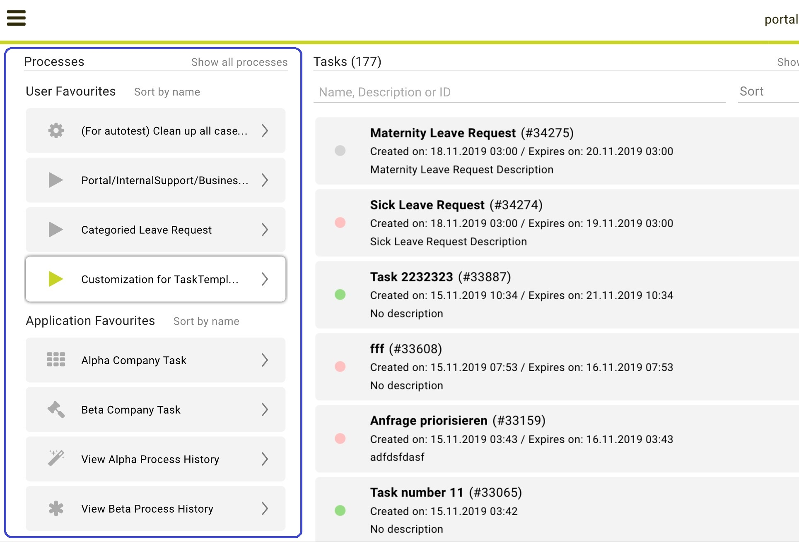
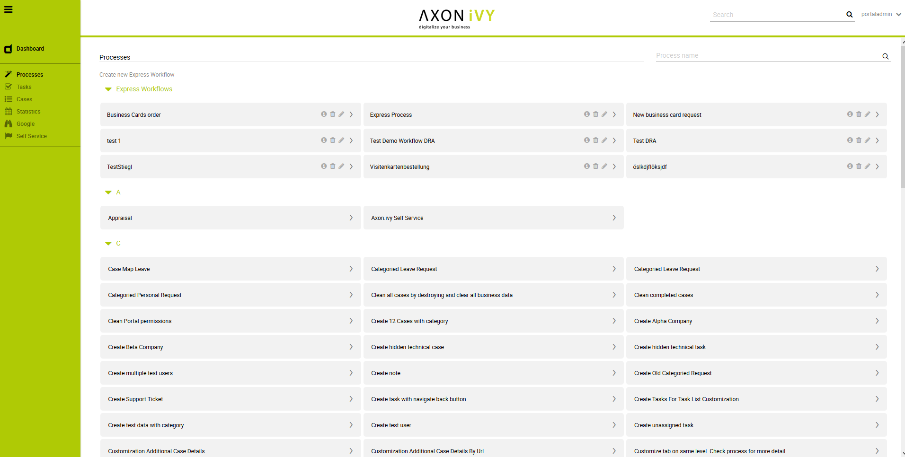

.. _full-process-list:

Full Process List
*****************

The :guilabel:`Full Process List` page gives you an overview on all the
processes in the application that are accessible to you. You can reach
the page by either using the |magic-icon| **Processes** link in the
Axon.ivy Portal menu or the quick link **Show all processes** in your
dashboard.

On the :guilabel:`Full Process List` page, you see a list of all processes. They
are sorted alphabetically and grouped by their initial character. An
exception are the :guilabel:`Express Workflows` which are grouped under an own
category Express Workflows. Express workflows are described in detail in :ref:`axon-ivy-express`.

If you’re looking for a specific process, you may use the |search-icon|
**Search** feature which is located on the right-hand side next to the
heading **Processes**. The search will look up your keyword in the
process names and filter the process list accordingly.

.. warning:: 
   Don’t confuse the process search
   with the global Axon.ivy Portal 
   search which you find in the    
   header area of the Portal.      

When you select a process from the list, a new case of this process is started.
Please be aware, that after you finished your activities in the case you will be
re-directed to the :guilabel:`Dashboard`  and not the :guilabel:`Full Process
List`.

.. hint:: 
   Starting processes from the Full Process List page is fine if you require
   this process only on a rare basis. For all processes which you use on a
   regular basis we highly recommend configuring them on your personal
   dashboard. See :ref:`howto-add-a-process-as-a-user-favorite` for an instruction.

.. include:: ../includes/_common-icon.rst