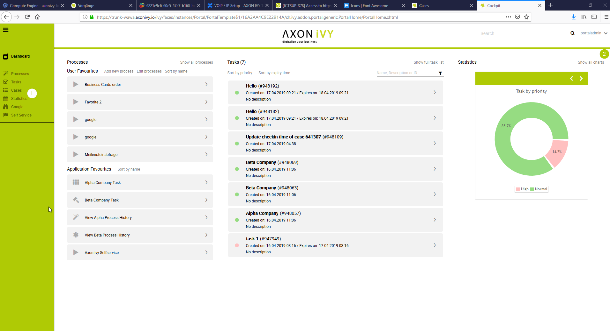
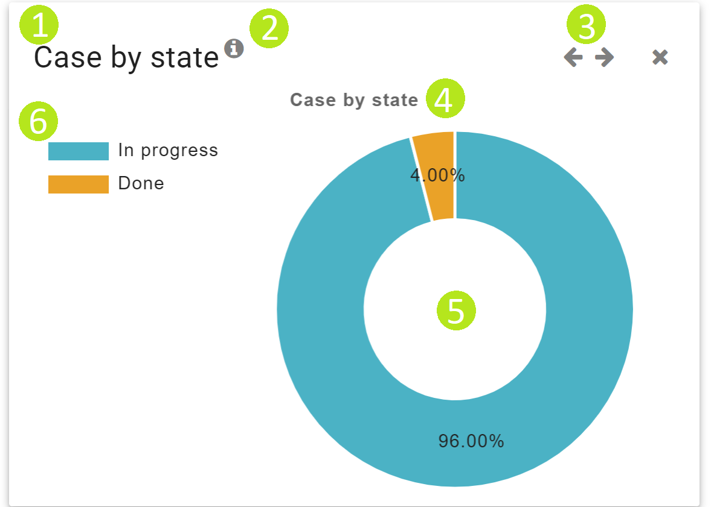
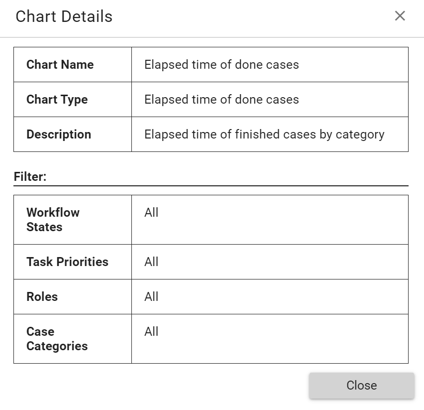
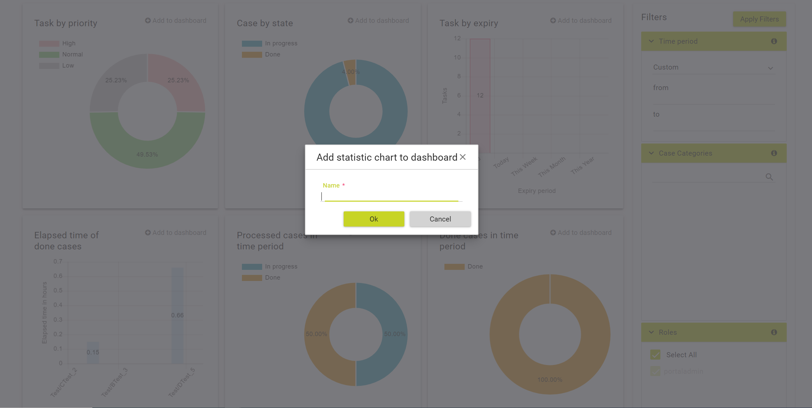
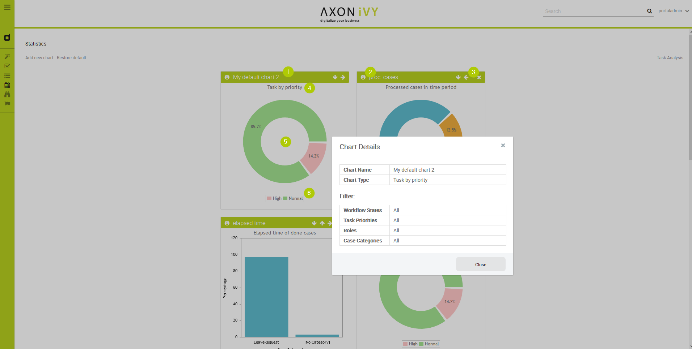

.. _full-statistic-list:

Full Statistics page
********************

One way to consume statistics is through your personal dashboard (see
:ref:`dashboard`). If you need a deeper insight in what is going on, the
:guilabel:`Full Statistics` page provides you with the perfect toolset. You can
consume statistics and charts here at one glance and have the chance to setup
your own statistics. You can reach the page by using the 
**Statistics** link in the Axon.ivy Portal menu or by using the **Show all
charts** quick link in the statistics section of your dashboard.

.. hint:: 
   The statistics allow you to evaluate case and task data only. Business data
   from your processes is not available in these statistics and must be
   considered separately.                      

On the :guilabel:`Full Statistics` page you see all charts that were previously
created. Each chart provides you with the following features:

1. The heading of the chart

2. An |info-icon| **Info** button, providing you with the configuration of
   the chart

3. Arrow buttons (|arrow-right-icon|, |arrow-left-icon|) depending
   on the position of the chart to allow you rearrangement according to
   your personal needs

4. The chart itself. It might provide you with a drill down function
   down to the task level.

5. The legend, explaining the part of the charts

.. _howto-create-chart:

HowTo: Create chart
-------------------

1. Use the link **Add new chart**

2. You are routed to the :guilabel:`Chart Configuration` page

3. Select one of the available chart types (see Available charts)

4. Select and configure one or more of the available filters (see Chart filter criterias).

5. Click **Add to dashboard**

6. The :guilabel:`Add statistic chart to dashboard` dialog is opened

7. Enter a unique name for the chart

8. Create the chart with the button **OK**

**Available charts**

+-----------------------+-----------------------+-----------------------+
| Name                  | Type                  | Description           |
+=======================+=======================+=======================+
| Tasks by priority     | Pie chart             | Displays all tasks    |
|                       |                       | assigned to a user or |
|                       |                       | a belonged role       |
|                       |                       | categorized by their  |
|                       |                       | priority (Low,        |
|                       |                       | Normal, High,         |
|                       |                       | Exception). The       |
|                       |                       | values are shown in   |
|                       |                       | percentages.          |
+-----------------------+-----------------------+-----------------------+
| Case by state         | Pie chart             | Displays all cases    |
|                       |                       | belonging to a user   |
|                       |                       | or a role categorized |
|                       |                       | by their state (In    |
|                       |                       | progress, Done). The  |
|                       |                       | values are shown in   |
|                       |                       | percentages.          |
+-----------------------+-----------------------+-----------------------+
| Tasks by expiry       | Bar chart             | Displays all tasks    |
|                       |                       | assigned to a user or |
|                       |                       | a belonged role       |
|                       |                       | categorized by expiry |
|                       |                       | time (Today, This     |
|                       |                       | Week, This Month,     |
|                       |                       | This Year). The valus |
|                       |                       | are the sum of tasks  |
|                       |                       | in the respective     |
|                       |                       | categories.           |
+-----------------------+-----------------------+-----------------------+
| Elapsed time of done  | Bar chart             | Displays the relative |
| cases.                |                       | elapsed time of all   |
|                       |                       | done cases belonging  |
|                       |                       | to a user or a role   |
|                       |                       | categorized by their  |
|                       |                       | Case Category. The    |
|                       |                       | values are shown in   |
|                       |                       | percentages.          |
+-----------------------+-----------------------+-----------------------+
| Processed cases in    | Pie chart             | Displays all cases    |
| time period           |                       | belonging to a user   |
|                       |                       | or a role, where at   |
|                       |                       | least one task was    |
|                       |                       | done during the       |
|                       |                       | selected time period. |
|                       |                       | In addition, the      |
|                       |                       | chart shows if the    |
|                       |                       | related case is still |
|                       |                       | in progress or        |
|                       |                       | already done. The     |
|                       |                       | values are shown in   |
|                       |                       | percentages.          |
+-----------------------+-----------------------+-----------------------+
| Done cases in time    | Pie chart             | Displays all cases    |
| period                |                       | belonging to a user   |
|                       |                       | or a role, which were |
|                       |                       | done during the       |
|                       |                       | selected time period. |
|                       |                       | The values are shown  |
|                       |                       | in percentages.       |
+-----------------------+-----------------------+-----------------------+

+-----------------------------------+-----------------------------------+
| Filter                            | Description                       |
+===================================+===================================+
| Time period                       | Select a predefined time filter   |
|                                   | (last month, last week, etc.) or  |
|                                   | set a custom filter selecting a   |
|                                   | fixed time period with a date     |
|                                   | picker.                           |
+-----------------------------------+-----------------------------------+
| Case categories                   | Select which case categories      |
|                                   | should be included in the chart.  |
|                                   | If you select “Select all”, also  |
|                                   | new categories created in the     |
|                                   | future will be included in the    |
|                                   | chart.                            |
+-----------------------------------+-----------------------------------+
| Roles                             | Select which roles involved in a  |
|                                   | case/task should be included in   |
|                                   | the chart. If you select “Select  |
|                                   | all”, also new roles created in   |
|                                   | the future will be included in    |
|                                   | the chart.                        |
+-----------------------------------+-----------------------------------+
| Workflow states                   | Select which status / statuses    |
|                                   | shall be analyzed (Created, In    |
|                                   | Progress, Done).                  |
+-----------------------------------+-----------------------------------+
| Task priorities                   | Select which task categories      |
|                                   | should be included in the chart.  |
+-----------------------------------+-----------------------------------+
| CustomVarFields 1-5               | If some business specific data is |
|                                   | included in these                 |
|                                   | CustomVarFields, you can select   |
|                                   | these fields for further          |
|                                   | filtering.                        |
+-----------------------------------+-----------------------------------+

.. centered:: Chart filter criterias

.. include:: ../includes/_common-icon.rst