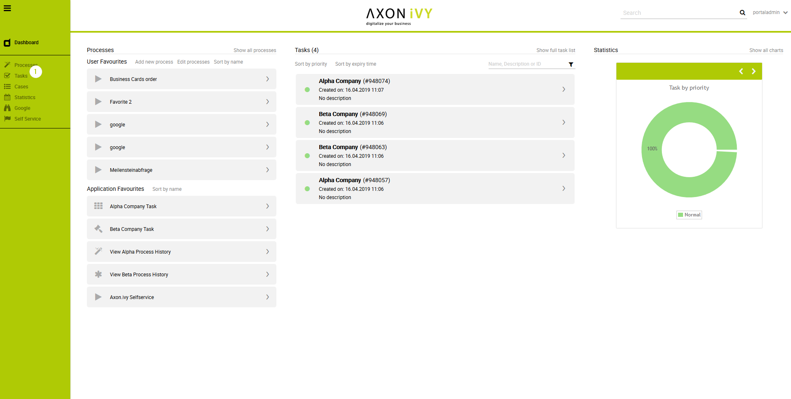
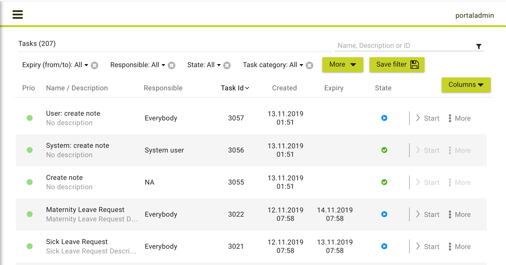
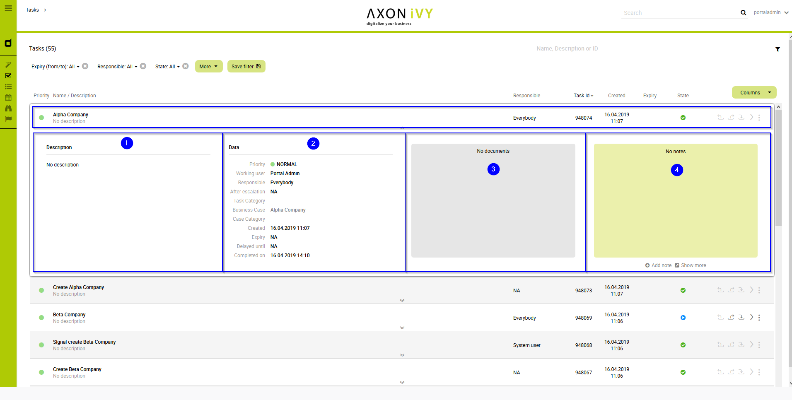
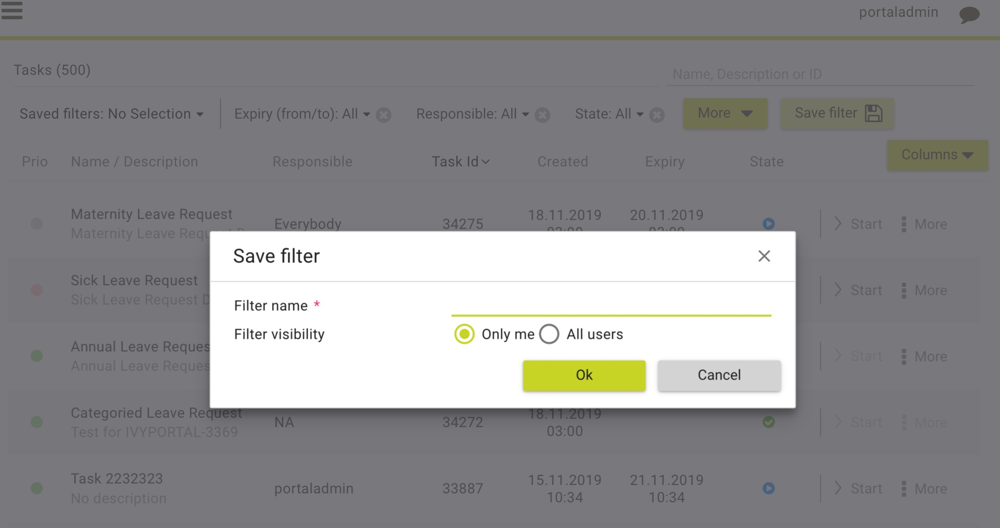
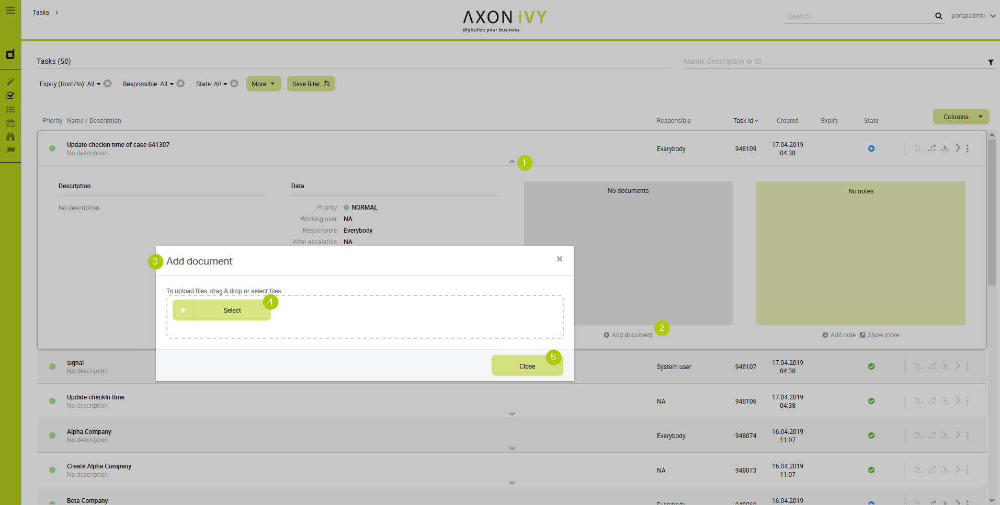
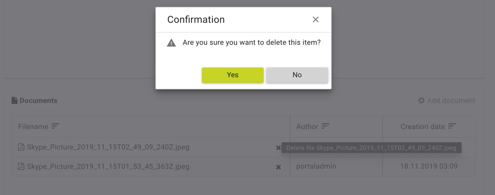
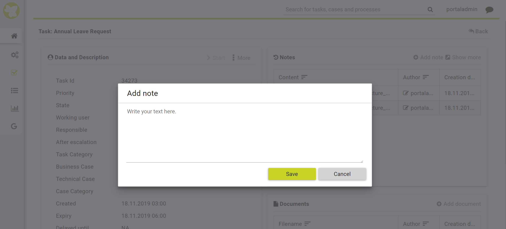
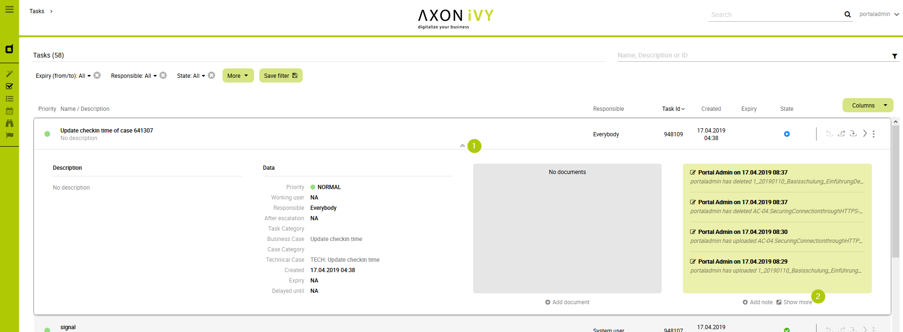

.. _full-task-list:

Full Task List
**************

The :guilabel:`Full Task List` page shows you the same tasks you see on your
personal dashboard. However, this page provides you with extended
information on the tasks, as well as, advanced search and filter
capabilities. You can reach the page by using the |check-icon| **Tasks**
link in the Axon.ivy Portal menu.

.. hint:: 
   Depending on the roles you hold
   in the application and the     
   configuration of the Axon.ivy  
   Portal, you might see not only 
   the tasks belonging to you but 
   all open tasks.                

   Navigate to Full Task List page

On the top of the **Full Task List** page you see next to the heading
**Tasks** in brackets the overall number of tasks shown to you. Further
to the right you find a |filter-icon| search feature which you might use if
you’re looking for a specific task. Below you find the filter feature.
The usage will be explained in the HowTo’s further down this chapter.
Finally, you see the list of tasks.

For each task the following key information is shown in the list:

1. Priority

2. Name and Description

3. Responsible user or role

4. Task ID

5. Creation Date

6. Expiry Date

7. Status

   Task key information

Furthermore, at the end of each column you find a set of key features in
handling tasks:

1. Reset Task

2. Delegate Task

3. Open Task

4. Further actions

Finally, you have the possibility to access the full set of the task
data by using the |down-icon| **Show Details** button in the center of
each task column. You may hide them again using the |up-icon| **Hide
Details** button accordingly.

The task details are separated in 4 different sections:

1. On the left-hand side you find again the task description. In this
   format you can, however, see the whole description if it is longer.

2. On the center-left, you find various metadata concerning the task and
   the respective case it is related to.

3. On the center-right, you find an area for documents that were
   attached to the case. These documents once attached to the case are
   available on all tasks. You may add or delete documents which his
   described in the HowTo’s below.

4. On the right-hand side you find a notes area. The Axon.ivy Portal
   adds notes here when a task – for example – is delegated. You may add
   additional notes which is described below.

   Detailed task information

HowTo: Use existing filter
--------------------------

.. hint:: 
   If there are no public filters and you didn’t create any filters so far,
   there might be no filters available. In this case, you must create a filter
   first. This is described in detail in HowTo: Create new filter.   

1. Click on the dropdown menu next to the label **Filter:**

2. Select the filter you want to use.

HowTo: Create new filter
------------------------

1. Click on the button **More** to select one of the available filters.
   For a list of available filters, see  `Task filter criterias`_.

2. Click on the newly added filter and configure it.

3. Add more filters by clicking on the button **Filter** again.

4. Drop filters by clicking on the |delete-attachment-icon| **Delete** button next to
   the filter.

5. When finished defining your filter, click on the button **Save
   filter**.

6. The :guilabel:`Save filter` dialog is opened.

7. Under **Filter name**, provide a recognizable name for the filter.

8. Under **Filter visibility**, you can select if the filter is only
   visible for you or shall be available to all users.

9. Save the filter by clicking the button **Ok**.

   HowTo create task filter

+-----------------------------------+-----------------------------------+
| Criteria                          | Description                       |
+===================================+===================================+
| Created (from / to)               | The filter lets you specify in    |
|                                   | which time period the task was    |
|                                   | created.                          |
+-----------------------------------+-----------------------------------+
| Description                       | The filter lets you search for    |
|                                   | keywords within the task          |
|                                   | description.                      |
+-----------------------------------+-----------------------------------+
| Expiry (from / to)                | The filter lets you specify in    |
|                                   | which time period the task will   |
|                                   | expire.                           |
+-----------------------------------+-----------------------------------+
| Priority                          | The filter lets you specify the   |
|                                   | priority of the tasks to be       |
|                                   | shown.                            |
+-----------------------------------+-----------------------------------+
| Responsible                       | The filter lets you specify a     |
|                                   | user or role which is responsible |
|                                   | for the task.                     |
+-----------------------------------+-----------------------------------+
| State                             | The filter lets you specify the   |
|                                   | task state.                       |
+-----------------------------------+-----------------------------------+

.. centered:: _`Task filter criterias`

.. hint:: 
   You may also start the creation
   of a new filter by selecting an
   existing filter first,         
   reconfiguring it and saving it.

.. hint:: 
   Depending on your permissions you
   might only be allowed to save    
   filters for yourself.            

HowTo: Attach a document to the case
------------------------------------

1. Open the task details of a task

2. Click the link |add-icon| **Add document**

3. The :guilabel:`Add document` dialog is opened

4. Upload a file by using the **Select** button or by simply dragging
   the file into the dialog

5. Click the button **Close** to add the attachment

   
   HowTo upload document

HowTo: Remove an attachment from the case
-----------------------------------------

1. Open the task details of a task

2. Click on the |delete-icon| **Delete attachment** link next to the
   attachment you want to remove

3. A :guilabel:`Confirmation` dialog is opened

4. Confirm the deletion with the button **Yes**

   HowTo delete a document

HowTo: Add a note to a task
---------------------------

1. Open the task details of a task

2. Click on the |add-icon| **Add note** link below the notes section

3. The :guilabel:`Add note` dialog is opened

4. Enter your note

5. Confirm your note by clicking the button :guilabel:`Save`

   HowTo add a note

HowTo: Export a task history
----------------------------

1. Open the task details of a task

2. Click on the |show-more-icon| **Show more** link below the notes section

3. A new page with the task history is opened

4. You may export the history by clicking on the button **Export to
   Excel**

   HowTo show note details

.. figure:: images/how-to-export-note-details.png
   :width: 6.49606in
   :height: 1.41339in  
   :align: center

   HowTo export note details

.. include:: ../includes/_common-icon.rst