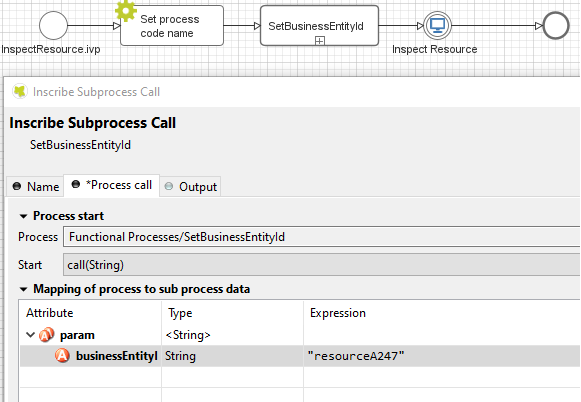

.. _components-portal-components-process-history:

Process History
***************

.. _components-portal-components-process-history-introduction:

Introduction
^^^^^^^^^^^^

This component is a lazy loading list that displays all business cases
of a business entity in your application. You can include this component
everywhere:

In a page

|process-history-example|

In a dialog

|process-history-dialog-example|

.. note::

      If you use this component in Portal, redirect to case details page when clicking on a row.

.. _components-portal-components-process-history-how-to-use:

How to Use
^^^^^^^^^^

First, you have to link the cases to the business entity. Call the subprocess
``SetBusinessEntityId`` in each process which needs to be linked and input an
identifier unique to your business entity. The subprocess will set the id to the
additional property "CASE_BUSINESS_ENTITY_PROPERTY" of the business case.

#. Link the cases to the business entity.

   Call the subprocess ``SetCaseBusinessEntity`` in the process which needs to be
   linked and input an identifier unique to your business entity. The
   subprocess will set the id to the additional property
   "CASE_BUSINESS_ENTITY_PROPERTY" of the business case.

   |set-business-entity-id-sub-process|

#. Include the process history component into your page:

   .. code-block:: html

         <ic:com.axonivy.portal.components.ProcessHistory businessEntityId="alpha" />

   The value of the attribute ``businessEntityId`` must match the id input
   into the subprocess in the first step.

   By default, the component will load 20 cases at a time. You can change this by
   setting the attribute ``chunkSize`` to the number you want. You should use this
   attribute alongside the attribute ``scrollHeight`` to configure the scroll bar
   of the list.

   Attributes of this component:

   .. csv-table::
      :file: ../documents/process_history_component_attributes.csv
      :header-rows: 1
      :class: longtable
      :widths: 1 1 1 3

   .. note::

         If you use this component in a dialog, you have to run the script
         ``processHistory.setup();`` when the dialog is shown, e.g.:

   .. code-block:: html

      <p:dialog widgetVar="process-history-dialog" id="process-history-dialog" width="800" height="500" resizable="false"
         header="Process history of Beta Company" modal="true" onShow="processHistory.setup();">
         <ic:com.axonivy.portal.components.ProcessHistory businessEntityId="beta" chunkSize="10" scrollHeight="400" />
            </p:dialog>

3. Override the callable subprocess ``OpenCaseDetailsHook`` to handle navigation when clicking on a case in the Process History component.

   Please refer to the process ``ProcessHistoryExample`` in ``portal-components-examples`` for more details on how to use the Process History.

   If you want to customize its style,
   please refer to :ref:`components-portal-components-style-customization`.

   .. important::

         If your process has a Trigger component or sends a signal to start
         another process with the option "Attach to Business Case that
         triggered this process" selected, the current case of the process
         will become a technical case and will not be loaded into the process
         history list. In this case, you need to call the SetCaseBusinessEntity subprocess after the first Trigger or signal sending step to be able query this case in the process history.

.. _components-portal-components-migrate-from-old-process-history:

Migrate from Deprecated Process History
^^^^^^^^^^^^^^^^^^^^^^^^^^^^^^^^^^^^^^^

#. Replace code in HTML files: replace ``ic:ch.ivy.addon.portal.component.ProcessHistory`` with ``ic:com.axonivy.portal.components.ProcessHistory``.

#. Optional: set ``showCaseOfOwner`` to ``true`` if you want to show the cases owned by the login user.

#. Optional: set ``dateTimePattern`` to a specific date/time pattern if you want to show the date/time in a unique format different from the default format (dd:MM.yyyy HH:mm).

#. Optional: Override the subprocess ``OpenCaseDetailsHook`` to handle navigation when clicking on a case in the Process History component.

   For applications using the Portal without IFrame:

      + Copy the contents of the subprocess ``OpenPortalCaseDetailsHook`` in ``portal`` to the overridden subprocess ``OpenCaseDetailsHook``.

   For applications using the Portal with an IFrame:

      + Set attribute ``isOpenInFrame`` to ``true``.

      + Modify the subprocess ``OpenCaseDetailsHook`` to generate ``caseDetailsUrl``. Process History component will navigate to this URL when the user clicks on a case.

.. |process-history-example| image:: ../../screenshots/components/process-history-example.png
.. |process-history-dialog-example| image:: ../../screenshots/components/process-history-dialog-example.png
