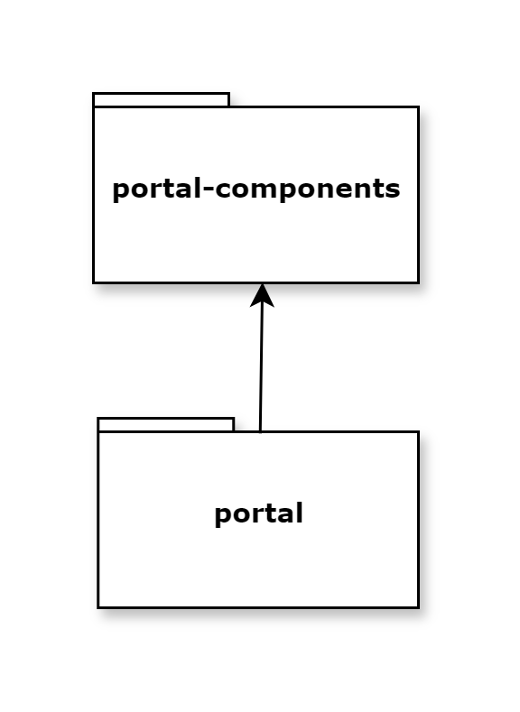
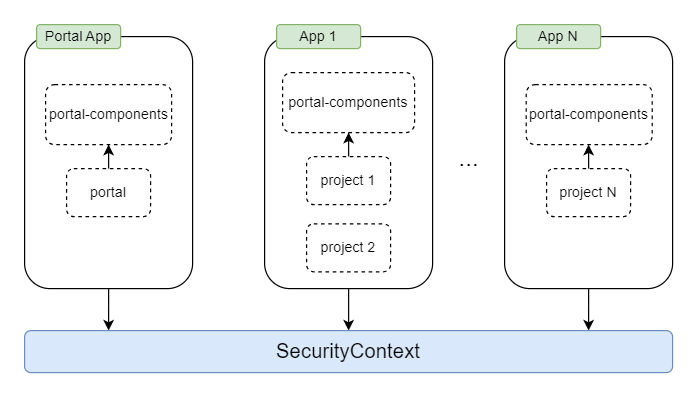

.. _architecture-ja:

アーキテクチャ
********************************

.. important::
      明示的にドキュメント化されていない CSS スタイル、Java メソッドなどは、ポータル内でのみ使用されます。
      これらは将来のバージョンで変更される可能性があるため、使用しないでください。
      

.. _multi-app-structure-ja:

基本的には、ポータルとプロジェクトの両方を 1 つのアプリケーションに展開できます。これは、シンプルなアプリケーションには合理的です。ただし、この方法では移行が難しくなることがあります。そのため、ポータルとプロジェクトを別々のアプリケーションに展開することを推奨します。

ポータルのマルチアプリケーション
=====================================================

ポータルとポータルを使用するプロジェクトは、同じセキュリティコンテキストの異なるアプリケーションに展開してください。

|multi-app-structure|

.. _architecture-portal-process-modules-structure-ja:

ポータルアプリは、portal-components と portal モジュールで構成されます。

|process-module-structure|

.. warning:: 実行するポータルは、セキュリティコンテキストごとに 1 つのみとすることを強く推奨します。

.. _architecture-portal-components-ja:

portal-components
=================

**パブリック UI コンポーネント一式を含む**

このモジュールには、ユーザーの選択、ロールの選択、ドキュメントテーブル、プロセスチェーン、プロセス履歴、プロセスビューアーなどの Ivy コンポーネントが含まれます。
これらのコンポーネントは、ポータルのパブリック API を提供しますが、モジュールのポータルには依存しません。
これらを自社のアプリケーションで使用できます。

.. _architecture-portal-ja:

portal
======

**ポータル固有の UI コンポーネント、テンプレート、ページを含む**

``portal`` モジュールは、ポータル、開発者用テンプレート、ポータルのページを使用、管理するのに必要な UI コンポーネント一式を提供します。

テンプレートには、トップメニュー、アプリケーションメニュー、ユーザーメニューなどの機能が用意されています。
また、ポータルホーム、ポータルタスクリスト、ポータルケースリストなどのデフォルトのページへのプロセスの開始リンクも含まれます。

