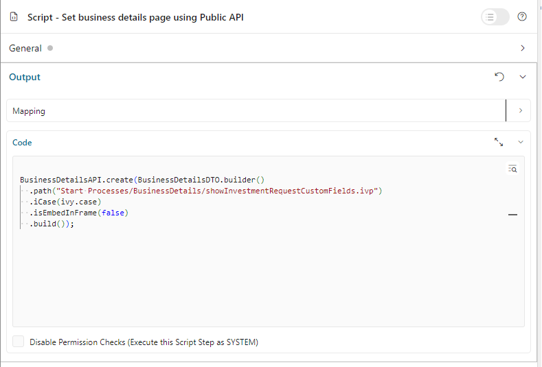
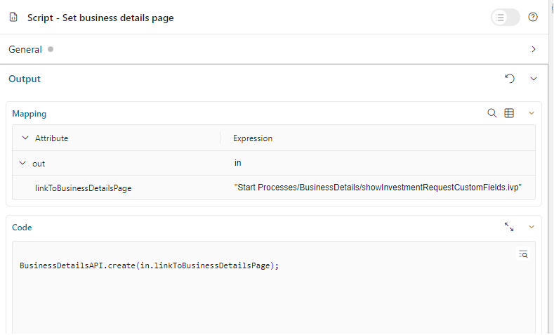
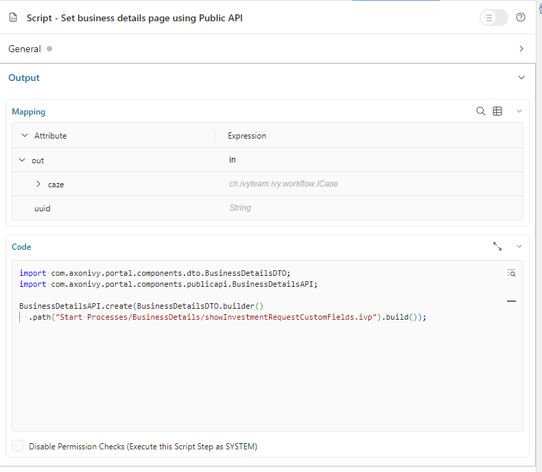
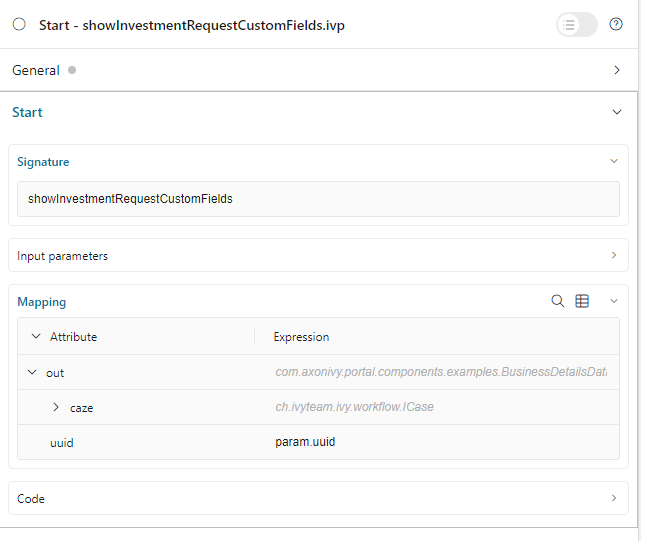

.. _customization-businessdetailspage-ja:

ビジネスの詳細ページ
=============================================

.. _customization-additionalcasedetailspage-ja.introduction:

概要
--------

デフォルトのビジネスの詳細ページには、ケースのすべてのカスタムフィールドが表示されます。ケースの詳細ページで ``ビジネスの詳細`` ボタンをクリックすると開きます。

ポータルでは、ケースごとにこのページをカスタマイズできます。

.. _customization-additionalcasedetailspage-ja.customization:

ビジネスの詳細ページをカスタマイズする方法
---------------------------------------------------------

#. ビジネスの詳細プロセスを作成します。このプロセスで、 ``uuid`` パラメーターを受け入れるリクエスト開始イベントを定義します。 
   ケースの詳細ページの ``ビジネスの詳細`` ボタンをクリックすると、このプロセスが呼び出され、ケースの UUID が ``uuid`` パラメーターとして受け渡されます。 
   このプロセスで、ビジネスの詳細ページのユーザーインターフェースを設計、実装します。

   |customization-business-details-page-start-request|

#. プロセスの :dev-url:`IWebStartable ID </doc/|version|/public-api/ch/ivyteam/ivy/workflow/start/IWebStartable.html#getId()>` をケースの ``businessDetails`` 文字列カスタムフィールドに格納します。 
   以下の 2 つの方法があります。
   
   * ``SetBusinessDetailsPage.p.json`` 呼び出し可能プロセスを使用し、ビジネスの詳細プロセスの IWebStartable ID をパラメーターとして受け渡します。 
     柔軟性を高めるため、ポータルはパラメーターとしての IWebStartable ID の末尾部分の受け渡しをサポートしていますが、セキュリティコンテキストでは、パラメーターで終わる IWebStartable ID を含むプロセスは 1 つのみとなります。 
     

      |set-business-details-page-callable-process|

   * ``ch.ivy.addon.portalkit.publicapi.BusinessDetailsAPI.create(String)`` または ``ch.ivy.addon.portalkit.publicapi.BusinessDetailsAPI.create(BusinessDetailsDTO)`` のいずれかのパブリック API を使用します。 
     詳細については、パブリック API のセクションを参照してください。

      |customize-business-details-with-public-api|

      .. tip:: 
         また、ビジネスの詳細ページでは、ビジネスの詳細が |ivy| の外部にある場合に、外部リンクを埋め込むことができます。
         パスを任意の URL に置き換えてください。後はポータルが処理します。例： ``BusinessDetailsAPI.create("https://google.com")``

カスタマイズ
-----------------------
-  カスタムのビジネスの詳細ページで IFrame を使用する場合は、そのように UI を設定できます。詳細については、:ref:`iframe-configure-template-ja` を参照してください。

-  パブリック API を使用し、 ``BusinessDetailsDTO.builder().isEmbedInFrame(Boolean)`` の値を設定することにより、ビジネスの詳細ページを IFrame 内で開始するかどうかを制御できます。 
   
   	- ``true``：IFrame 内で開始する（デフォルト値）
   	- ``false``：IFrame 内で開始しない

-  また、 ``ICase`` の値もカスタマイズできます。API は自動的に ``Ivy.wfCase()`` から ``ICase`` を受け取ります。 ``BusinessDetailsDTO.builder().iCase(ICase)`` を使用して、これを変更します。

   |start-business-details-page-iframe|

- API は、バックグラウンドで IWebStartable ID を ``businessDetails`` 文字列カスタムフィールドに設定します。本格的にカスタマイズする場合は、ビジネスの詳細プロセスの IWebStartable ID を確認し、URL クエリ文字列を追加し、ケースの ``businessDetails`` 文字列カスタムフィールドに設定してください。 
   
  

.. note::

   - 新しい UI がアプリケーション全体の設計と機能の要件に適合していることを確認してください。

   - 統合を徹底的にテストして、ケース情報が正確に受け渡され、表示されることを確認してください。

   - 外部リンクを使用する場合は、リンクが安全で、アプリケーション環境からアクセスできることを確認してください。

権限の設定
--------------------

:dev-url:`エンジンコックピット </doc/|version|/engine-guide/reference/engine-cockpit/security.html>` で権限を設定します。
セキュリティ領域で［PortalPermissions］、［PortalCasePermissions］、［ShowCaseDetails］を順に開いてください。

または、権限の検索バーで :bdg-ref-warning:`🔑ShowCaseDetails <ShowCaseDetails>` を検索します。 ``Everybody`` ロールの権限は自動的に ``true`` に設定されます。

