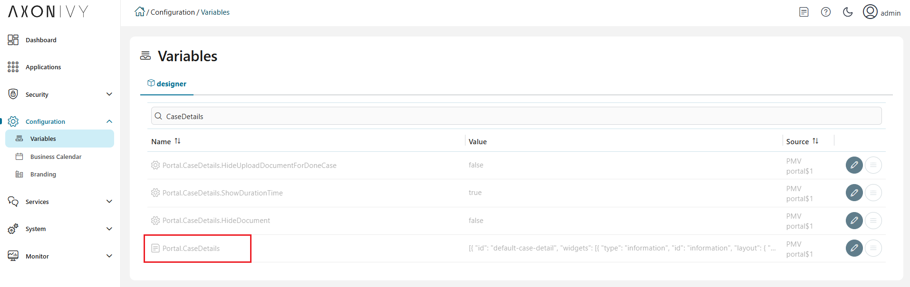
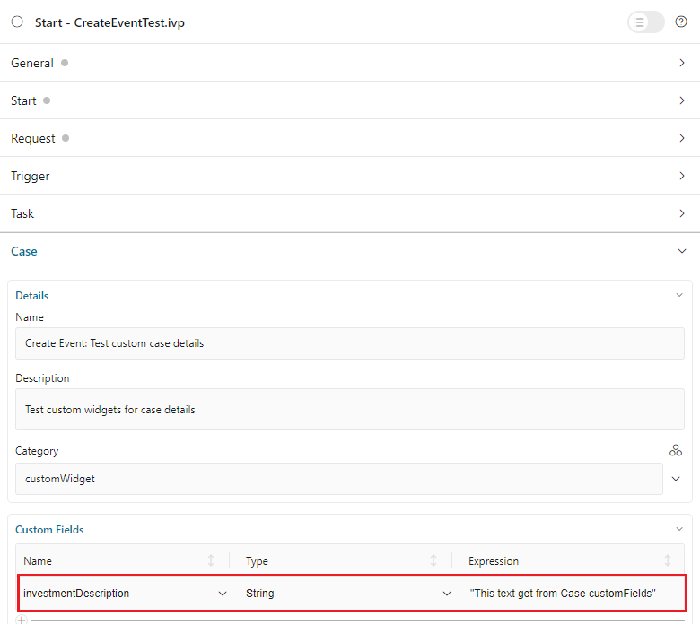
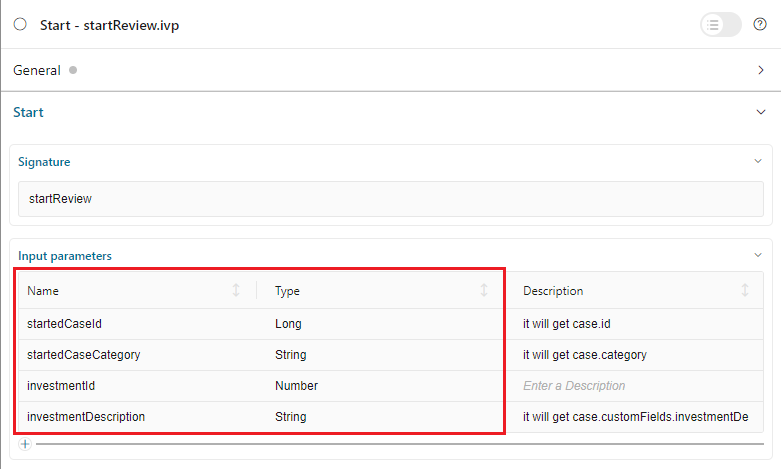

.. _customization-case-item-details-ja:

ケース項目の詳細
======================================

CaseItemDetails は、ユーザーが操作できるケース情報を含むポータルの組み込みコンポーネントです。
ポータルでは、CaseItemDetails をカスタマイズして、追加の必要なケース情報を表示できます。

CaseItemDetails には以下が含まれます。

- **CaseItemGeneralInformation** ``1``
- **CaseItemDetailsDocuments** ``2``
- **CaseItemDetailsRelatedCases** ``3``
- **CaseItemDetailsRelatedTasks** ``4``
- **CaseItemDetailsHistories** ``5``
-  ケースの詳細のカスタムパネル： ``caseItemDetailCustomTop``、 ``caseItemDetailCustomMiddle``、 ``caseItemDetailCustomBottom``
   

|case-standard-1|

|case-standard-2|

.. important::
   表示可能なウィジェットはすべて :ref:`variable Portal.CaseDetails <case-details-configuration-variable-ja>` で設定されます。

.. _case-details-configuration-variable-ja:

ケースの詳細ページのウィジェットを設定する方法
------------------------------------------------------------------------------

-  ケースの詳細ページで表示可能なすべてのウィジェットの設定は、 **Portal.CaseDetails 変数** に保存されます。
-  管理者は、エンジンコックピットで、設定ページの **Portal.CaseDetails** 変数でウィジェットを設定できます。
   |edit-variable-portal-case-details|

-  デフォルト設定には 5 つのウィジェットが含まれます。

   .. code-block:: javascript
      
         [
            {
               "id": "default-case-detail",
               "widgets": [
                  {
                     "type": "information",
                     "id": "information",
                     "layout": {
                        "w": 6,
                        "h": 8,
                        "x": 0,
                        "y": 0
                     }
                  },
                  {
                     "type": "document",
                     "id": "document",
                     "layout": {
                        "w": 6,
                        "h": 8,
                        "x": 6,
                        "y": 0
                     }
                  },
                  {
                     "type": "technicalCase",
                     "id": "technicalCase",
                     "layout": {
                        "w": 12,
                        "h": 6,
                        "x": 0,
                        "y": 8
                     }
                  },
                  {
                     "type": "relatedTask",
                     "id": "relatedTask",
                     "layout": {
                        "w": 12,
                        "h": 6,
                        "x": 0,
                        "y": 14
                     }
                  },
                  {
                     "type": "history",
                     "id": "history",
                     "layout": {
                        "w": 12,
                        "h": 6,
                        "x": 0,
                        "y": 20
                     }
                  }
               ]
            }
         ]                                                       

   -  各ケースの詳細のレイアウトの構造は、 **Portal.CaseDetails** 変数に保存されます。

      ``id``：レイアウトの ID。

      ``widgets``：レイアウト内のウィジェットの定義。

      ``filters``：レイアウトを使用可能なケースを決定する条件。以下の 2 つのタイプのケースフィルターがあります。
      
      -  ``categories`` （ケースのカテゴリー）
      -  ``states`` （ケースのビジネスの状態）

         利用可能なケースのビジネスの状態については、:dev-url:`ケースのビジネスの状態 </doc/|version|/public-api/ch/ivyteam/ivy/workflow/caze/CaseBusinessState.html>` を参照してください。
         

   -  ケースの詳細のレイアウトに含まれる各ウィジェットの構造は、 **Portal.CaseDetails** 変数に格納されます。

      ``id``：ウィジェットの ID。

      ``type``: type of widget, there are 6 types: 
      -  ``information``
      -  ``document``
      -  ``technicalCase``
      -  ``relatedTask``
      -  ``history``
      -  ``custom``.

      ``layout``：ウィジェットの UI のスタイル設定を定義します。

         ``x``：HTML DOMスタイル ``left`` は ``x / 12 * 100%`` として計算されます。

         ``y``：HTML DOMスタイル ``top`` は ``y / 12 * 100%`` として計算されます。

         ``w``：HTML DOMスタイル ``width`` は ``60 * w + 20 * (幅 - 1)`` として計算されます。

         ``h``：HTML DOMスタイル ``height`` は ``60 * h + 20 * (高さ - 1)`` として計算されます。

         ``styleClass`` （オプション）：CSS クラスを HTML DOM に追加します。

         ``style`` （オプション）：インラインスタイルを HTML DOM に追加します。

      ``data`` （カスタムウィジェット）：カスタムウィジェットのデータ。:ref:`カスタムウィジェットの表示 <customization-case-item-details-how-to-override-ui-custom-body-ja>` を参照してください。

   .. important::

      - ウィジェットの ``type`` と ``id`` は **変更しないでください**。
      - ``x``、 ``y``、 ``w``、 ``h`` を変更して、ウィジェットのサイズと位置を更新できます。
      - ``x``、 ``y``、 ``w``、 ``h`` は **整数** で指定してください。
      - ``x + w`` は **12** **以下** でなければなりません。
      - フィルタータイプ ``states`` ではすべてのケースのビジネスの状態がサポートされます。

.. _customization-case-item-details-how-to-override-ui-custom-body-ja:

カスタムウィジェットの表示
--------------------------------------------------------

カスタムウィジェット用に、ケースの詳細ウィジェット内に新しい ``data`` ノードを提供します。各カスタムウィジェットの ``data`` の構造は以下のとおりです。

   - ``type``：カスタムウィジェットパネルのタイプ。 ``caseItemDetailCustomTop``、 ``caseItemDetailCustomMiddle``、 ``caseItemDetailCustomBottom`` の 3 つのタイプがあります。

   - ``url``：外部ウェブサイトの URL。

   - ``processPath``：カスタムウィジェットに表示される Ivy プロセスのユーザーフレンドリーなリクエストパス。

   - ``params``：上記の Ivy プロセスのパラメーター。各パラメーターは以下のように定義できます。

      - 上記の Ivy プロセスのパラメーター名となるキー名。注記： ``caseId`` は使用しないでください。

      - ``case.`` で始まる必要があるケースのキー値。 ``case.id`` と ``case.category`` の 2 つの値がサポートされます。

      - カスタムケースフィールドのキー値は ``case.customFields.`` で始まり、その後にカスタムフィールド名が続く必要があります。

      - その他のキー値は、ハードコーディングされた値として処理されます。

.. tip:: 
      カスタムケースの詳細の JSON の概要を理解するには
   
      - ``portal-developer-examples/resources/files`` プロジェクトの ``variables.Portal.CaseDetails.json`` ファイルを参照します。
      - Designer の対応するアプリケーションフォルダーにコピーします。

          - 例：AxonIvyDesigner/configuration/applications/designer

      - 破棄したケースを作成するか、 ``portal-developer-examples`` プロジェクトの ``Start Processes/CaseDetailsCustomWidgetExample/CreateEventTest.ivp`` プロセスを開始します。
      - ホームページに移動します。
      - ケースの詳細に移動し、新しいカスタムレイアウトを確認します。
   
      変数の設定方法については、:dev-url:`|ivy| の変数 </doc/|version|/designer-guide/configuration/variables.html>` を参照してください。
   

新規カスタムパネルの追加
^^^^^^^^^^^^^^^^^^^^^^^^^^^^^^^^^^^^^^^^

新規カスタムパネルを追加するには、以下の 2 つのステップが必要です。

#. カスタムウィジェットを追加するには、 **エンジンの管理者** がコックピットページで :ref:`Portal.CaseDetails <case-details-configuration-variable-ja>` 変数を設定する必要があります。
   

   .. _case-details-custom-configuration-variable-example:

   -  以下は、3 つのカスタムウィジェットを含む **Portal.CaseDetails** 設定の例です。

      .. code-block:: javascript

         [
            {
               "id": "default-case-detail",
               "widgets": [
                  {
                     "type": "information",
                     "id": "information",
                     "layout": {
                        "w": 6,
                        "h": 8,
                        "x": 0,
                        "y": 0
                     }
                  },
                  {
                     "type": "document",
                     "id": "document",
                     "layout": {
                        "w": 6,
                        "h": 8,
                        "x": 6,
                        "y": 0
                     }
                  },
                  {
                     "type": "history",
                     "id": "history",
                     "layout": {
                        "w": 12,
                        "h": 6,
                        "x": 0,
                        "y": 8
                     }
                  },
                  {
                     "type": "custom",
                     "id": "customTop",
                     "layout": {
                        "x": 0,
                        "y": 14,
                        "w": 12,
                        "h": 6
                     },
                     "data": {
                        "type": "caseItemDetailCustomTop"
                     }
                  },
                  {
                     "type": "custom",
                     "id": "customMiddle",
                     "layout": {
                        "x": 0,
                        "y": 20,
                        "w": 12,
                        "h": 6
                     },
                     "data": {
                        "type": "caseItemDetailCustomMiddle"
                     }
                  },
                  {
                     "type": "custom",
                     "id": "customBottom",
                     "layout": {
                        "x": 0,
                        "y": 26,
                        "w": 12,
                        "h": 6
                     },
                     "data": {
                        "type": "caseItemDetailCustomBottom"
                     }
                  }
               ]
            }
         ]
         
#. **IFrame** を使用してケースの詳細をカスタマイズするには、 ``data`` ノードで以下の 2 つの入力パラメーターのいずれかを定義する必要があります。

   -  ``url``：外部 URL を使用する場合。

   -  ``processPath``：Ivy のプロセス開始を使用する場合。 ``params`` を ``data`` ノードに追加して、プロセスのパラメーターを事前に定義できます。
      
      

      .. important::
         ``processPath`` または ``url`` のいずれか 1 つのみを使用してください。

      以下は、外部 URL を使用してカスタマイズしたケースの詳細ページの例です。

      .. code-block:: javascript

         [
            {
               "id": "case-detail",
               "widgets": [
                  {
                  "type": "information",
                  "id": "information",
                  "layout": {
                     "x": 0,
                     "y": 0,
                     "w": 6,
                     "h": 8
                  }
                  },
                  {
                  "type": "custom",
                  "id": "customURL",
                  "layout": {
                     "x": 6,
                     "y": 0,
                     "w": 6,
                     "h": 8
                  },
                  "data": {
                     "url": "https://www.axonivy.com/"
                  }
                  }
               ]
            }
         ]
      ..

      結果：

      |case-customized-iframe-url|

      以下の例は、ivy のプロセスの開始を使用してカスタマイズしたケースの詳細を示しています。
      詳細については、 ``portal-developer-examples`` の ``CaseDetailsCustomWidgetExample`` プロセスを参照してください。
      

      .. code-block:: javascript

         [
            {
               "id": "case-detail",
               "widgets": [
                  {
                     "type": "information",
                     "id": "information",
                     "layout": {
                        "x": 0,
                        "y": 0,
                        "w": 6,
                        "h": 8
                  }
                  },
                  {
                     "type": "history",
                     "id": "history",
                     "layout": {
                        "x": 6,
                        "y": 0,
                        "w": 6,
                        "h": 8
                  }
                  },
                  {
                  "type": "custom",
                  "id": "customIvyProcess",
                  "layout": {
                     "x": 0,
                     "y": 6,
                     "w": 12,
                     "h": 8
                  },
                  "data": {
                     "processPath": "Start Processes/CaseDetailsCustomWidgetExample/startReview.ivp",
                     "params": {
                        "startedCaseId": "case.id",
                        "startedCaseCategory": "case.category",
                        "investmentId": "1573111",
                        "investmentDescription": "case.customFields.investmentDescription"
                     }
                  }
                  }
               ]
            }
         ]
      ..

      カスタムケースフィールドを用意します。

      |case-customized-iframe-process-custom-field|

      パラメーターをプロセスデータにマップします。

      |case-customized-iframe-process-input-mapping|

      結果：

      |case-customized-iframe-process|

.. |case-standard-1| image:: ../../screenshots/case-detail/customization/case-standard-1.png
.. |case-standard-2| image:: ../../screenshots/case-detail/customization/case-standard-2.png

.. |case-customized-iframe-url| image:: ../../screenshots/case-detail/customization/case-customized-iframe-url.png

.. |case-customized-iframe-process| image:: ../../screenshots/case-detail/customization/case-customized-iframe-process.png

