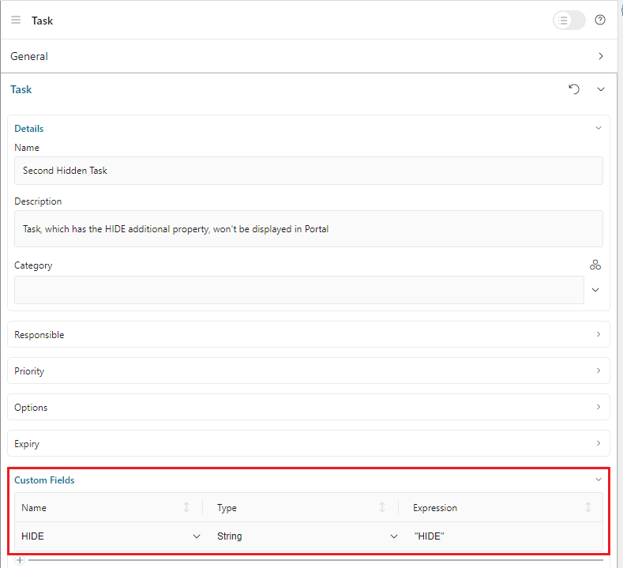
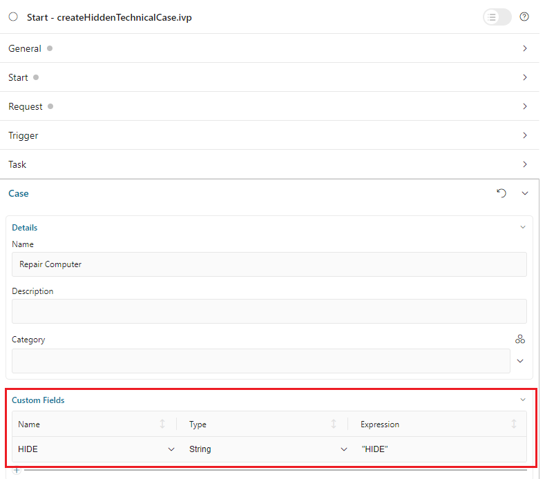

.. _customization-hideTechnicalStuffs-ja:

テクニカル要素の非表示
===========================================

Ivy の ``PortalHiddenTaskCaseExcluded`` の値によって、非表示のタスクとケースが表示（ ``FALSE`` ）または非表示（ ``TRUE`` ）になります。
デフォルト値は ``TRUE`` です。

テクニカルロールの非表示
-------------------------------------------

テクニカルロールはどこにも表示されません（委任や不在の管理など）。
デフォルトでは、 ``AXONIVY_PORTAL_ADMIN`` がテクニカルロールです。

ロールをテクニカルロールとしてマークするには、そのロールの任意の値で ``HIDE`` プロパティを設定します。

.. admonition:: ポータルのユーティリティメソッドの使用
      
      - プロパティの設定：
         com.axonivy.portal.components.util.RoleAPI.setProperty([自分のロール], ch.ivy.addon.portalkit.enums.AdditionalProperty.HIDE.toString(), "HIDE")
      - 設定の取り消し：
         com.axonivy.portal.components.util.RoleAPI.removeProperty([自分のロール], ch.ivy.addon.portalkit.enums.AdditionalProperty.HIDE.toString())

テクニカルタスクの非表示
----------------------------------------------------

テクニカルタスクは、ポータルのタスクリストに表示されません。

タスクをテクニカルタスクとしてマークするには、以下のいずれかの方法に従います。

.. admonition:: ポータルの TaskAPI のユーティリティメソッドの使用

      プロジェクトがポータルに依存する場合

      - テクニカルタスクの設定：
         com.axonivy.portal.components.util.TaskAPI.setHidePropertyToHideInPortal(ITask)
      - 設定の取り消し：
         com.axonivy.portal.components.util.TaskAPI.removeHidePropertyToDisplayInPortal(ITask)

.. admonition:: ITask API のカスタムフィールドの使用

      タスクエディターを開き、 ``Custom Fields`` セクションを展開します。

      - テクニカルタスクの設定：
         ``HIDE`` という名前で ``STRING`` フィールドを定義します。値を ``HIDE`` に設定します。
      - 設定の取り消し：
         ``HIDE`` という名前のカスタム ``STRING`` フィールドを削除します。

      |hide-technical-task|

テクニカルケースの非表示
----------------------------------------------------

テクニカルケースは、ポータルのケースリストに表示されません。

テクニカルケースに属するタスクはテクニカルタスクと見なされ、非表示になります。

ケースをテクニカルケースとしてマークするには、以下のいずれかの方法に従います。

.. admonition:: ポータルの CaseAPI のユーティリティメソッドの使用

      プロジェクトがポータルに依存する場合

      - テクニカルケースの設定：
         com.axonivy.portal.components.publicapi.CaseAPI.setHidePropertyToHideInPortal(ICase)
      - 設定の取り消し：
         com.axonivy.portal.components.publicapi.CaseAPI.removeHidePropertyToDisplayInPortal(ICase)

.. admonition:: ICase API のカスタムフィールドの使用

      ケースエディターを開き、``Custom Fields`` セクションを展開します。

      - テクニカルケースの設定：
         ``HIDE`` という名前で ``STRING`` フィールドを定義します。値を ``HIDE`` に設定します。
      - 設定の取り消し：
         ``HIDE`` という名前のカスタム ``STRING`` フィールドを削除します。

      |hide-technical-case|

