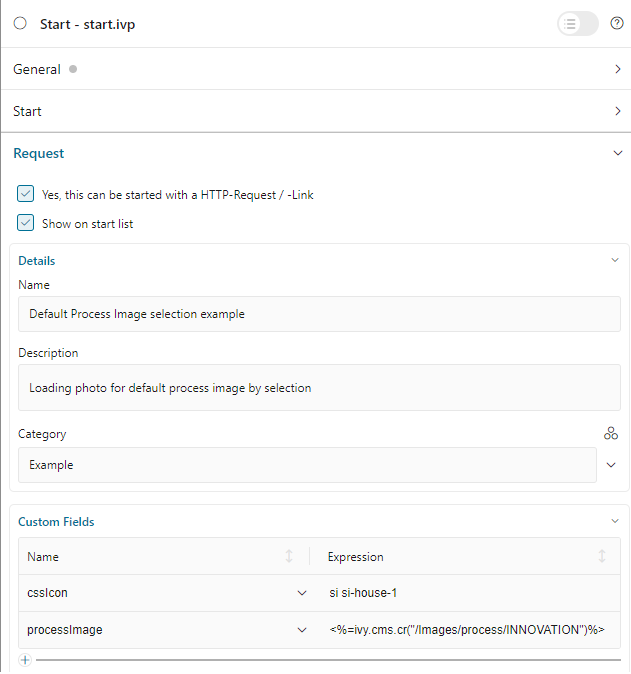

.. _customization-process-image-ja:

プロセスの画像
=================================

.. _customization-process-image-introduction-ja:

概要
------------

このセクションに従って、ポータルのプロセスの画像をカスタマイズします。

.. _customization-process-image-customization-ja:

独自のプロセスの画像の定義
---------------------------------------------------

#. タイプ画像を使用して、プロジェクトで CMS オブジェクトを作成します。

#. プロセスの開始の :guilabel:`カスタムフィールド` で ``processImage`` カスタムフィールドを定義します。
   カスタムフィールドの値は、上記で作成した CMS オブジェクトになります。

   |define-process-image|

#. 全プロセスリストページに移動し、カスタマイズしたプロセスを検索します。

   |image-process-list|

.. |image-process-list| image:: ../../screenshots/process-image/customization/image-process-list.png
