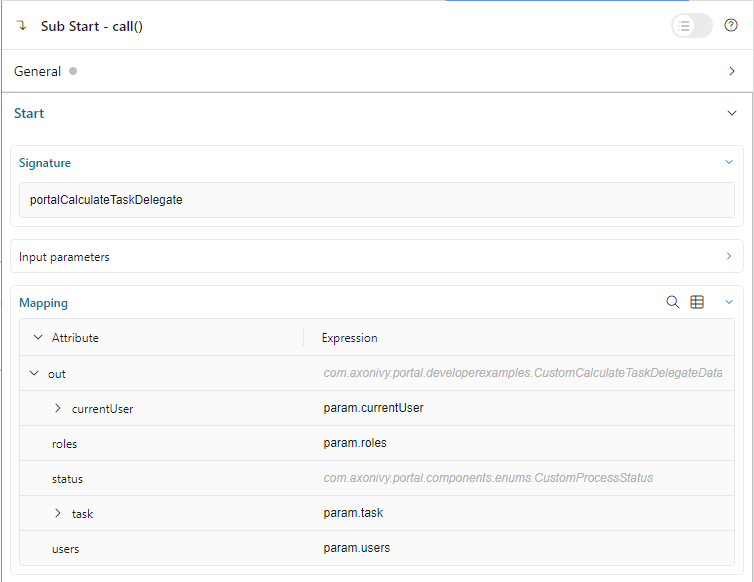

.. _customization-task-delegation-ja:

タスクの委任
==========================================

タスクを委任できるユーザーとロールのリストをカスタマイズするには、以下を使用して呼び出し可能サブプロセスを作成します。

**シグネチャ**：portalCalculateTaskDelegate

.. csv-table::
  :file: tables/portal-calculate-task-delegate.csv
  :header-rows: 1
  :widths: 30, 50, 20

|calculate-task-delegate|

呼び出し可能サブプロセスのデータのパラメーターには、 ``currentUser`` と委任する現在の ``task`` が含まれます。

タスクを委任できるユーザーとロールを ``users`` リストと ``roles`` リストから取得します。
これらのリストを編集して、委任リストを作成します。

ポータルは、上記の詳細情報でサブプロセスを呼び出し、すべての ``roles`` と ``users`` を組み合わせて、タスクを委任できるロールとユーザーのリストを作成します。

1 つの呼び出し可能サブプロセスをスキップするには、結果の ``status`` 変数を ``SKIP`` に設定してください。

.. tip::
    ポータルでは、標準 ``users`` リストとロールを呼び出し可能なパラメーターとして利用できます。
    新しいユーザーリストを作成する代わりに、 ``users`` リストをフィルターしてください。その方が効率的です。

    ロールでユーザーをフィルターしたい場合は、各ユーザーのロールを取得する ``getRoles()`` メソッドを使用してください。

