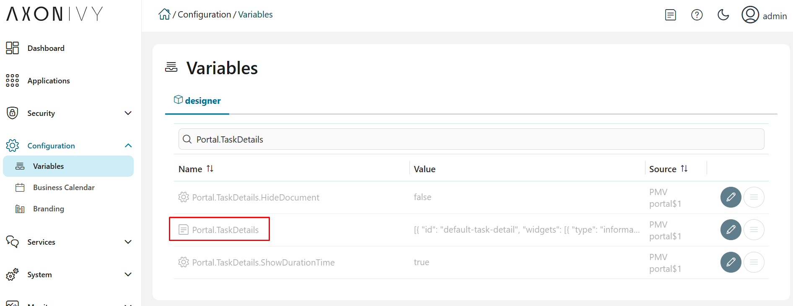
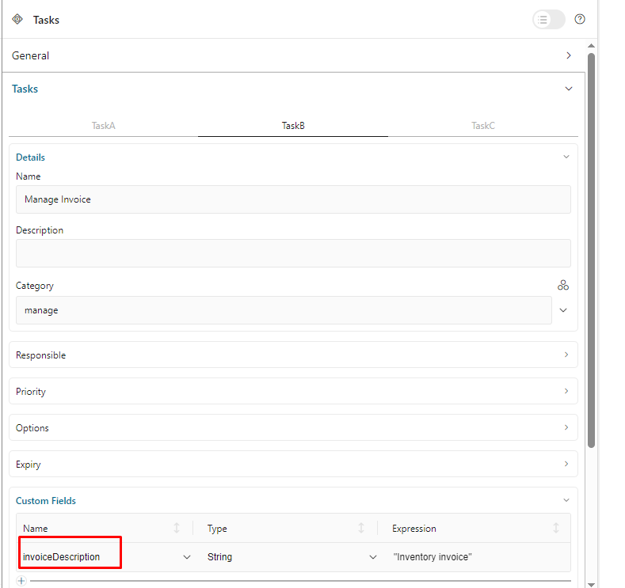
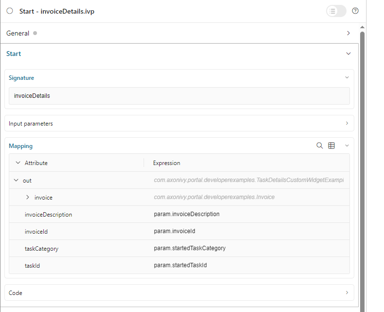

.. _customization-task-item-details-ja:

タスク項目の詳細
======================================

TaskItemDetails は、ユーザーが操作できるロール、ユーザー、タスク、ケース、時間情報を含む、ポータルの組み込みコンポーネントです。

ポータルでは、TaskItemDetails コンポーネントのコンセプトをオーバーライドして、必要なタスクの情報を表示できます。

TaskItemDetails には以下が含まれます。

-  **データと説明** ``1``

-  **ドキュメント** ``2``

-  **履歴** ``3``

-  **カスタムパネル（ウィジェット）**

|task-standard|

.. important:: 表示可能なウィジェットはすべて :ref:`Portal.TaskDetails <task-details-configuration-variable-ja>` 変数で設定されます。

.. _task-details-configuration-variable-ja:

タスクの詳細ページのウィジェットを設定する方法
------------------------------------------------------------------------

-  タスクの詳細ページで表示可能なすべてのウィジェットの設定は、 **Portal.TaskDetails 変数** に保存されます。
-  コックピットの管理者は、コックピット設定ページの **Portal.TaskDetails** 変数でウィジェットを設定できます。
   |edit-variable-portal-task-details|

-  デフォルト設定には 3 つのウィジェットが含まれます。

   .. code-block:: javascript

      [
         {
            "id": "default-task-detail",
            "filters": {
               "categories" : ["support"],
               "states" : ["DONE", "OPEN"]
            },
            "widgets": 
            [
               {
                  "id": "information",
                  "type": "information",
                  "layout": {
                     "x": 0, "y": 0, "w": 6, "h": 6
                  }
               },
               {
                  "id": "history",
                  "type": "history",
                  "layout": {
                     "x": 6, "y": 6, "w": 6, "h": 6
                  }
               },
               {
                  "id": "document",
                  "type": "document",
                  "layout": {
                     "x": 6, "y": 0, "w": 6, "h": 6
                  }
               },
               {
                  "id": "custom",
                  "type": "custom",
                  "layout": {
                     "x": 0, "y": 6, "w": 6, "h": 6
                  },
                  "data" : {
                     "processPath": "Start Processes/TaskDetailsCustomWidgetExample/invoiceDetails.ivp",
                     "params": {
                        "startedTaskId": "task.id",
                        "startedTaskCategory": "task.category",
                        "invoiceId": "000001573",
                        "invoiceDescription": "task.customFields.invoiceDescription"
                     }
                  }
               }
            ]
         }
      ]

   ..

-  **Portal.TaskDetails** 変数の各タスクの詳細のレイアウトの構造：

   ``id``：レイアウトの識別に使用する ID。

   ``widgets``：レイアウト内のウィジェットの定義。

   ``filters``：レイアウトを使用可能なタスクを決定する条件。 ``categories`` （タスクのカテゴリー）と ``states`` （タスクのビジネスの状態）の 2 つのタイプのフィルターがあります。

-  **Portal.TaskDetails** 変数の各タスクの詳細のレイアウトに含まれる各ウィジェットの構造：

   ``type``： ``information``、 ``document``、 ``history``、 ``custom`` の 4 つのタイプがあります。

   ``x``：HTML DOMスタイル ``left`` は ``x / 12 * 100%`` で計算されます。

   ``y``：HTML DOMスタイル ``top`` は ``y / 12 * 100%`` で計算されます。

   ``w``：HTML DOMスタイル ``width`` は ``60 * w + 20 * (w - 1)`` で計算されます。

   ``h``：HTML DOMスタイル ``height`` は ``60 * h + 20 * (h - 1)`` で計算されます。

   ``styleClass`` （オプション）：CSS クラスを HTML DOM に追加します。

   ``style`` （オプション）：インラインスタイルを HTML DOM に追加します。

   ``data`` （カスタムウィジェット）：iframe を使用するカスタムウィジェットのデータ。

      ``type``：IFrame を使用しないカスタムウィジェットのタイプ。 ``taskItemDetailCustomPanelTop`` と ``taskItemDetailCustomPanelBottom`` の 2 つのタイプがあります。

      ``url``：外部ウェブサイトの URL。

      ``processPath``：カスタムウィジェットに表示される Ivy プロセスのユーザーフレンドリーなリクエストパス。

      ``params``：上記の Ivy プロセスのパラメーター。各パラメーターは以下のように定義できます。

         上記の Ivy プロセスのパラメーター名となるキー名。注記： ``taskId`` は使用しないでください。

         - ``task.`` で始まる必要があるタスクのキー値。 ``task.id`` と ``task.category`` の 2 つの値がサポートされます。

         - カスタムタスクフィールドのキー値は ``task.customFields.`` で始まり、その後にカスタムフィールド名が続く必要があります。

         - その他のキー値は、ハードコーディングされた値として処理されます。

.. important::
   - ウィジェットの ``type`` は **変更しないでください**。
      ``x``、 ``y``、 ``w``、 ``h`` を変更して、ウィジェットのサイズと位置を更新できます。
   - ``x``、 ``y``、 ``w``、 ``h`` は **整数** で指定してください。
   - ``x + w`` は **12** **以下** でなければなりません。
   -  カスタムウィジェットのデータについて、 ``processPath`` を入力する場合は ``url`` を入力しないでください。いずれか 1 つのみ使用できます。
   - フィルタータイプ ``states`` ではすべてのタスクのビジネスの状態がサポートされます。:dev-url:`タスクのビジネスの状態 </doc/|version|/public-api/ch/ivyteam/ivy/workflow/TaskBusinessState.html>` を参照して、利用可能なタスクのビジネスの状態を確認してください。

カスタムパネル（ウィジェット）の表示
------------------------------------------------------------------

.. tip:: 
   カスタムタスクの詳細の JSON の概要を理解するには

   - ``portal-developer-examples/resources/files`` プロジェクトの ``variables.Portal.TaskDetails.json`` ファイルを参照します。
   - Designer の対応するアプリケーションフォルダーにコピーします。

      - 例：AxonIvyDesigner/configuration/applications/designer

   - 破棄したタスクを作成するか、 ``portal-developer-examples`` プロジェクトの ``Start Processes/TaskDetailsCustomWidgetExample/SalesManagement.ivp`` プロセスを開始します。
   - ``Start Processes/ExamplePortalStart/DefaultApplicationHomePage.ivp`` プロセスでサンプルホームページに移動します。
   - 最後に、タスクの詳細に移動し、新しいカスタムレイアウトを確認します。

   変数の設定方法については、:dev-url:`|ivy| の変数 </doc/|version|/designer-guide/configuration/variables.html>` を参照してください。

以下の **2 つのステップ** で、新しいカスタムパネルを追加します。

#. カスタムウィジェットを追加するには、 **エンジンの管理者** がコックピットページで :ref:`Portal.TaskDetails <task-details-configuration-variable-ja>` 変数を設定する必要があります。
   

   .. _task-details-custom-configuration-variable-example-ja:
   
   -  レイアウト設定を含む Portal.TaskDetails の例には、4 つのカスタムウィジェットが含まれます。
   
   .. code-block:: javascript

      [
         {
            "id": "default-task-detail",
            "widgets": 
               [
                  {
                     "type": "information",
                     "layout": {
                        "x": 0, "y": 4, "w": 6, "h": 12
                     }
                  },
                  {
                     "type": "document",
                     "layout": {
                        "x": 6, "y": 4, "w": 6, "h": 6
                     }
                  },
                  {
                     "type": "history",
                     "layout": {
                        "x": 6, "y": 10, "w": 6, "h": 6
                     }
                  },
                  {
                     "type": "custom",
                     "layout": {
                        "x": 0, "y": 0, "w": 12, "h": 4
                     },
                     "data" : {
                        "type": "taskItemDetailCustomPanelTop"
                     }
                  },
                  {
                     "type": "custom",
                     "layout": {
                        "x": 0, "y": 16, "w": 6, "h": 4
                     },
                     "data" : {
                        "type": "taskItemDetailCustomPanelBottom"
                     }
                  }
               ]
            }
        ]

   ..

#. タスクの詳細をカスタマイズするには、IFrame を使用します。

   -  外部 URL を使用する場合は、 ``url`` パラメーターを入力する必要があります。

   -  開始プロセスを使用する場合は、 ``ivy`` パラメーターを入力する必要があります。

   -  開始プロセスを使用する場合は、 ``params`` のパラメーターを事前に定義できます。

      外部 URL を使用してカスタマイズしたタスクの詳細

      .. code-block:: javascript

         [
            {
               "id": "task-detail",
               "widgets": [
                  {
                     "type": "information",
                     "layout": {
                     "x": 0, "y": 0, "w": 4, "h": 12
                     }
                  },
                  {
                     "type": "custom",
                     "layout": {
                     "x": 6, "y": 0, "w": 8, "h": 6
                     },
                     "data" : {
                     "url": "https://www.axonivy.com/"
                     }
                  }
               ]
            }
         ]

      結果

      |task-customized-iframe-url|

      プロセスの開始を使用してカスタマイズしたタスクの詳細については、 ``portal-developer-examples`` の ``TaskDetailsCustomWidgetExample`` プロセスを参照してください。

      .. code-block:: javascript

            [
               {
                  "id": "task-detail",
                  "widgets": [
                     {
                        "type": "information",
                        "layout": {
                        "x": 0, "y": 0, "w": 6, "h": 12
                        }
                     },
                     {
                        "type": "history",
                        "layout": {
                        "x": 6, "y": 6, "w": 6, "h": 6
                        }
                     },
                     {
                        "type": "custom",
                        "layout": {
                        "x": 0, "y": 6, "w": 6, "h": 6
                        },
                        "data" : {
                           "processPath": "Start Processes/TaskDetailsCustomWidgetExample/invoiceDetails.ivp",
                           "params": {
                              "startedTaskId": "task.id",
                              "startedTaskCategory": "task.category",
                              "invoiceId": "000001573",
                              "invoiceDescription": "task.customFields.invoiceDescription"
                           }
                        }
                     }
                  ]
               }
            ]

      カスタムタスクフィールドを用意します。

      |task-customized-iframe-process-custom-field|

      パラメーターをプロセスデータにマップします。

      |task-customized-iframe-process-input-mapping|

      結果

      |task-customized-iframe-process|

.. |task-standard| image:: ../../screenshots/task-detail/customization/task-standard.png

.. |task-customized-iframe-url| image:: ../../screenshots/task-detail/customization/task-customized-iframe-url.png
.. |task-customized-iframe-process| image:: ../../screenshots/task-detail/customization/task-customized-iframe-process.png

