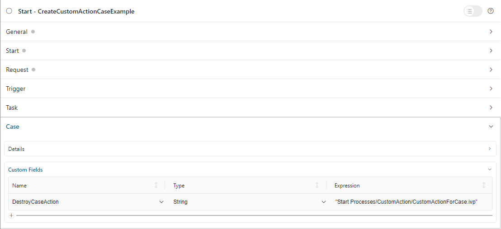
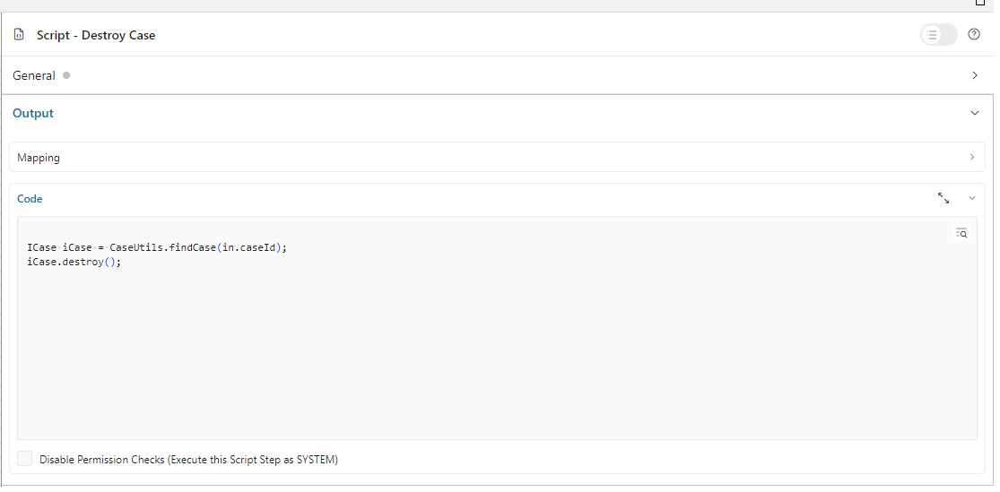
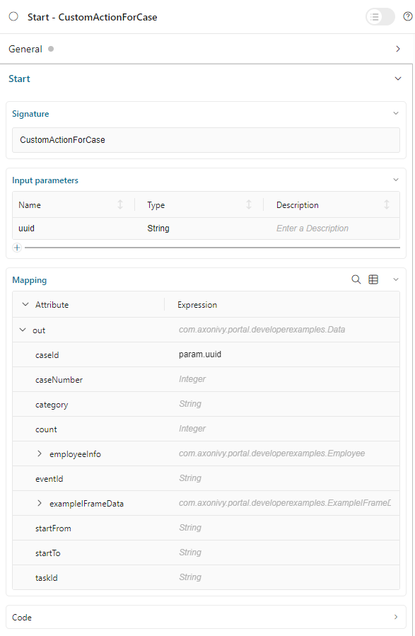
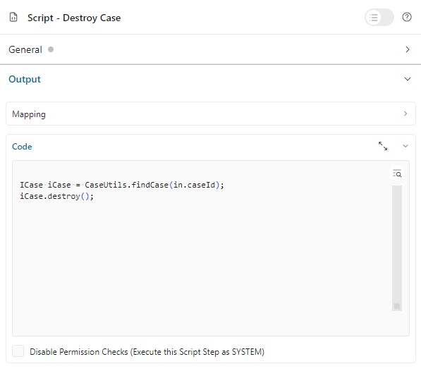

.. _configure-new-dashboard-case-widget-ja:

ケースウィジェットの設定
==================================================================

ケースウィジェットの定義
--------------------------------------------------

ポータルダッシュボードのケースウィジェットは、インタラクティブなケースリストです。詳細については、:ref:`ケースリストウィジェット <new-dashboard-case-list-widget-ja>` を参照してください。

以下はポータルダッシュボードのケースウィジェットの JSON 定義の例です。

.. code-block:: javascript

   {
      "type": "case",
      "id": "case-widget",
      "names": [
         {
            "locale": "en",
            "value": "Your Cases"
         },
         {
            "locale": "de",
            "value": "Ihre Vorgänge"
         }
      ],
      "layout": {
         "x": 0,
         "y": 0,
         "w": 10,
         "h": 9,
         "style": "text-color: blue;",
         "styleClass": "your-widget-class"
      },
      "sortField": "name",
      "rowsPerPage": 20,
      "showWidgetInfo": true,
      "showFullscreenMode": true,
      "isTopMenu": false,
      "columns": [
         {
            "field": "id"
         },
         {
            "field": "name",
            "visible": "false"
         },
         {
            "field": "description"
         },
         {
            "field": "creator"
         },
         {
            "field": "state",
            "headers": [
            {
               "locale": "en",
               "value": "State"
            },
            {
               "locale": "de",
               "value": "Status"
            }
            ]
         },
         {
            "field": "startTimestamp"
         },
         {
            "field": "actions"
         }
      ]
   }
..

ケースウィジェットの JSON の基本的な構造
-  ``type``：ウィジェットのタイプ。ケースウィジェットには ``case`` を使用します。

-  ``id``：ウィジェットの ID。

-  ``names``：UI に表示されるウィジェットの複数言語の名前。

-  ``layout``：ケースウィジェットのレイアウトの定義。

   -  ``x``：HTML DOMスタイル ``left`` は ``x / 12 * 100%`` として計算されます。

   -  ``y``：HTML DOMスタイル ``top`` は ``y / 12 * 100%`` として計算されます。

   -  ``w``：HTML DOMスタイル ``width`` は ``60 * w + 20 * (w - 1)`` として計算されます。

   -  ``h``：HTML DOMスタイル ``height`` は ``60 * h + 20 * (h - 1)`` として計算されます。

   -  ``styleClass`` （オプション）：CSS クラスをケースウィジェットの HTML DOM に追加します。

   -  ``style`` （オプション）：インラインスタイルをケースウィジェットの HTML DOM に追加します。

-  ``sortField``：ケースウィジェットのソートフィールドの初期値。

-  ``sortDescending``：ソートフィールドの初期値の並べ替え方向。デフォルト値は ``false`` （昇順で並べ替え）です。 
   

-  ``rowsPerPage``：ケースウィジェットの 1 ページに表示されるケースの最大数。
   初期値は 1 ページあたり 10 行です。

-  ``showWidgetInfo``：ウィジェット情報アイコンの表示設定。デフォルト値は ``true`` です。アイコンを非表示にするには ``false`` に設定してください。

-  ``showFullscreenMode``：全画面モードのアイコンの表示設定。デフォルト値は ``true`` です。アイコンを非表示にするには ``false`` に設定してください。

-  ``isTopMenu``：値が ``true`` の場合、ダッシュボードはナビゲーションバーの最上位の項目として表示されます。 
   値が ``false`` の場合は、 `ダッシュボード` メニューの下にサブ項目として表示されます。 
   デフォルト値は  ``false`` です。

-  ``columns``：ケースウィジェットの各列の列設定。列のフィルター、スタイル、表示設定などを事前に定義し、カスタム列も定義できます。
   
   

   -  ``field``：列のフィールド名。
         
         標準の列の ``field`` は以下のいずれかになります。

            - ``id``：ケース ID

            - ``name``：ケース名

            - ``description``：ケースの説明

            - ``states``：ケースのビジネスの状態

            - ``creator``：ケースの作成者

            - ``startTimestamp``：ケースの作成日時

            - ``endTimestamp``：ケースの終了日時

            - ``owner``：ケースオーナーのリスト

            - ``actions``：``ケースの詳細にアクセス``、 ``ケースのビジネスの詳細``、 ``ケースを破棄`` などのアクション
              

         カスタム列の ``field`` は、ケースのカスタムフィールドの名前になります。
         ポータルは、 ``field`` 属性の値を使用して、列の値を取得します。
         

   -  ``visible``：列の表示設定。デフォルト値は「true」です。列を非表示にするには、「false」に設定してください。
      

   -  ``quickSearch``：クイック検索の検索範囲にこのフィールドを追加します。デフォルト値は ``false`` です。
      列の検索条件を適用するには、 ``true`` に設定してください。

   -  ``headers``：列の複数言語のヘッダー。

.. _configure-new-dashboard-case-widget-custom-columns-ja:

カスタム列
-----------------------

ポータルは、ケースのカスタムフィールドをサポートします。ケースウィジェットでは列として表示できます。

従来のカスタム列
^^^^^^^^^^^^^^^^^^^^^^^^^^^^^^^^^^^^^^^^^^^^^^^

表示する列を、フィルター、形式、スタイルなどの他の属性とともに事前に定義できます。
以下はカスタム列の標準的な JSON の例です。

.. code-block:: javascript

   {
      ...

      "columns": [
         {
            "type": "CUSTOM",
            "field": "HIDE",
            "style": "width: 110px"
         }
      ]
   }

..

カスタム列には、前のセクションで説明した属性のほかに、以下の 2 つの違いがあります。

   - ``type``：ウィジェットの列のタイプ。 ``STANDARD`` と ``CUSTOM`` の 2 つのオプションがあります。

   - ``field``：この属性は、列のデータを取得するのに使用されるケースのカスタムフィールドの名前です。
     

.. important::
   ポータルでは、 ``custom-fields.yaml`` ファイルで宣言されたカスタムフィールドのみ表示されます。
   詳細については、:dev-url:`カスタムフィールドのメタ情報 </doc/|version|/designer-guide/how-to/workflow/custom-fields.html#meta-information>` を参照してください。

カスタムアクションボタンの列
^^^^^^^^^^^^^^^^^^^^^^^^^^^^^^^^^^^^^^^^^^^^^^^^^^^^^^^^^^
ポータルでは、ニーズに合わせてケースウィジェットの列としてカスタムアクションボタンを作成できます。これらのボタンをクリックすると、カスタムプロセスがトリガーされます。

以下の手順に従って実装します。

   #. カスタムアクションボタンをクリックするとトリガーされる新しいプロセスを作成します。このプロセスで、 ``uuid`` パラメーターを受け入れるリクエスト開始イベントを定義します。 
      ケースの詳細ページの ``カスタムアクション`` ボタンをクリックすると、このプロセスが呼び出され、ケースの UUID が ``uuid`` パラメーターとして受け渡されます。 
   
      
      |custom-action-button-process-demo|

   #. このプロセスで、カスタムアクションのアクション／スクリプトを設計、実装します。
   
      |custom-action-destroy-case|

   #. ``custom-fields.yaml`` のカスタムアクションボタンを記述します。 

      .. code-block:: yaml

         CustomFields:
            Cases:
               DestroyCaseAction:
                  Label: Destroy Case Action
                  Category: Custom Case Action
                  Icon: si si-controls-play
                  IsCustomAction: true

      - これがアクションボタンであることをポータルに伝えるには、 ``IsCustomAction: true`` が必須です。
      - ``Icon`` については、|ivy| Market の Html Dialog Demos で利用可能な Streamline アイコンを参照してください。

   #. メインプロセスのプロセスの開始でカスタムフィールドを割り当てます。
   
      |custom-action-button-custom-field|

フィルター条件
-------------------------------------

ケースウィジェットのほとんどの列でフィルター条件を事前に定義できます。条件は列ごとに異なり、リストのみ、文字列のみを受け入れる列もあれば、日時など、特定の形式の文字列を必要とする列もあります。

詳細については、:ref:`複合フィルター <complex-filter-ja>` を参照してください。

Json フィルターの基本構造：

   .. code-block:: javascript

         {
            ...
      
            "columns": [
               {
                  "field": "name"
               }
            ],
            "filters" : [
               {
                  "field" : "name",
                  "values" : [ "Mike ", "Nam" ],
                  "operator" : "contains",
                  "type" : "standard"
               } 
            ]
         }

   ..
   
.. _configure-new-dashboard-case-widget-filter-structure-ja:

   - ``field``：列名に対応するフィルターのフィールド名

   - ``values``：フィルターの値（リスト、文字列または数値）

   - ``operator``：フィルター演算子。演算子はフィールドのタイプによって異なります。

     - **文字列列**：is、is_not、empty、not_empty、contains、not_contains、start_with、not_start_with、end_with、not_end_with

     - **数値列**：between、not_between、empty、not_empty、equal、not_equal、less、less_or_equal、greater、greater_or_equal

     - **日付列**：today、yesterday、is、is_not、before、after、between、not_between、current、last、next、empty、not_empty

   - ``type``： ``standard`` （標準の列）または ``custom`` （カスタム列）

   - 日付タイプの追加フィールド：

      - ``periodType``：文字列値、 ``YEAR``、 ``MONTH``、 ``WEEK``、 ``DAY``

      - ``from``：文字列値。例："2024/03/19"

      - ``to``：文字列値。例："2024/01/01"
   
   - 数値タイプの追加フィールド：

      - ``from``：文字列値。例：「3.0」

      - ``to``：文字列値。例：「55.2」

追加フィールドは、各フィールドタイプの演算子やフィルターに依存します。以下はフィルター設定可能な列とそれに対応するフィルター条件のリストです。

.. tip:: 
   これらのウィジェットをカスタマイズする際は、期待どおりに動作するように、ダッシュボード設定を使用してウィジェットを編集してから、ダッシュボードのエクスポート機能を利用することを推奨します。  

標準の列：

   - ``name``

      .. code-block:: javascript

         {
            ...
      
            "columns": [
               {
                  "field": "name"
               }
            ],
            "filters" : [ 
               {
                  "field" : "name",
                  "values" : [ "Mike ", "Nam" ],
                  "operator" : "contains",
                  "type" : "standard"
               } 
            ]
         }

      ..

      この列は、文字列列で利用可能なすべての演算子を受け入れます。さらに、文字列のリストとして ``値`` も受け入れます。

   - ``description``

      .. code-block:: javascript

         {
            ...
      
            "columns": [
               {
                  "field": "description"
               }
            ],
            "filters" : [ 
               {
                  "field" : "description",
                  "values" : [ "Leave" ],
                  "operator" : "not_end_with",
                  "type" : "standard"
               } 
            ]
         }

      ..

      この列は、文字列列で利用可能なすべての演算子を受け入れます。さらに、文字列のリストとして ``値`` も受け入れます。

   - ``state``：ケースのビジネスの状態

      .. code-block:: javascript

         {
            ...
      
            "columns": [
               {
                  "field": "state"
               }
            ],
            "filters" : [ 
               {
                  "field" : "state",
                  "values" : [ "DESTROYED", "DONE", "OPEN" ],
                  "operator" : "in",
                  "type" : "standard"
               } 
            ]
         }
      ..

      この列は、フィルター値としてケースのビジネスの状態名のリストのみ受け入れます。利用可能なフィルターの演算子は ``in`` です。

      利用可能なケースのビジネスの状態については、:dev-url:`ケースのビジネスの状態 </doc/|version|/public-api/ch/ivyteam/ivy/workflow/caze/CaseBusinessState.html>` を参照してください。
      

   - ``creator``

      .. code-block:: javascript

         {
            ...
      
            "columns": [
               {
                  "field": "creator"
               }
            ],
            "filters" : [ 
               {
                  "field" : "creator",
                  "values" : [ "backendDev2", "gm1" ],
                  "operator" : "in",
                  "type" : "standard"
               },
               {
                  "field" : "creator",
                  "operator" : "current_user",
                  "type" : "standard"
               } 
            ]
         }

      ..

      この列は、ケース作成者のユーザー名のフィルター値としてユーザー名のリストのみ受け入れます。利用可能なフィルターの演算子は ``in``、 ``not_in``、 ``current_user`` です。 
      ``current_user`` 演算子には値フィールドは必要ありません。

   - ``startTimestamp``、 ``endTimestamp``：ケースの作成日と終了日

      .. code-block:: javascript

         {
            ...
      
            "columns": [
               {
                  "field": "creator"
               }
            ],
            "filters" : [ 
               {
                  "field" : "startTimestamp",
                  "to" : "03/12/2024",
                  "operator" : "after",
                  "type" : "standard"
               },
               {
                  "field" : "startTimestamp",
                  "operator" : "current",
                  "periodType" : "MONTH",
                  "type" : "standard"               
               },
               {
                  "field" : "startTimestamp",
                  "from" : "03/01/2024",
                  "to" : "03/17/2024",
                  "operator" : "between",
                  "type" : "standard"
               },
               {
                  "field" : "startTimestamp",
                  "operator" : "last",
                  "periods" : 2,
                  "periodType" : "YEAR",
                  "type" : "standard"
               },
               {
                  "field" : "startTimestamp",
                  "from" : "03/19/2024",
                  "operator" : "is",
                  "type" : "standard"
               },
               {
                  "field" : "startTimestamp",
                  "operator" : "empty",
                  "type" : "standard"
               }
            ]
         }

      ..

      この列は、日付列で利用可能なすべての演算子を受け入れます。フィールドは演算子によって異なります。上記のJSON の例は、日付フィールドのほとんどのユースケースをカバーします。
      受け入れ可能な日付の形式は、 ``dd.MM.yyyy``、 ``dd.MM.yyyy HH:mm``、 ``MM/dd/yyyy``、 ``MM/dd/yyyy HH:mm`` です。

   - ``category``

      .. code-block:: javascript

         {
            ...
      
            "columns": [
               {
                  "field": "category"
               }
            ],
            "filters" : [ 
               {
                  "field" : "category",
                  "values" : [ "LeaveRequest", "Leave_Request_1" ],
                  "operator" : "in",
                  "type" : "standard"
               }
            ]
         }

      ..

      利用可能なフィルターの演算子は ``in``、 ``not_in``、 ``no_category``、 ``contains``、 ``not_contains`` です。 
      ``no_category`` 演算子には値フィールドは必要ありません。

カスタムフィールド列： 

   - :ref:`configure-new-dashboard-case-widget-custom-columns-ja` は、:ref:`標準の列 <configure-new-dashboard-case-widget-filter-structure-ja>` と同じ演算子を使用しています。

   - ``type`` フィールドは ``custom`` になります。

   .. code-block:: javascript

      {
         ...

         "columns": [
            {
               "field": "InvoiceNumber"
            }
         ],
         "filters" : [ 
            {
               "field" : "InvoiceNumber",
               "value" : "566.00",
               "operator" : "less_or_equal",
               "type" : "custom"
            }
         ]
      }

   ..

クイック検索
----------------------------------

クイック検索は、ユーザーがケースウィジェット内のケースを素早く検索できる便利な機能です。
クイック検索の設定には以下の 2 つの属性があります。
   
   * ``enableQuickSearch``：ウィジェットのクイック検索機能を有効にします。

   * ``quickSearch``：クイック検索機能を使用した列の検索が可能なことを示します。

``enableQuickSearch`` 属性を ``false`` に設定すると、 ``quickSearch`` 属性の値にかかわらず、クイック検索機能が無効になります。

逆に、 ``enableQuickSearch`` 属性を ``true`` に設定した場合は、 ``quickSearch`` 属性が ``true`` に設定されているすべての列の値でクイック検索機能による検索が可能になります。

``quickSearch`` 属性をケースウィジェットのいずれの列にも割り当てていない場合、クイック検索機能はデフォルトで名前フィールドと説明フィールドを検索します。

これらの属性の定義は以下のとおりです。

   * ``enableQuickSearch``：クイック検索機能を有効／無効にします。以下のようにケースウィジェットの ``enableQuickSearch`` フィールドを設定してください。
     

      .. code-block:: javascript

         {
            ...
            "type": "case",
            "id": "case_98ae4fc1c83f4f22be5244c8027ecf40"
            ...
            "enableQuickSearch": "true",
            ...
         }

      ..

      有効な値：

      * ``true``：クイック検索テキストボックスを表示します。
      * ``false``：クイック検索テキストボックスを非表示にします。
      * ``not defined``：クイック検索テキストボックスを非表示にします。

   * ``quickSearch``：クイック検索機能で検索できる列を選択します。以下のように各列の ``quickSearch`` フィールドを設定してください。
     

      .. code-block:: javascript

         {
            ...
            "type": "case",
            "id": "case_98ae4fc1c83f4f22be5244c8027ecf40"
            ...
            "columns": [
               {
                  "field": "id",
                  "quickSearch": "false"
               },
               ...
            ]
            ...
         }

      ..

      有効な値：

      * ``true``：この列にクイック検索を適用します。
      * ``false``：この列にクイック検索を適用しません。
      * ``not defined``：``name`` 列と ``description`` 列は ``true``、その他の列は自動的に ``false`` になります。

