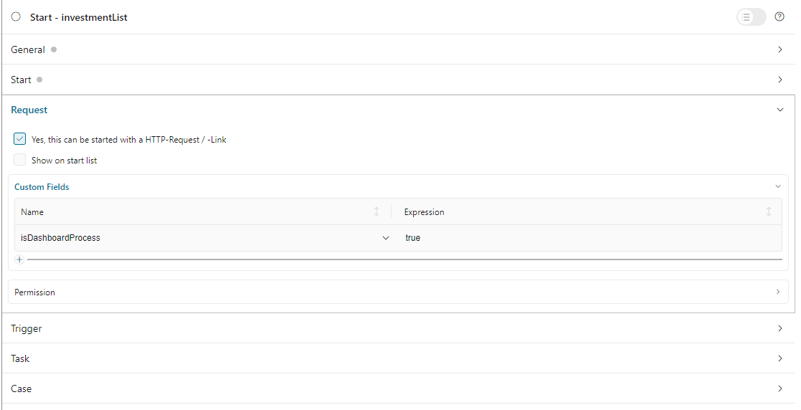
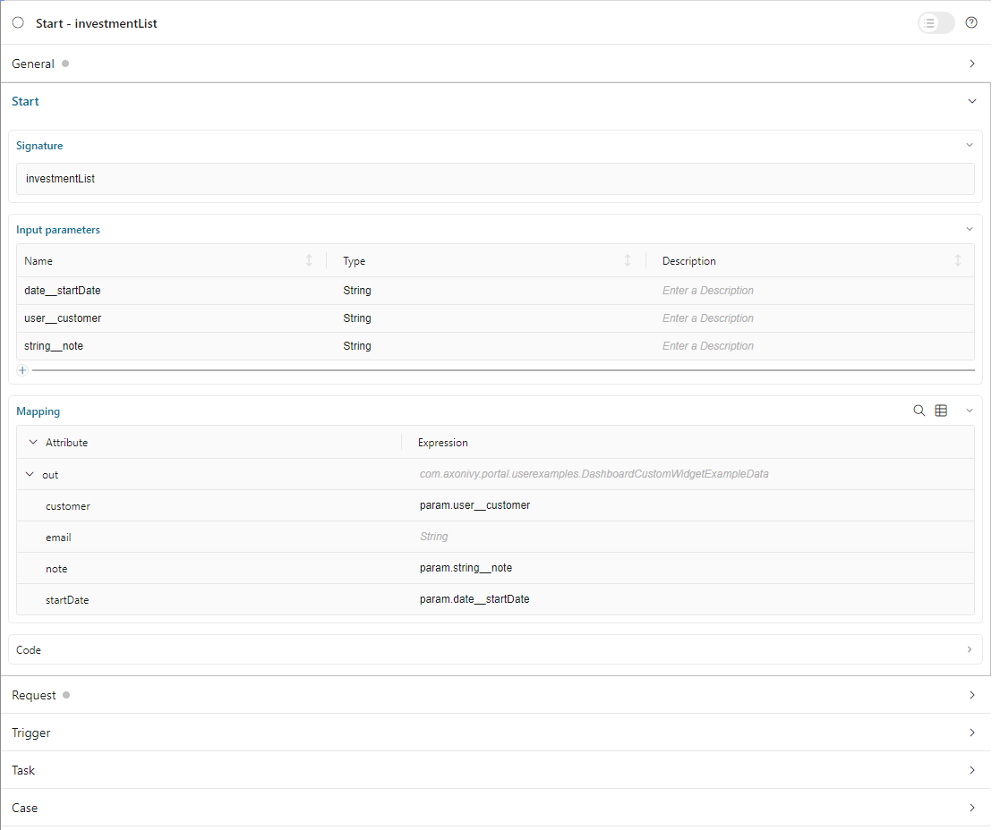

.. _configure-new-dashboard-custom-widget-ja:

カスタムウィジェットの設定
================================================================

ポータルには、タスク、ケース、プロセスウィジェットなど、さまざまなウィジェットが用意されています。天気ウィジェットのようなウィジェットが必要な場合は、 
カスタムウィジェットを作成することも可能です。カスタムウィジェットは、IFrame を使用して、コンテンツを表示します。 
コンテンツには、Ivy プロセスまたは外部ウェブページの URL を定義できます。 

.. _define-an-ivy-process-for-the-custom-widget-ja:

カスタムウィジェットの Ivy プロセスの定義
----------------------------------------------------------------------------

カスタムウィジェットでは、事前定義された Ivy プロセスを表示できます。この方法では、別のページを開かずに、ポータルダッシュボードで直接作業できます。

最初に、開発者がポータルのプロセスを作成する必要があります。
ダッシュボード：

   プロセスの ``isDashboardProcess`` カスタムフィールドを true に設定します。

   |dashboard-custom-field|

   プロセスのパラメーターは文字列変数とし、以下の形式で名前を付ける必要があります。 ``type__name``

   |dashboard-custom-params|

   ``type``：パラメーターのタイプ。4 つのタイプがサポートされています。

      ``user``: username of an Ivy user.

      ``string``: type java.lang.String.

      ``boolean``: type java.lang.Boolean.

      ``date``: type java.util.Date.

   ``name``：カスタムウィジェットの設定ダイアログで表示したいフィールドの名前。名前が空欄の場合、ウィジェットのヘッダーは非表示になります。

   上記の形式で定義する理由は、エンドユーザーが適切な方法でパラメーターを Ivy プロセスに送信できるようにするためです。

   例えば、 ``user__customer`` パラメーターを定義した場合、ポータルには「customer」という名前のドロップダウンが表示され、カスタムウィジェットの設定ダイアログでシステムの Ivy ユーザーを選択できます。 
   

   上記のプロセスのカスタムウィジェットの設定ダイアログは以下のようになります。

   |dashboard-custom-widget-configuration|

JSON を使用したカスタムウィジェットの定義
--------------------------------------------------------------------------

カスタムダッシュボードウィジェットでは、iframe からダッシュボードで外部ウェブページや Ivy プロセスを操作できます。

以下はポータルダッシュボードのカスタムウィジェットの標準的な JSON 定義の例です。

   .. code-block:: javascript

      {
         "type": "custom",
         "id": "custom-widget",
         "showFullscreenMode": true,
         "names": [
            {
               "locale": "en",
               "value": "Custom Widget"
            }
         ],
         "layout": {
            "x": 10, "y": 0, "w": 2, "h": 4
         },
         "data": {
            ...
         }
      }
   ..

カスタムウィジェットの JSON の基本的な構造

   ``type``：ウィジェットのタイプ。 ``custom`` を使用して、このウィジェットをカスタムウィジェットとしてマークします。
   

   ``id``：ウィジェットの ID。

   ``names``：UI に表示されるウィジェットの複数言語の名前。

   ``data``：カスタマイズのデータ。このフィールドの使用方法については、以下のセクションを参照してください。
   

   ``showFullscreenMode``：全画面モードのアイコンの表示設定。デフォルト値は ``true`` です。アイコンを非表示にするには ``false`` に設定してください。

Ivy プロセスの定義
------------------------------------------------

開発者は、JSON ファイルで宣言することにより、カスタムウィジェットを事前に定義できます。

JSON 構造

   .. code-block:: javascript

      {
         "type": "custom",
         "id": "custom-widget",
         "showFullscreenMode": true,
         "names": [
            {
               "locale": "en",
               "value": "Custom Widget"
            }
         ],
         "layout": {
            "x": 10, "y": 0, "w": 12, "h": 6
         },
         "data" : {
           "processPath": "designer/portal-user-examples/Start Processes/DashboardCustomWidgetExample/investmentList.ivp",
           "params": [
               {
                  "type": "user",
                  "name": "customer",
                  "value": "demo"
               },
               {
                  "type": "date",
                  "name": "startDate",
                  "value": "11/19/2021"
               },
               {
                  "type": "string",
                  "name": "note",
                  "value": "a short note for demo process"
               }
            ]
        }
      }
   ..

続ける前に、上記の :ref:`カスタムウィジェットの Ivy プロセスの定義 <define-an-ivy-process-for-the-custom-widget-ja>` のセクションを読み、名前とタイプの関係を理解してください。

属性の説明

   ``processPath``：カスタムウィジェットに表示される Ivy プロセスの :dev-url:`|ivy| IWebStartable </doc/|version|/public-api/ch/ivyteam/ivy/workflow/start/IWebStartable.html>` ID。

   ``params``：上記の Ivy プロセスのパラメーター。以下のように各パラメーターを定義できます。

      - name：パラメーターの名前

      - value：パラメーターの事前定義済みの値

      - type：カスタムウィジェットの設定ダイアログに表示されるパラメーターのデータのタイプ。
        ``string``、 ``user``、 ``date``、 ``boolean`` の 4 つのタイプがあります。
        

         - ``string`` タイプ：パラメーターを通常の文字列としてマークします。ユーザーは、設定ダイアログの入力テキストフィールドでこのパラメーターを編集できます。
           
           

         .. code-block:: javascript

            {
               ...

               "params": [
                     {
                        "type": "string",
                        "name": "note",
                        "value": "a short note for demo process"
                     }
                  ]
            }
         ..

         - ``user`` タイプ：パラメーターの値は |ivy| のユーザー名です。ユーザーは、設定ダイアログのドロップダウンでユーザーを選択して、このパラメーターを編集できます。
           
           Ivy のユーザー名のみ、値として受け入れられます。

         .. code-block:: javascript

            {
               ...

               "params": [
                     {
                        "type": "user",
                        "name": "customer",
                        "value": "demo"
                     }
                  ]
            }
         ..

         - ``date`` タイプ：パラメーターの値は日付です。ユーザーは、設定ダイアログの日付ピッカーを使用してこのパラメーターを編集できます。
           このタイプは、dd.MM.yyyy と MM/dd/yyyy の日付の形式のみ受け入れます。
           

         .. code-block:: javascript

            {
               ...

               "params": [
                     {
                        "type": "date",
                        "name": "startDate",
                        "value": "01/01/2024"
                     }
                  ]
            }
         ..

         - ``boolean`` タイプ：このパラメーターはブール値です。設定ダイアログでは、このフィールドはラジオボタンとしてレンダリングされます。
           ユーザーはラジオボタンをクリックして、true または false を選択できます。
           
           このタイプは、 ``true`` または ``false`` の値のみ受け入れます。

カスタムウィジェットの Ivy プロセスの定義方法については、 ``variables.Portal.Dashboard.json`` JSON ファイル、 ``portal-user-examples`` プロジェクトの ``DashboardCustomWidgetExample/investmentList.ivp`` プロセスを参照してください。

.. |dashboard-custom-widget-configuration| image:: ../../screenshots/dashboard/process-custom-widget-configuration.png
